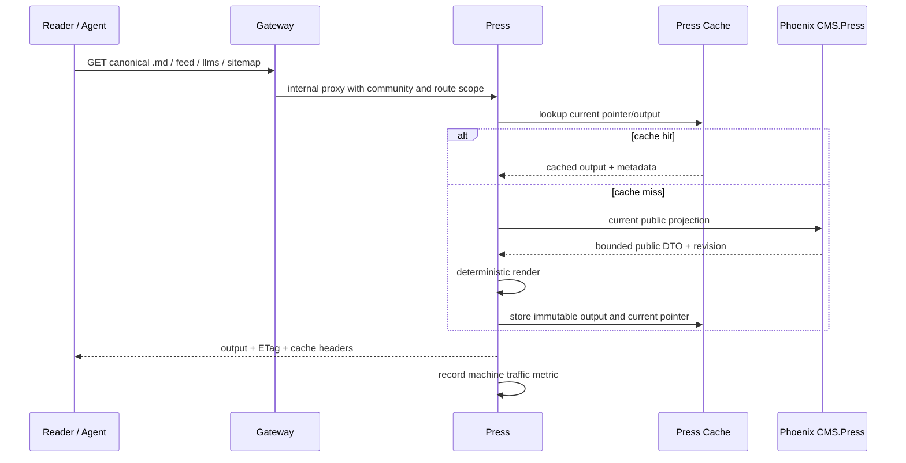

# Press v1

> 运行形态：Node/Hono
>
> Phoenix Context：`CMS.Press`
>
> UI：Dashboard 中的 Press 配置
>
> 当前状态：v1 已实现，合并到当前分支，部署前验证中

## 定位

`Press` 是 Groupher 已发布内容的公共输出层。它通过 Phoenix 提供的有界内部接口
读取当前 canonical public projection，在自己的缓存层生成适合浏览器、Feed Reader、搜索
爬虫和 Agent 消费的官方派生产物。

Press 不是新的内容系统，也不拥有文章、Docs Tree 或发布状态。它只做单向读取和
输出，不允许通过 Markdown、Feed 或其他导出格式反向修改 canonical 内容。

```text
Phoenix current public Article / site projection
                    |
                    | internal Press projection
                    v
             Press Hono app
                    |
        +-----------+-----------+
        |           |           |
        v           v           v
     Markdown      Feed      Agent/SEO output
```

正式名称统一为 `Press`：

- Phoenix Context：`CMS.Press`。
- Node app：`backend/Press`。
- package：`@groupher/press`。
- 本地直接调试域名：`https://press.groupher.localhost`。
- 面向用户的 URL 仍属于社区域名，由 Gateway 转发，不能暴露内部服务域名。

## v1 目标

v1 交付以下能力：

1. **[Must]** 将当前 Docs 专用的 `.md` 实现抽成所有 Article Thread 共用的 Markdown 输出能力。
2. **[Must]** 提供 RSS 2.0；`Press*RSSFeed` DTO 表示未序列化的 syndication 数据，Atom、
   JSON Feed 复用它并仅在 renderer 层分流。
3. **[Must]** 提供 `llms.txt` 和动态 community sitemap 的基础输出。
4. **[Must]** 建立 `CMS.Press` 配置、内部读取接口和 Press 自有缓存边界。
5. **[Must]** 将 Press 请求与人类页面浏览量分开，建立机器流量统计。
6. **[Must]** 保持 public URL、custom domain 和 canonical URL 由 Gateway/Groupher 控制。
7. **[Should]** 支持轻量 bot 明细与文章级时间段趋势查询（用于运营排障/监控）。
8. **[Should]** 对核心可观测指标留存 TSDB 友好结构，为后续独立时序存储做预留。

v1 先采用 read-through rendering，不要求一开始就完成 Outbox、对象存储和全量静态
物化。renderer、cache key 和接口合同必须允许后续平滑升级为事件驱动静态发布。

### v1 必做梳理

- P0（必须）：1~6，作为公开输出正确性与可控发布的前置条件。
- P1（应有）：7~8，作为运维可观测性的第一层增强，用于趋势排查和 bot 分布观察。
- P2（后续）：7/8 的演进版（例如更细粒度时序存储、异常 bot 聚类、历史追溯窗口延长）可在
  v2 处理。

## 当前基础与需要替换的实现

仓库当前已有 Docs Markdown 输出：

```text
/{community}/doc/{id}/{slug}.md
        |
        v
Main proxy
        |
        v
/api/docs/{community}/{id}/markdown
        |
        v
getDoc() -> public GraphQL -> document.markdown
```

这个实现证明 `document.markdown` 已经可以作为 canonical Markdown 来源，但它存在
以下限制：

- 路由和 handler 只支持 Doc，无法复用于 Post、Changelog 和其他 Article Thread。
- 输出逻辑位于 Main，导致公共机器输出和页面应用部署耦合。
- 使用普通 public Article read path，缓存 miss 时可能增加文章 views。
- Feed 如果复用同一路径逐篇读取，会形成 N+1，并污染人类访问统计。
- Next cache 与发布 revision 没有明确的 cache key/invalidation 合同。

### 现有接口支持情况

当前仓库已经具备 Press 专用的 internal projection/API：

- Docs Markdown 当前通过 `getDoc -> public GraphQL -> document.markdown` 读取；该路径可能进入
  public Article read path，不适合作为 Press 的长期机器输出合同。
- 当前 public Article、ArticleDocument、published Docs tree 和 active Doc release 已封装为 Press DTO；Press
  通过 Phoenix GraphQL projection 读取，不直接查询 Phoenix 业务表。
- `ArticleSnapshot` 是 Phoenix 的历史记录，不进入 Press public contract；Press 不接受
  `snapshot_ref` 或历史 release 参数，只读取当前最新的 public 内容。
- `CMS.Press.article/community_rss_feed/thread_rss_feed/site_manifest` 已作为内部读取合同，负责一次性完成
  public stage、可见性、Thread 和数量限制等业务过滤。

因此，v1 的接口工作不是重做内容模型，而是把现有 Phoenix 事实封装成无副作用、批量化、可缓存的
Press projection/API；在此之前不能把 public GraphQL read path 直接当作 Press origin。

迁移后，Gateway 应在 Main 之前识别 canonical Article URL 的 `.md` 变体，并将请求
内部转发到 Press。这里是 reverse proxy/route，不是向用户返回 30x 跳转；地址栏和
canonical URL 保持不变。

旧的 Main Markdown Route Handler 只在切换期间作为兼容入口，Gateway 完成接入后
删除，不能让 Main 和 Press 长期各维护一套 renderer。

## 所有权

### Phoenix / `CMS.Press`

Phoenix 继续负责领域事实：

- canonical Article、ArticleDocument、Doc Tree 和 Community。
- Draft/Public、审核、归档、Trash、删除和 Thread enable 状态。
- 当前 public Article/ArticleDocument、published Docs tree、active Doc release 和稳定的 public content ref。
- `ArticleSnapshot` 等历史记录继续由 Phoenix 管理，但不会通过 Press 接口暴露。
- community/custom-domain、locale、canonical origin。v1 的 custom-domain 路由映射暂由 Gateway
  `CUSTOM_DOMAIN_COMMUNITIES` 环境变量提供；Phoenix 统一 domain registry 留到后续。
- Press 配置及其权限、审计和更新事务。
- 面向 Press 的无副作用、批量化 internal projection。
- 发布、撤回、删除、域名和配置变化后的 invalidation signal。

`CMS.Press` 是 Press 产品在 Phoenix 内的 domain facade。Dashboard 不应继续把 RSS
作为一个没有 owner 的通用 Dashboard embed 来演进；现有 `dashboard.rss` 只作为
迁移来源。

建议的 facade 语义：

```text
CMS.Press.config(community)
CMS.Press.update_config(community, attrs, actor)
CMS.Press.article(article_path)
CMS.Press.community_rss_feed(community, opts)
CMS.Press.thread_rss_feed(community, thread, opts)
CMS.Press.site_manifest(community)
```

这些函数位于 `CMS.Press` 内，不再重复添加 `press_` 或 `get_` 前缀；只有更新动作保留
`update_config` 动词。GraphQL/HTTP resolver 只负责参数解包和 DTO 输出，不能在 resolver
中重新实现可见性规则。
Dashboard 与 `CMS.Press` 的 GraphQL 契约命名为 `pressConfig / updatePressConfig`，
保存链路是 Dashboard UI → `updatePressConfig` → `CMS.Press`。

GraphQL 契约建议：

- Query: `pressConfig(community: String!): PressConfig`
- Mutation: `updatePressConfig(input: UpdatePressConfigInput!): PressConfigPayload`
- Query: `pressArticle(article: ArticlePathInput!): PressArticle`
- Query: `pressCommunityRssFeed(community: String!, input: PressCommunityRSSFeedInput!): PressCommunityRSSFeed`
- Query: `pressThreadRssFeed(community: String!, thread: Thread!, input: PressThreadRSSFeedInput!): PressThreadRSSFeed`
- Query: `pressSiteManifest(community: String!): PressSiteManifest`

Absinthe 将 GraphQL 字段中的缩写输出为 `Rss`，因此实际可执行字段使用上述命名；DTO 类型仍使用
`PressCommunityRSSFeed` / `PressThreadRSSFeed`。Press client 使用 GraphQL alias 将响应键规范化为
`pressCommunityRSSFeed` / `pressThreadRSSFeed`。

### Press Hono app

Press 负责执行和输出：

- `.md`、RSS、Atom、JSON Feed、`llms.txt` 和 sitemap 路由。
- Thread route adapter 和公共 renderer registry。
- XML/JSON escaping、时间格式、Content-Type 和安全响应头。
- ETag、Last-Modified、条件请求和 Cache-Control。
- 自有的 render cache、route pointer cache 和 negative cache。
- renderer/schema version、诊断、重试和可观测性。
- Press 机器流量统计和 Dashboard 所需的聚合指标。
- 通过 Phoenix internal projection/API 读取内容；通过自己的 ORM 将机器流量统计写入 `analysis` analytics namespace。

Press 可以缓存 Phoenix 接口返回的 current public projection 和最终输出，但不能直接连接
Phoenix 的业务 PostgreSQL（`cms`）实例。缓存是读取接口之上的执行层，不是绕过接口的数据副本。
Press 的统计与事件可由 Press 直连独立 `analysis` analytics schema/数据库对象进行持久化，不影响业务库事务。

### Gateway

Gateway 负责：

- 保持 public/custom-domain URL 稳定。
- 在 Main 前识别 Press 路由并转发到 `PRESS_SITE`。
- 保留原始 host、protocol 和 request metadata，但不替 Press 决定 canonical origin。
- 平台根域静态文件保留由 Gateway 管理，`/{file}`（含 `sitemap.xml`）仅用于平台根域场景。
- `community`/custom-domain scope 的 `sitemap.xml` 不应命中上述静态文件分支，必须转发给 Press
  生成并返回社区 sitemap。
- 不解析文章内容、不生成 Feed、不拥有 Press cache。

### Main 与 Dashboard

Main 只负责页面集成：

- 输出 `<link rel="alternate">` Feed discovery。
- 在适当位置提供 Copy Markdown、RSS 等入口。
- 不再拥有 Markdown/Feed renderer。

Dashboard 只负责 Press 配置和统计 UI。保存动作写入 Phoenix `CMS.Press`，不能直接
写 Press cache 或向 Press app 持久化业务配置。

## 配置模型

v1 将当前 `dashboard.rss` 迁移为 community-scoped Press 配置。建议最小字段为：

```text
PressConfig
├─ community_id
├─ markdown_enabled      # 保留当前 Docs .md 能力，默认 true
├─ feed_enabled          # 默认 false，避免无意公开历史内容
├─ feed_type             # digest | full
├─ feed_count            # 5..50，统一默认 20
├─ feed_threads          # post | changelog | doc | blog
├─ llms_enabled
└─ sitemap_enabled
```

约束：

- `feed_threads` 必须显式配置，不能默认把所有 public Thread 混成一个 Feed。
- RSS、Atom 和 JSON Feed 共享 enable/type/count/threads，不维护三套业务配置。
- `full` Feed 使用发布时保存的 HTML；`digest` 使用持久化 digest（doc/post/changelog/blog
  均已持久化）。
- Docs Feed 以 `DocPublishRelease` 为更新单元，避免一次 Docs 发布制造大量独立条目。
- 配置更新由 Phoenix 记录审计，并向 Press 发出 cache invalidation signal。
- 现有前端 `feedCount = 5` 与后端 `20` 的默认值在迁移时统一为 `20`。

## Public URL

Press 路由镜像 canonical content URL，而不是建立第二套资源路径。

| 输出               | Groupher public URL               |
| ------------------ | --------------------------------- |
| Doc Markdown       | `/{community}/doc/{id}/{slug}.md` |
| Post Markdown      | `/{community}/post/{id}.md`       |
| Changelog Markdown | `/{community}/changelog/{id}.md`  |
| Community RSS      | `/{community}/feed.xml`           |
| Thread RSS         | `/{community}/{thread}/feed.xml`  |
| Atom               | `/{community}/feed.atom`          |
| JSON Feed          | `/{community}/feed.json`          |
| Agent manifest     | `/{community}/llms.txt`           |
| Sitemap            | `/{community}/sitemap.xml`        |

custom domain 下由 Gateway 将 community scope 注入内部请求，对外去掉 community
前缀：

```text
https://docs.example.com/feed.xml
https://docs.example.com/llms.txt
https://docs.example.com/doc/{id}/{slug}.md
https://docs.example.com/sitemap.xml
```

约束：

- public path 使用 stable public ref/inner id，不泄露数据库 id。
- Feed GUID 使用稳定 content ref，不能使用可能因 slug 改变的 URL。
- v1 Phoenix projection 当前返回全局 `site_host` 作为 canonical origin；custom-domain canonical
  origin 尚未接入已验证 domain registry，是已知限制。不能直接信任 Host header。
- `https://groupher.com/sitemap.xml` 这类平台根域站点 sitemap 保持由 Gateway 静态提供；
  社区 scope 的 `sitemap.xml`（含 custom domain）由 Press 生成。
- slug 变化后由 Gateway/Phoenix 的 canonical route contract 决定 redirect；Press 不
  独立维护 slug history。

## Phoenix internal projection

Press 不复用会增加 views 的普通 public Article query。v1 建立四个只读、无副作用的
有界 DTO。所有接口只解析当前最新的 public 内容，不提供任意历史版本或 release 查询。

### Article

用于单篇 `.md`：

```text
PressArticle
├─ community_ref
├─ article_ref
├─ article_revision
├─ thread
├─ canonical_path
├─ canonical_origin
├─ title / subtitle
├─ markdown
├─ html
├─ digest
├─ body_hash
├─ published_at / updated_at
├─ author
├─ tags
└─ visibility
```

GraphQL 直接复用现有 `ArticlePathInput`（`innerId + community + thread`）定位当前公开
Article。`article_revision` 只用于 cache key 和条件请求，不允许客户端用它选择历史内容。

### Community RSS Feed

用于 `/{community}/feed.*`，内容是 Press 配置选中的多个 Thread 当前公开 Article：

```text
PressCommunityRSSFeed
├─ community
│  ├─ public_ref / slug
│  ├─ title / description / locale
│  └─ canonical_origin
├─ config_revision
├─ feed_revision
└─ items[]
   ├─ article_ref
   ├─ article_revision
   ├─ thread
   ├─ title / digest / html
   ├─ canonical_url
   ├─ published_at / updated_at
   ├─ author
   └─ tags
```

### Thread RSS Feed

用于 `/{community}/{thread}/feed.*`，返回一个 Thread 下当前公开 Article，DTO 与
`PressCommunityRSSFeed` 的 item contract 相同：

```text
PressThreadRSSFeed
├─ community
├─ thread
├─ config_revision
├─ feed_revision
└─ items[]
```

这里的 `PressCommunityRSSFeed` / `PressThreadRSSFeed` 不是已经序列化的 RSS XML，而是
统一的 syndication 数据合同。Press 将同一份 DTO 分别交给 RSS 2.0、Atom 和 JSON Feed
renderer；三种格式共享文章选择、排序、GUID 和 revision 语义，不建立独立查询合同。

Phoenix 必须在一次查询中完成 community scope、public stage、审核、Trash、Thread
enable、Feed thread selection、排序和数量限制。Press 不逐篇回查，也不复制这些
业务过滤规则。

### Site manifest

用于 `llms.txt` 和 sitemap：

```text
PressSiteManifest
├─ community metadata
├─ site_revision
├─ public Docs tree / enabled Thread routes
└─ bounded content manifest
```

Docs 只使用当前 published tree 和 active release。历史 `DocPublishRelease` 不能通过 Press
参数访问，也不能从 Dashboard draft tree 生成公开文件。

## Markdown 输出合同

Press 直接消费发布时生成并持久化的 `document.markdown`，不在 Node app 内重新解析
Plate JSON。Thread adapter 只负责 route 参数、projection 类型和响应 metadata，不
拥有不同的 Markdown serializer。

v1 为避免无提示破坏现有 Docs `.md` 合同，默认返回 canonical Markdown body 原文：

```http
Content-Type: text/markdown; charset=utf-8
Content-Disposition: inline
X-Content-Type-Options: nosniff
ETag: "<body-hash>:<renderer-version>"
Link: <canonical-url>; rel="canonical"
```

标题、作者和发布时间通过 Article metadata、headers 和 `llms.txt` manifest 提供。
如果以后需要“带 frontmatter 的完整文件”或自动补 `# Title`，必须定义新的明确
profile/renderer version，不能静默修改当前 `.md` 输出。

Markdown 中的资源使用 Groupher/Assets Hub canonical URL。Press 不内联图片，也不
保存 provider bucket/object key。

## Feed 语义

普通 Feed 表达当前公开内容，不将每次小修改都制造为新的条目：

- Post、Changelog、Blog 使用稳定 content ref 作为 GUID。
- `pubDate/published_at` 表示首次发布；Atom/JSON Feed 可额外表达 `updated_at`。
- Docs Feed 以最新 `DocPublishRelease` 作为一个 Feed item；历史 Doc revision 和旧 release
  不会成为可访问的 Feed item。`llms.txt`/sitemap 仍按当前 published Docs tree 列出 bounded
  文档 URL。
- 内容被 Trash、撤回或权限收紧后，不能继续出现在新 Feed 或缓存响应中。
- XML 中的 absolute URL 必须来自 canonical origin。
- Feed item 数量严格受 `feed_count` 控制，接口和 renderer 均设置大小上限。

正常 Feed 与“每个 revision 一项”的审计型版本 Feed 是两种产品语义。后者不进入
v1，未来如需要应使用独立 URL 和配置，不能改变普通订阅者的 GUID 语义。

## Cache

Press 拥有独立缓存层。Phoenix 只提供当前公开 projection 和 revision，不负责缓存 XML
或 Markdown HTTP response。

### Cache key

单篇内容：

```text
communityRef + thread + articleRef + articleRevision + rendererVersion + outputKind
```

Feed：

```text
communityRef + feedConfigRevision + feedRevision + rendererVersion + outputKind
```

Site output：

```text
communityRef + siteRevision + rendererVersion + outputKind
```

相同 key 必须产生 byte-stable output。`generated_at = now()` 这类非确定字段不能破坏
幂等性；需要时间时使用当前 public projection 自带的 UTC 时间。

### Cache layers

v1 允许两层缓存：

```text
L1: process-local hot cache（可选）
L2: Press-owned shared output cache（必须可跨实例复用）
```

v1 已使用 PostgreSQL `analysis.press_output_cache` 作为跨实例 L2，由 Press 的 Drizzle ORM
管理；业务代码只依赖 Press cache interface，不直接使用 provider API。L1 为 process-local
hot cache。

current public path 可以指向内部 immutable revision key，但对外只暴露 current pointer，
不能通过 URL 或 API 选择历史 revision。没有可靠 invalidation 前，pointer 和 negative cache
使用保守 TTL；immutable output 可以使用较长 TTL。

当前实现的 TTL 为：pointer 60 秒、negative cache 15 秒、immutable output 24 小时；单次输出
总大小上限为 5 MiB。

### Invalidation

Press 的 `POST /internal/invalidate` 必须携带 `x-press-internal-token`，由
`PRESS_INTERNAL_TOKEN` 配置。Phoenix 在 Article publish/republish 和 Press config update
成功后通过 `PRESS_INTERNAL_URL` 异步调用；调用失败不回滚 Phoenix 业务事务，Press 仍以短 TTL
作为失败兜底：

- content publish/republish。
- Trash、unpublish、archive、permanent delete、Docs release publish 和
  custom domain/canonical origin update 当前依靠 pointer TTL/revision 兜底，后续补齐统一
  lifecycle hook。

Article `article_revision` 始终包含内容 hash 和 Phoenix `updated_at`，因此 title/slug 等不改正文的
republish 也会生成新的 immutable output key，不会被 24 小时 output TTL 卡住。

无 durable Outbox 时不能承诺即时、永久一致的 CDN purge，因此 v1 不使用无限长的
current-path cache。v2 再将 invalidation signal 升级为事务 Outbox + 可重试任务。

## 机器流量统计

Press endpoint 面向 Feed Reader、搜索爬虫、Agent 和其他自动化客户端。按内容分发口径先统一按
“机器友好内容流量”计量，并继续用 `bot_family`（含 `unknown`）细分来源，不能调用
Article read path 增加人类页面 views。

Press 至少记录以下聚合维度：

```text
community_ref
output_kind         # markdown | rss | atom | json_feed | llms | sitemap
thread
status
cache_status        # hit | miss | stale | bypass
bot_family          # googlebot | bingbot | openai | anthropic | others | unknown
response_bytes
origin_duration
render_duration
request_time_utc
```

核心指标：

- `press_requests_total`。
- `press_cache_hits_total` / `press_cache_misses_total`。
- `press_origin_fetches_total`。
- `press_response_bytes_total`。
- `press_render_duration` / `press_origin_duration`。
- 按 status/output kind 聚合的 error rate。

不默认保存完整 IP、Authorization、Cookie 或原始 query string。Dashboard 展示按社区
聚合的机器访问量、Feed 订阅抓取趋势、热门 Markdown/Agent 输出和 cache hit rate；
这些指标与 Main 的人类 page views 分开展示。

### 轻量明细与趋势能力（v1）

为了支持“某篇文章的趋势 + bot 明细 + 时间段追踪”，v1 已保留一层轻量事件明细：

```text
MetricEvent（事件明细）
├─ request_time_utc
├─ community_ref
├─ thread
├─ content_ref（无内容时为空）
├─ output_kind           # markdown | rss | atom | json_feed | llms | sitemap
├─ status_code
├─ cache_status          # hit | miss | stale | bypass
├─ duration_ms           # total/request/origin/render 可分字段
├─ response_bytes
├─ bot_family            # googlebot | bingbot | openai | anthropic | others | unknown
├─ ua_family             # chromium/web/cli/curl/http-client（可选）
├─ client_ip_hash
├─ request_id
└─ article_revision / feed_revision
```

事件明细写入行为：

- 异步写入，不阻塞主响应；
- 缓存成功和缓存未命中都要写；
- 原始明细保留 `7` 天；
- 同时异步滚动聚合为 `MetricHourly`，保留更久（如 180 天）。

按文章趋势与 bot 分析示例维度（供 Dashboard 查询）：

- `community_ref, content_ref, hour_bucket` -> `requests_total`
- `community_ref, content_ref, bot_family, hour_bucket` -> `bot_requests`
- `community_ref, content_ref, cache_status, hour_bucket` -> `cache_mix`
- `community_ref, thread, output_kind, hour_bucket` -> `thread_activity`

`v1` 中 bot 识别优先级可先用 `ua regex` + `request cadence` 规则：

1. 先按 User-Agent 白名单识别常见 bot（如 `bot`, `spider`, `crawl`, `feedly` 等）
2. 再补充高频短间隔规则（如 60 秒内重复请求）标记可疑 bot
3. 无法归类时写入 `unknown`

该标记仅用于事件可观测性（`bot_family` 标签），不影响内容输出、缓存策略或 views 语义。

如果需要精细到“某个时间段被某类 bot 命中哪些内容”，用事件明细或 hourly 明细联查即可。
`Press` 仍然不把这些记录写到 Article human views。

v1 已实现 `MetricEvent` 异步写入、`MetricHourly` rollup 和 `bot_family` 粒度；OpenAI/Anthropic
常见 UA（如 GPTBot、ChatGPT-User、OAI-SearchBot、ClaudeBot）有显式归类，其他 bot 通过
`isbot` fallback 归入 `others`，无法判断时为 `unknown`。

### 存储落地建议（TSDB 取舍）

统计属于时序事件，但 v1 可以先不马上上专用 TSDB：

- Press 与 Phoenix 可以共用 PostgreSQL 实例，但统计持久化统一归入 `analysis` analytics namespace，
  与 `cms` 业务库事务域隔离，并设置清晰的保留策略；
- 优先使用 PostgreSQL schema `analysis`，物理表命名为 `analysis.press_metric_events`、
  `analysis.press_metric_hourly`；
- 如果部署环境不使用 schema，则退化为 `analysis_press_metric_events`、
  `analysis_press_metric_hourly` 表前缀；
- `analysis.press_metric_events`（原始明细）保留 7 天；
- `analysis.press_metric_hourly`（按小时聚合）保留 180 天，承担趋势查询主力；
- `analysis.press_output_cache` 保存 Press 输出缓存。

等满足下列条件之一再上 TSDB（优先 TimescaleDB）：

- 写入 QPS 持续较高，明细表成为主存储热点；
- 报表时间窗拉长到分钟/秒级且回溯频繁，按小时聚合不够用；
- 排障/分析查询开始影响主数据库事务性能。

后续升级到 `Press` 专用分析数据库（TimescaleDB / VictoriaMetrics / ClickHouse）时，保留
`raw + hourly` 的双层结构不变，只变更写入后端和查询执行端，不改 Press 事件语义。

## v1 请求流程



错误语义：

- unknown/hidden/deleted content：`404`，GraphQL `NOT_EXIST`/`4003` 也映射为 `404`，negative cache
  使用短 TTL。
- Phoenix timeout/unavailable 且没有安全 cache：`502/503`，不能伪装成 `404`。
- v1 不启用 stale-if-error；撤回、权限收紧或删除后的旧公开内容不能通过中间缓存继续返回。
- renderer failure：`500`，记录 articleRef、articleRevision、rendererVersion 和 correlation ID，不记录
  完整敏感正文。

## 安全与边界

- Press 仅公开 public、审核通过、未 Trash、Thread enabled 的内容。
- v1 不实现 Press-to-Phoenix 的应用层 service credential 校验，以先跑通只读公开输出链路。
- Phoenix-to-Press 的 `/internal/invalidate` 使用 `PRESS_INTERNAL_TOKEN` 和
  `x-press-internal-token`；未配置 token 时 endpoint 拒绝请求。
- v1 Phoenix operations 只能返回有界的当前 public 内容，不提供 Draft、private、历史 revision、
  任意 release 或 mutation 能力。
- Press 不传播浏览器 Cookie 或 Authorization；v2 统一采用 `docs/auth/v1.md` 定义的
  Auth client-credentials/service JWT 合同。
- public route 不接受任意 revision/release ref，从而避免猜测历史或 Draft 内容。
- private Docs、preview branch 和 Dashboard draft 不进入 v1 Press/CDN。
- 输出设置明确的 Content-Type、`nosniff` 和安全缓存头。
- Feed、`llms.txt` 和 sitemap 都有条目数、文档大小和总响应大小上限。
- renderer 对 XML/JSON/Markdown metadata 做正确 escaping，不能字符串拼接未转义字段。
- Press 不负责邮件、Webhook、IM 投递；这些能力属于 Posthouse。
- Press 不负责外部内容导入；该能力属于 Content Import。
- Press 不拥有在线搜索 query/index；现有 `CMS.SearchArtiments` 保持不变。
- AI 摘要/翻译属于 AI app；Press 只能消费带 model/prompt version 的已批准结果。

## v1 实施切片（已完成）

### v1a：边界和通用 Markdown（已完成）

- 建立 `CMS.Press` config facade 和无副作用 current public projection。
- 建立 `backend/Press` Hono app、health 和 cache interface；v1 不实施 Press-to-Phoenix service credential 校验。
- 抽出 thread-generic Markdown handler。
- Gateway 将 Doc/Post/Changelog `.md` 内部转发到 Press。
- 保持现有 Doc `.md` byte contract，切换后删除 Main 专用实现。
- 建立独立 machine metrics，验证不会增加 Article views。
- 建立最小可观测聚合指标（counter、status、cache 命中）作为 v1a 的 Must 基线。

### v1b：Feed（已完成）

- 将现有 `dashboard.rss` 配置迁到 `CMS.Press`。
- 接通 Dashboard 保存，增加 enable 和 thread selection。
- 建立一次读取的 community/thread RSS Feed projection。
- 输出 RSS 2.0、Atom 和 JSON Feed。
- Main 增加 Feed autodiscovery。
- 验证 GUID、UTC 时间、escaping、full/digest、数量限制和 custom domain URL。
- `MetricEvent` 异步落库 + `MetricHourly` rollup 已完成，用于内容级趋势与 bot 分类分析。

### v1c：Agent 与 SEO 输出（已完成）

- `llms.txt`。
- community dynamic sitemap。
- site manifest projection 和当前 Docs public tree/active release 对齐。
- 社区/custom-domain 与平台根域 `/sitemap.xml` 分流校验。
- 输出大小限制、分片策略和 cache key。

### Later（Deferred）

- `llms-full.txt`、Docs Markdown package/ZIP。
- 面向 RAG、离线搜索和迁移工具的版本化 JSON/NDJSON export。
- durable Phoenix Outbox、Press job queue、对象存储和原子 manifest 切换。
- tombstone、CDN purge、任务 retry/reconciliation。
- PDF/ePub 等需要重型 renderer 的导出任务。

## 验收标准

v1 完成时应满足：

- Doc、Post、Changelog 的 `.md` 共享同一 Press handler 和 renderer。
- public URL 在迁移前后稳定，浏览器不会被重定向到 Press 内部域名。
- Press 只通过 Phoenix internal projection/API 读取，不直接连接 Phoenix 业务数据库（`cms`）；统计写入
  `analysis` analytics namespace。
- 一个 Feed 请求不会逐篇调用 public Article query，也不会增加人类 views。
- RSS、Atom、JSON Feed 基于同一 DTO，GUID 和 canonical URL 稳定。
- Press 配置由 `CMS.Press` 拥有，Dashboard 保存链路真实可用。
- cache key 包含 article/config/feed/site revision 和 renderer version。
- Article publish/republish、Press config update 会主动调用 invalidation；delete、Docs release
  和 domain 变化以 revision/pointer TTL 兜底，直到统一 lifecycle hook 接入。
- Press 机器流量、cache hit/miss、origin/render latency 可单独观测。
- P1（可延后）：Press 可输出内容级趋势查询基础：按 article / thread / bot_family / 时间窗聚合可回溯。
- hidden、Draft、Trash、审核不通过的内容不会出现在任何公共 Press 输出中。
- `llms.txt` 和 sitemap 只读取 published site projection。
- `https://groupher.com/sitemap.xml` 仍由 Gateway 静态提供；社区 scope 与 custom domain 的
  `sitemap.xml` 由 Press 生成并返回，避免 `/:file` 静态分发规则误中。
