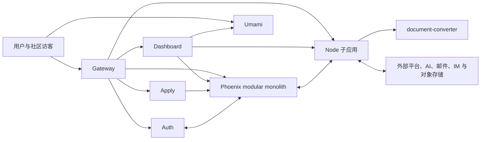

# Groupher 子应用

> 状态：架构约定
>
> 更新：2026-07-24

## 背景

Groupher 的 Phoenix 后端继续保持模块化大单体，现有 Context 仍然拥有领域数据、
权限和事务。这里的“拆子应用”不是把 Phoenix Context 拆成一组拥有独立数据库的
微服务，而是把适合其他运行时、独立部署或独立扩缩容的执行逻辑移出 Dashboard
和 Phoenix。

拆分主要解决以下问题：

- 隔离内容解析、媒体处理、AI SDK、第三方平台 SDK 等重依赖。
- 缩小 Dashboard 的服务端构建范围和部署耦合。
- 让长任务、外部网络调用和第三方投递拥有独立的超时、重试与扩缩容策略。
- 允许 Node、Python 和 vendor application 使用各自最合适的运行时。
- 把第三方平台故障限制在对应执行边界内。

除 `Apply` 和系统级的 `Auth` 外，业务 UI 仍然留在 Dashboard。逻辑迁出
Dashboard 并不必然缩小浏览器端 bundle；它主要移走服务端依赖、构建负担和部署
耦合。`Apply` 隔离低频的社区创建流程，`Auth` 统一所有前端应用的登录和会话入口。

## 总体原则

### Phoenix 保持领域所有权

Phoenix Context 继续负责：

- 用户、社区和权限。
- 社区配置及各类业务数据的 source of truth。
- 配额、计费、审计和人工操作记录。
- 最终业务校验和数据库事务。

子应用不得直接连接 Phoenix 数据库。需要领域数据时，使用有界、可审计的内部 API
或由 Phoenix 发布的版本化事件/快照。

### Dashboard 保持产品 UI

除 `Apply` 和 `Auth` 外，导入、资源管理、AI、风控、分析和集成配置页面都留在
Dashboard。`Integrations` 只是 Dashboard 中的功能分组，不是服务端子应用。

### 子应用拥有执行逻辑

子应用可以拥有以下非领域状态：

- 临时文件和不可变任务产物。
- 队列、重试状态和投递记录。
- 外部服务的短期缓存或只读快照。
- 运行时指标、trace 和诊断信息。

这些状态不能替代 Phoenix 中的业务记录。

### 统一接入和服务信任

- 面向用户的 URL 尽量由 Gateway 保持稳定，再转发到不同部署。
- 内部调用使用 service-to-service 身份、短期凭证和明确的 community/user scope。
- 写操作必须支持幂等键；异步流程应携带 correlation ID 和 trace ID。
- 子应用返回结构化诊断，不能把第三方错误或敏感信息直接暴露给用户。
- 长任务优先使用队列、Workflow 或 Phoenix Outbox，避免请求链无限延长。

### Delegation Token

Phoenix 在入口完成用户鉴权和业务授权后，可以签发短期、自包含的 delegation
token。Token 携带完成当前操作所需的最小身份、community、权限范围、目标服务和
有效期；下游子应用只需验证签名和声明，不需要为了鉴权再次回访 Phoenix。

子应用继续调用更下游的服务时，应传递面向该服务、权限进一步收窄的 delegation
token，而不是传播通用的长期凭证。

Delegation token 只解决授权结果的可信传递，不复制领域数据。下游确实需要读取
canonical 内容、配额或最新业务状态时，仍然通过 Phoenix internal API 获取；最终
敏感写操作也继续由 Phoenix 校验并执行事务。

Browser Session 由 [`auth`](./auth.md) 建立，用来表达用户已经登录；delegation
token 由 Phoenix 针对具体服务和操作签发。两者不能混用。

具体 token 格式、签名算法、密钥分发和轮换机制留到实现阶段决定。

## 本地开发

子应用的本地域名、HTTPS、Gateway 入口和端口映射约定见
[`Portless 本地子应用域名`](./portless.md)。Portless 只负责本地寻址和生产域名
形态模拟，不替代 Dev Hub 的进程管理，也不改变各子应用的部署边界。
服务间 endpoint 的命名和注入约定见 [`子应用地址配置`](./service-endpoints.md)。

## 子应用清单

| 子应用                                          | 运行形态                  | UI 所在位置            | 定位                               | 当前状态                         |
| ----------------------------------------------- | ------------------------- | ---------------------- | ---------------------------------- | -------------------------------- |
| [`content-import`](./content-import.md)         | Node/Hono + Workflow      | Dashboard              | 多来源内容导入和标准化             | 已独立承载 server implementation |
| [`document-converter`](./document-converter.md) | Python/FastAPI            | 无独立 UI              | 单文件到 Markdown 的格式转换       | 已有独立服务                     |
| [`assets-hub`](./assets-hub.md)                 | Node/Hono                 | Dashboard              | 上传、校验、媒体处理和多存储执行层 | 规划中                           |
| [`apply`](./apply.md)                           | 独立 TanStack Start 前端  | 独立 UI                | 社区申请与创建流程                 | V1 目标合同已确认                |
| [`auth`](./auth.md)                             | Node/Hono + Auth.js       | 独立系统 UI            | OAuth、登录和统一会话入口          | 已建立独立应用并由 Gateway 接入  |
| [`Press`](../press/v1.md)                       | Node/Hono                 | Dashboard 配置         | 单向、缓存友好的官方内容输出       | 设计中                           |
| [`posthouse`](./posthouse.md)                   | Node/Hono                 | Dashboard Integrations | Webhook、IM 和邮件的收发中心       | 规划中                           |
| [`ai`](./ai.md)                                 | Node/Hono                 | Dashboard、Docs 和 IM  | AI 能力编排和 provider 适配        | 规划中                           |
| [`risk-center`](./risk-center.md)               | Node/Hono                 | Dashboard              | 风险信号查询、聚合和低延迟判定     | 规划中                           |
| [`umami`](./umami.md)                           | 自托管 vendor application | Dashboard              | 社区访问统计                       | 规划中                           |

## 总体关系

图中的双向连接只代表受信任的 API 或事件交换，不代表共享数据库。

## 不再单独拆分的概念

- `Content Writers`：不创建。文章、Docs、Changelog 等写入继续由现有 Phoenix
  Context 负责。
- `Chat Bots`：平台连接和消息传输归入 `posthouse`；回答生成和工具调用归入
  `ai` 或 Phoenix。
- `Webhooks`：归入 `posthouse` 的 inbound/outbound transport。
- `Integrations`：只保留为 Dashboard 的产品导航和配置集合。
- `Content Convert`：使用已存在且命名更准确的 `document-converter`。
- `Blackhole`：继续作为 Phoenix Context；对应的 Node 执行应用命名为
  `risk-center`。

## 推荐实施顺序

1. 先迁出已经成形的 `content-import` Node 逻辑，并保持 Dashboard UI 和原 URL。
2. 以现有 `document-converter` 作为独立部署范本，补齐服务鉴权和可观测性。
3. 建立 `assets-hub`，先统一上传、删除、公共 URL 和容量结算链路。
4. 建立 `posthouse`，从 outbound webhook 和 Phoenix Outbox 开始。
5. 建立 `risk-center` 的最小查询接口和 Phoenix `Blackhole` 规则快照。
6. 建立统一的 `ai` 应用，再按实际运行差异决定是否细拆。
7. 在独立 `Apply` 前建立统一的 `auth` 边界；按产品需求推进 `Press` 和
   Umami 部署。

实施顺序不是调用依赖顺序。每个子应用都应以可独立部署、可回滚且不改变 Phoenix
领域边界的最小切片开始。
