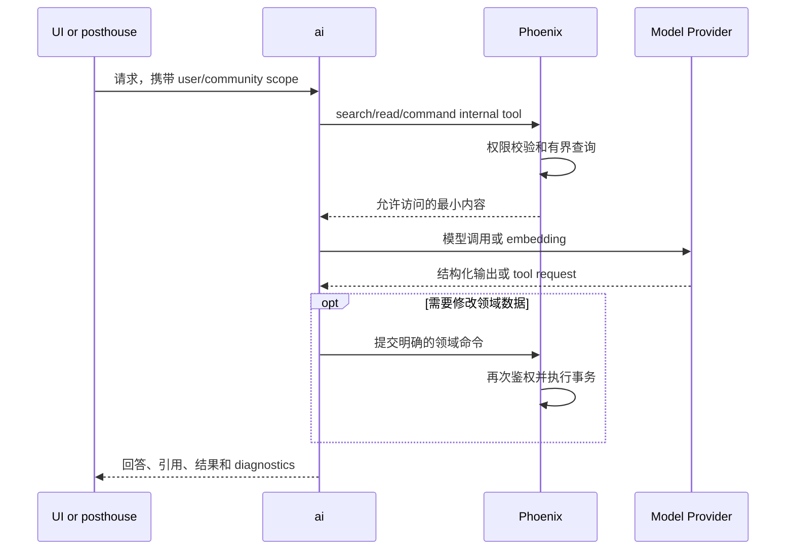

# AI

> 运行形态：Node/Hono
>
> UI：Dashboard、Docs、Main 或经由 IM 使用
>
> 当前状态：规划中；首期保持一个部署、内部按能力分模块

## 定位

`ai` 统一承载 Groupher 的模型调用、provider adapter、工具编排、用量和 trace。
首期不按翻译、审核、重复检测或 Docs Assistant 拆成多个部署；先在同一个 Node
应用中建立清晰模块，等运行特征真正分化后再拆。

AI 能力分为两类：

### 无状态或弱状态能力

- 翻译。
- 摘要。
- 标题、标签和写作建议。
- 文本分类与内容审核辅助。
- 格式或语气改写。

这类请求携带完整输入即可执行，不需要查询 Phoenix 领域数据。

### 依赖 Groupher 内容的能力

- 重复内容和相似问题检测。
- Permission-aware Docs Assistant。
- 社区周报和 Changelog 汇总。
- 基于社区内容的问答与语义检索。
- IM 中查询或操作社区内容。

这类能力必须通过有界、带用户和 community scope 的 Phoenix internal API 读取
数据，不能直接连接数据库。

## 内部模块

首期建议保持以下逻辑目录：

```text
transforms/
moderation/
duplicates/
docs-assistant/
providers/
usage/
traces/
```

- `transforms`：翻译、摘要、标题、标签和改写。
- `moderation`：模型辅助审核和结构化风险信号。
- `duplicates`：精确、文本和语义重复检测。
- `docs-assistant`：有权限约束的检索、阅读、回答和工具调用。
- `providers`：模型 SDK、fallback、超时和统一错误。
- `usage`：token、模型成本、community/user 配额投影。
- `traces`：prompt、tool call、latency 和可审计结果。

## 基本流程

### 无状态转换

```text
Dashboard
  -> AI API with scoped service/user identity
  -> validate input and policy
  -> provider adapter
  -> structured result + usage + diagnostics
  -> Dashboard
```

### 依赖社区数据



在 IM 场景中，平台收发由 `posthouse` 负责；`ai` 只接收标准化消息并返回回复或
工具调用结果。

## 重复内容检测

首期不需要先引入 vector database。推荐流程：

1. 使用 canonical `contentHash` 检测精确重复。
2. 通过 Phoenix `CMS.SearchArtiments` 或专用 internal API 获取少量词法候选。
3. 对新内容和候选调用 `embed`/`embedMany`，使用 cosine similarity 重排。
4. 只对最高分的少量候选调用 LLM 做结构化验证和原因说明。
5. 返回候选 ref、分数和解释，由产品决定提示、Review 或继续发布。

当前公共搜索投影不足以高效返回所有重排材料时，应增加窄的 server-trust 查询，
例如：

```text
searchDuplicateCandidates(
  community,
  thread,
  title,
  plainText,
  limit
)
```

该查询只返回 `ref`、`locator`、`title`、`digest`、`plainText` 和 `contentHash`
等必要字段，避免 AI 应用先搜索再逐条读取造成 N+1。

只有词法召回长期无法覆盖真实相似内容时，才增加预计算 embedding index。

## 内容审核与风控

AI 内容审核返回的是可解释信号，不直接封禁用户或删除内容。结果可交给
`risk-center` 聚合，也可由 Phoenix 在当前业务操作中使用；最终处罚、审计和人工
处置仍由 Phoenix `Blackhole` 及对应领域 Context 完成。

## 数据和安全边界

- Prompt 和 tool input 必须经过权限裁剪，不能把整个 community 数据集发送给模型。
- Provider key 只能存在服务端。
- 日志默认不保存完整私有正文；需要保留时必须有明确用途和 retention。
- 所有结果记录 model、provider、prompt version、tool version 和 usage。
- 模型输出不能绕过 Phoenix 直接执行领域写操作。
- 流式响应中也要保持身份、社区和取消信号。

## 何时继续拆分

只有出现明确运行差异时再拆部署，例如：

- Docs Assistant 需要大量长连接和流式响应。
- 翻译/摘要变成高吞吐批任务。
- embedding indexing 需要独立队列和存储。
- 本地模型或 GPU workload 不能运行在当前平台。

在此之前，一个部署加内部模块比多个边界相似的 AI 微服务更容易治理 provider、
用量、权限和 observability。
