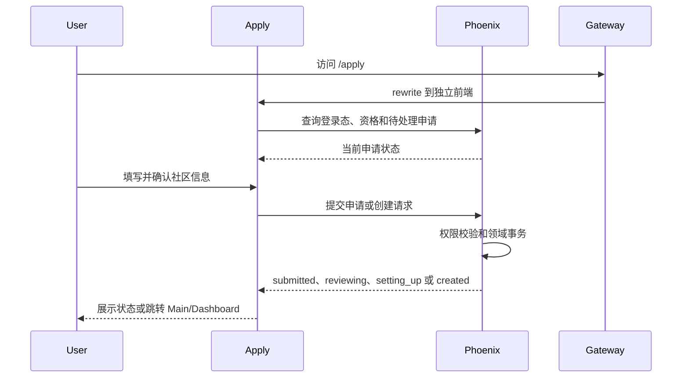

# Apply

> 运行形态：独立 TanStack Start 前端
>
> UI：独立于 Dashboard
>
> 当前状态：V1 目标合同已确认；后端继续使用 Phoenix

详细实现合同见 [`docs/todo/apply_v1.md`](../todo/apply_v1.md)。本文只保留稳定的部署定位和
子应用边界；前端运行时、Phoenix Application 模型、Community Creation/Setup、
迁移顺序和验收标准以 V1 文档为准。

## 定位

`Apply` 承载社区申请、创建和首次初始化流程。它是本组子应用中唯一拆出业务 UI 的
应用，原因是这段流程只出现在用户生命周期的早期；社区创建完成后，用户通常长期
使用 Main 和 Dashboard。

独立部署可以避免把申请流程的页面、表单、预览和相关依赖放进 Dashboard 的常用
bundle。

## 提供的页面和流程

- 未登录用户的登录或注册引导。
- 社区类型、名称、slug/domain 和基础信息填写。
- 创建资格、名称和域名可用性检查。
- 申请状态、审核状态和失败恢复。
- 有全局权限的审核人员使用的审核队列、决策和失败重试；与申请人 Flow 分离 bundle。
- 创建完成后的首次引导及跳转。

具体业务字段和审批模型由 Phoenix 的 `CMS.CommunityApplications` Context 定义，
`Apply` 不建立独立业务后端。

## URL 与部署

推荐继续使用主站路径：

```text
https://groupher.com/apply
```

Gateway 将该路径 rewrite 到独立部署。相比 `apply.groupher.com`，同站路径更容易
保持现有 cookie、OAuth callback 和登录态语义，也不会让用户感知内部部署边界。

`/apply` 是独立 Apply 应用的公开 basepath，不是另一个前端项目中的父 route。Apply 源码
route tree 从 app-local `/` 开始；TanStack Router `basepath` 负责公开 URL 与内部 route 的
双向映射，Gateway 保持 pathname 转发：

```text
Apply /          <-> public /apply
Apply /status/*  <-> public /apply/status/*
Apply /review/*  <-> public /apply/review/*
```

同一规则覆盖静态资源、SSR data、Server Function 和 HMR。独立应用必须拥有自己的
package、app config、router、SSR server、public assets、env、listener 和 health check；
不得把 route、proxy adapter、Provider 或 build output 放回 Main/Dashboard/Dash。

## 基本流程



## 边界

`Apply` 负责：

- 申请和首次创建的页面、交互、表单状态和恢复体验。
- 与 Phoenix API 的前端集成。
- 创建成功后的跨应用导航。

Phoenix 负责：

- 用户身份、创建资格和限额。
- 申请记录、审核、社区创建和初始化事务。
- slug/domain 冲突校验。
- 审计和通知。

`Apply` 不直接连接数据库，不复制社区创建逻辑，也不演变成通用社区初始化服务。

## 关键约束

- 登录态和 CSRF 策略必须与 Main/Dashboard 保持一致。
- Gateway rewrite 后，用户可见 URL 不应跳到部署平台域名。
- 重复提交必须使用幂等键，刷新页面可以恢复 pending 状态。
- 创建成功后应尽快卸载申请流程代码并跳转到长期使用的应用。
