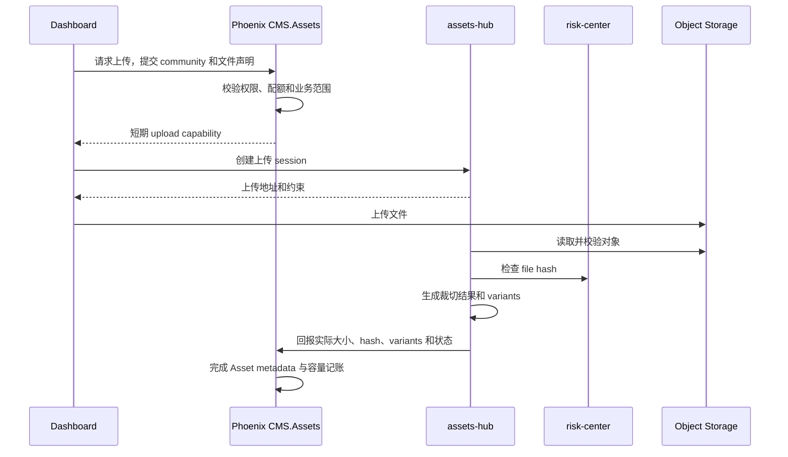

# Assets Hub

> 运行形态：Node/Hono
>
> UI：Dashboard
>
> 当前状态：规划中；Phoenix 已有社区资源及文章资源引用基础

## 定位

`assets-hub` 是资源文件的执行层，负责上传、校验、媒体处理、多存储适配、实际删除
和公共访问路由。Phoenix `CMS.Assets` 继续拥有社区资源元数据、文章引用、权限、
容量和计费事实。

名称使用 `assets-hub` 而不是 `assets-uploader`，因为上传只是资源完整生命周期中的
一个环节。

## 提供的服务

- 创建短期上传授权和 multipart upload。
- 文件类型、大小、签名和内容安全校验。
- 计算 checksum/file hash，并调用 `risk-center` 检查恶意文件。
- 图片裁切、压缩、格式转换、缩略图和响应式 variants。
- 视频、音频等后续媒体处理任务的统一入口。
- S3/R2/Blob 等不同存储平台的 provider adapter。
- 原始对象、variants 和失败任务残留的删除与垃圾回收。
- CDN/origin 路由、缓存失效和 provider migration。
- 向 Phoenix 回报实际存储字节数、处理结果和删除结果。

## 数据所有权

### Phoenix `CMS.Assets`

- `community`、owner、权限和可见性。
- Asset public ref、业务 metadata 和生命周期状态。
- 文章、评论等内容对 Asset 的引用。
- 社区已用容量、配额、套餐和计费投影。
- “仍被引用的资源不能删除”等业务规则。

### `assets-hub`

- Provider、bucket、object key 和 variant key 的执行映射。
- 上传 session、处理 job 和短期任务状态。
- 对象校验结果、checksum 和处理 diagnostics。
- CDN purge、provider deletion 和 storage reconciliation。

`assets-hub` 不直接查询 Phoenix 数据库。执行上传或删除前，由 Phoenix 返回经过
权限和配额判断、签过名且自包含的短期 capability；`assets-hub` 在本地验签，无需
为了鉴权回访 Phoenix。执行结束后再把测量结果回写 Phoenix。

## 上传流程



服务端上传可省略浏览器直传，但权限、配额、校验和 finalize 的边界不变。

## 删除流程

1. Dashboard 向 Phoenix 请求删除资源。
2. Phoenix 校验权限、内容引用、社区范围和计费影响。
3. Phoenix 创建删除意图并向 `assets-hub` 发出有界、幂等的删除任务。
4. `assets-hub` 删除原始对象和所有 variants，发布 tombstone 并清理 CDN 缓存。
5. Phoenix 根据结果更新资源状态和容量；失败任务进入重试或 reconciliation。

删除不能只依赖前端隐藏按钮，也不能先删对象再检查引用。对外访问在删除期间应先
命中 tombstone，避免 CDN 中的旧文件继续可见。

## 公共 URL

外部内容应使用 Groupher 拥有的稳定地址，而不是保存 provider 原始 URL。推荐的
canonical 形态为：

```text
https://assets.groupher.com/a/<assetPublicRef>/<variant>
```

数据库和执行层保存 `provider + bucket + key`。切换存储平台时只修改 origin
resolution，不改变文章中的公共 URL。

社区自定义域名可以把 `/media/...` rewrite 到中央资源域名，但 canonical URL 仍然
由 Groupher 统一管理。

## 关键约束

- 上传 capability 必须短期、限大小、限 MIME、限 community 和限 object key。
- 私有资源不能通过可猜测 URL 变成公开资源。
- 所有 finalize、delete 和 provider callback 必须幂等。
- 实际容量以完成校验后的对象及有效 variants 为准，不信任浏览器声明。
- Provider migration 必须支持双读、回填校验和可回滚切换。
