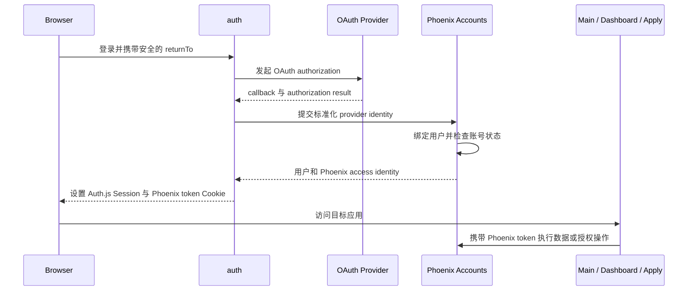

# Auth

> 运行形态：独立 Node/Hono + `@auth/core` 应用
>
> UI：独立的系统级登录 UI
>
> 当前状态：独立 Hono/Auth.js 应用已建立，Main 和 Dashboard 统一经 Gateway 使用

## 定位

`auth` 统一处理 Groupher 各前端应用的 OAuth、登录、登出和 Browser Session。
Main、Dashboard、Apply 以及后续前端应用不再分别部署一套 provider 和 callback
handler，只消费统一登录结果。

该子应用拆分的是认证协议和会话运行边界，不是 Phoenix 的用户领域。用户、
External Identity、账号状态、community membership 和业务权限继续由 Phoenix
管理。

名称使用 `auth` 而不是 `session`，因为 Session 只是其能力之一；OAuth provider、
callback 和登录流程同样属于这个边界。

## 当前状态

迁移前 Main 和 Dashboard 各自提供：

```text
/api/auth/[...nextauth]
/api/auth/logout
```

现在 OAuth provider、callback、logout 和 Phoenix identity exchange 已迁至
`frontend/auth`。Main 和 Dashboard 不再挂载 Auth handler，也不再解码 Auth.js
Session；它们只被动携带 Auth 写入的 `groupher-auth.token`。

## 提供的服务

- GitHub 等 OAuth provider 的授权发起和 callback。
- OAuth state、错误和安全返回地址处理。
- 登录、登出、Session 签发、刷新和失效。
- 统一的 Cookie 名称、作用域和生命周期。
- 登录及 callback 所需的少量系统 UI。
- 向 Main、Dashboard 和 Apply 提供一致的用户登录状态。

## 领域边界

### `auth` 负责

- 外部 OAuth/OIDC 协议。
- Browser Session 的生命周期。
- Provider credential 和 callback 配置。
- 登录完成后返回原始前端应用。

### Phoenix Accounts 负责

- 用户和 External Identity。
- Provider identity 的绑定、冲突与账号合并。
- 账号状态、封禁和风险检查。
- Community membership、角色和业务授权。
- Phoenix access identity 和面向子应用的 delegation token。

### Main、Dashboard 和 Apply 负责

- 触发登录或登出。
- 被动携带 `groupher-auth.token`。
- 根据 Phoenix 返回的当前用户数据展示用户 UI。
- 把需要领域数据或权限判断的操作提交给 Phoenix。

前端应用不再分别维护 OAuth provider、callback 和 Session 签发逻辑。

## 基本流程



## 公共入口

用户可见 URL 继续由 Gateway 保持稳定：

```text
https://groupher.com/login
https://groupher.com/logout
https://groupher.com/api/auth/*
```

Gateway 把这些路径 rewrite 到独立 `auth` 部署。OAuth provider 只配置一组 canonical
callback，不感知 Main、Dashboard 和 Apply 的实际部署地址。

本地开发沿用同一边界。`main.groupher.localhost`、
`dashboard.groupher.localhost` 和 `landing.groupher.localhost` 都先进入 Gateway，
由 Gateway 把 `/api/auth/*` 转发到 Auth。Auth.js 的 Session、CSRF、callback、
state 和 PKCE Cookie 统一设置在 `.groupher.localhost`，因此从任意产品子域发起的
OAuth 流程都能回到 canonical callback：

```text
https://groupher.localhost/api/auth/callback/github
```

发起登录时必须把当前产品 URL（包括子域名）作为完整 `callbackUrl` 传给 Auth。
Auth 完成 canonical callback 后，只允许跳回 `groupher.localhost` 及其受控子域，
从而既保留 `dashboard.groupher.localhost` 等原始入口，也避免开放重定向。

统一 Session 使用 Groupher 专属 Cookie 名称
`__Secure-groupher-auth.session-token`，仅由 Hono/Auth 子应用中的 `@auth/core`
创建、解码、刷新和删除。Main、Dashboard、Gateway 与 Phoenix 都不读取其内容。

浏览器 GraphQL 请求统一访问当前产品域下的 `/api/graphql`。Gateway 仅把 HttpOnly
`groupher-auth.token` Cookie 以同名 Cookie 转发给 Phoenix，不解析 token、不重命名，
也不转换成 `Authorization` header。这样登录态不依赖浏览器跨子域 Cookie、CORS
或第三方 Cookie 策略；
`api.groupher.localhost` 只作为 GraphiQL、诊断和服务间调用入口。

OAuth callback 成功后，Auth 直接把 Phoenix 返回的 access identity 写入专属
HttpOnly Cookie `groupher-auth.token`。Phoenix token 不写入 Auth.js Session，
Main 和 Dashboard 也不承担 Cookie 同步职责。浏览器、Gateway 与 Phoenix 之间只有
`groupher-auth.token` 这一种 Cookie 名称。Phoenix 不兼容旧 `auth.token` Cookie，
`Authorization: Bearer` 仅作为外部 API、CLI 和 agent 调用的后备认证方式。

## Session 与 Delegation Token

Browser Session 表达“用户已经完成登录”，用于 Main、Dashboard 和 Apply 的登录态。
Delegation token 表达“某个服务可以代表该用户，在限定范围内执行某项操作”，由
Phoenix 面向具体下游服务签发。

两者不能混用，也不能把 Browser Session 直接传给 `content-import`、`assets-hub`
等执行应用充当服务授权。

## 关键约束

- Auth.js Session 只属于 Auth 子应用，业务应用不能依赖其 payload 或加密格式。
- `auth` 不缓存或复制 Phoenix 的完整用户和权限数据。
- 敏感业务操作仍由 Phoenix 检查最新账号状态和权限。
- `returnTo` 必须限制在允许的 Groupher 地址内，避免开放重定向。
- 登录、callback 和 logout 必须使用固定 canonical URL。
- 自定义社区域名不能直接共享 `groupher.com` Cookie；后续应使用安全的跳转和一次性
  交换流程解决跨域登录。

## 当前实现

Auth 使用 Hono 承载标准 Web Request/Response，并直接调用 `@auth/core`：

1. 独立 `frontend/auth` Hono/Auth.js 应用负责统一 handler。
2. Gateway 将登录、callback 和 logout 路径转发到 `auth`。
3. Auth 在 callback 完成后同时写入 Auth.js Session 和 `groupher-auth.token`。
4. Main 和 Dashboard 不消费 Auth.js Session，只读取或携带 Phoenix token Cookie。
5. `Apply` 从开始就使用统一入口。

Hono 只负责 HTTP 路由和运行时适配；OAuth provider、state、PKCE、Session 等协议
能力继续由 `@auth/core` 提供。

## 代码与运行入口

`frontend/auth` 不包含 React 或 Next.js 运行时：

| 文件            | 职责                                                        |
| --------------- | ----------------------------------------------------------- |
| `src/app.ts`    | 定义 Hono 路由和 `/health`、`/api/auth/logout`              |
| `src/auth.ts`   | 封装 `@auth/core`、Phoenix identity exchange 和 Cookie 提交 |
| `src/server.ts` | Dev Hub 和独立 Node 部署使用的 HTTP server                  |
| `index.ts`      | Vercel Hono 部署的标准默认导出                              |

Main 和 Dashboard 只调用 `frontend/core/lib/oauth.ts` 暴露的 Groupher Auth 客户端；
客户端不依赖 `next-auth/react`，也不读取或解密 Auth.js Session。

`@auth/core` 当前是 Auth.js 面向 framework adapter 的底层接口，因此所有直接调用都
限制在 `src/auth.ts`。版本使用精确锁定，未来升级只需要验证这一层的标准
`Request -> Response` contract。

## Cookie contract

| Cookie                                 | 写入方               | 消费方                                         | 用途                          |
| -------------------------------------- | -------------------- | ---------------------------------------------- | ----------------------------- |
| `__Secure-groupher-auth.session-token` | `@auth/core`         | 仅 `@auth/core`                                | OAuth Browser Session         |
| `__Secure-groupher-auth.csrf-token` 等 | `@auth/core`         | 仅 `@auth/core`                                | CSRF、state、PKCE 和 callback |
| `groupher-auth.token`                  | Auth 的 Hono wrapper | Main/Dashboard server routes、Gateway、Phoenix | Phoenix 用户认证              |

生产和本地 HTTPS 环境中的 Cookie 均使用 `HttpOnly`、`Secure`、`SameSite=Lax` 和
父域 Domain。Auth.js Session 与 Phoenix Cookie 的首期有效期统一为 14 天。

Auth 只有在 `@auth/core` 的 callback response 确实签发 Session Cookie 后，才追加
`groupher-auth.token`，避免出现只有 Phoenix Cookie、没有 Auth.js Session 的半登录
状态。登出时浏览器只请求 `/api/auth/logout`，由 Auth 子应用统一清理 Auth.js Cookie
和 Phoenix Cookie。

## 环境变量

| 名称                                    | 说明                                                  |
| --------------------------------------- | ----------------------------------------------------- |
| `AUTH_URL`                              | canonical 用户入口，例如 `https://groupher.localhost` |
| `AUTH_COOKIE_DOMAIN`                    | Cookie 父域，例如 `.groupher.localhost`               |
| `NEXTAUTH_SECRET`                       | Auth.js JWT Session 的签名和加密密钥                  |
| `AUTH_GITHUB_ID` / `AUTH_GITHUB_SECRET` | GitHub OAuth App credential                           |
| `GROUPHER_SERVER_TRUST_SECRET`          | Auth 调 Phoenix identity exchange 的服务信任凭证      |
| `PHOENIX_GRAPHQL_ENDPOINT`              | Phoenix GraphQL 内部地址                              |
| `AUTH_COOKIE_SECURE`                    | 非生产环境覆盖 Secure Cookie 推导，仅用于特殊调试     |
| `PORT` / `HOST`                         | 独立 Node server 的监听地址                           |

本地加载顺序是 `.env.local`、`.env.development`、`.env`，先出现的值优先。生产部署
必须显式提供 `AUTH_URL`、`AUTH_COOKIE_DOMAIN` 和所有 secret，不能依赖仓库中的
development 默认值。

## 本地验证

```bash
yarn workspace @groupher/frontend-auth type-check
yarn workspace @groupher/frontend-auth test
yarn workspace @groupher/frontend-auth build
```

实际测试仍通过仓库统一的 Vitest 配置执行。运行中的最小检查为：

```text
GET /health
GET /api/auth/providers
GET /api/auth/csrf
```

完整 OAuth 验证必须从 `https://groupher.localhost` 经 Gateway 发起，不能用
`127.0.0.1:3004` 代替 canonical callback。

## 后续扩展约束

- 当前 profile normalization 只实现 GitHub 字段；新增 provider 时应增加独立
  normalization adapter，不能继续把所有 profile 强制转换成 GitHub profile。
- 自定义社区域名不能共享 Groupher 父域 Cookie，应使用一次性 code exchange。
- Phoenix token 续期策略需要与 Phoenix token TTL 一起设计，不能只延长 Auth.js
  Session。
- `@auth/core` 升级前必须回归 provider、CSRF、callback、Session Cookie 和安全跳转
  五类 contract。
- 当前 Node 侧部分临时资源的 owner ref 由 Phoenix token 摘要派生；token 轮换后，
  尚未完成的 preview 可能无法继续访问。迁出 Content Import 时，应改为由 Phoenix
  校验后返回稳定的 user ref，或将稳定主体放入签名 delegation claims，不能通过
  未验证 JWT payload 推断用户身份。
- `/health` 目前只表示 Auth 进程可用，不表示 OAuth Provider 与 Phoenix 凭据完整。
  生产部署流水线应增加独立的配置校验，缺少必要 secret、Provider credentials、
  `AUTH_COOKIE_DOMAIN` 或 Phoenix 地址时直接阻止发布。
