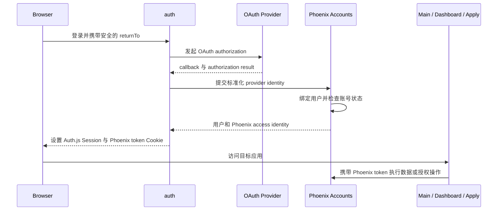

# Auth

> 运行形态：生产为 Cloudflare Worker；本地为独立 Node/Hono + `@auth/core` 应用
>
> UI：独立的系统级登录 UI
>
> 当前状态：Auth Worker 已上线；平台根域由 `edge-router` Service Binding 接入，独立域名为
> `auth.groupher.com`；本地 Dev Gateway 仅用于开发

## 定位

`auth` 统一处理 Groupher 各前端应用的 OAuth、登录、登出和 Browser Session。
Community、Dash、Apply 以及后续前端应用不再分别部署一套 provider 和 callback
handler，只消费统一登录结果。

该子应用拆分的是认证协议和会话运行边界，不是 Phoenix 的用户领域。用户、
External Identity、账号状态、community membership 和业务权限继续由 Phoenix
管理。

名称使用 `auth` 而不是 `session`，因为 Session 只是其能力之一；OAuth provider、
callback 和登录流程同样属于这个边界。

## 当前状态

迁移前 Main 和 Dashboard 各自提供：

```text
/api/auth/[...nextauth]
/api/auth/logout
```

现在 OAuth provider、callback、logout 和 Phoenix identity exchange 已迁至
`backend/auth`。生产请求可通过 `edge-router` 的 Auth Service Binding 或直接访问
`auth.groupher.com`；Community、Dash 和其他产品不再挂载 Auth handler，也不再
解码 Auth.js Session，只被动携带 Auth 写入的 `groupher-auth.token`。

## 提供的服务

- GitHub 等 OAuth provider 的授权发起和 callback。
- OAuth state、错误和安全返回地址处理。
- 登录、登出、Session 签发、刷新和失效。
- 统一的 Cookie 名称、作用域和生命周期。
- 登录及 callback 所需的少量系统 UI。
- 向 Community、Dash 和 Apply 提供一致的用户登录状态。

## 领域边界

### `auth` 负责

- 外部 OAuth/OIDC 协议。
- Browser Session 的生命周期。
- Provider credential 和 callback 配置。
- 登录完成后返回原始前端应用。

### Phoenix Accounts 负责

- 用户和 External Identity。
- Provider identity 的绑定、冲突与账号合并。
- 账号状态、封禁和风险检查。
- Community membership、角色和业务授权。
- Phoenix access identity 和面向子应用的 delegation token。

### Main、Dashboard 和 Apply 负责

- 触发登录或登出。
- 被动携带 `groupher-auth.token`。
- 根据 Phoenix 返回的当前用户数据展示用户 UI。
- 把需要领域数据或权限判断的操作提交给 Phoenix。

前端应用不再分别维护 OAuth provider、callback 和 Session 签发逻辑。

## 基本流程



## 公共入口

生产环境保留 canonical Auth 直连入口，同时平台根域通过 `edge-router` 接入同一个 Auth
Worker：

```text
https://auth.groupher.com/api/auth/*  -> auth Worker
https://groupher.com/api/auth/*       -> edge-router -> AUTH Service Binding -> auth Worker
```

`groupher.com/api/auth/*` 不是旧 Gateway rewrite，而是生产 edge-router 的正式同源入口。
前端共享 Auth consumer 默认使用 `https://auth.groupher.com/api/auth`，因此跨源请求显式
使用 `credentials: include`；需要同源浏览器 API 的场景才使用平台根域路径。Dash、Apply
等独立产品仍可直接访问 canonical Auth。
`https://groupher.com/login` 和 `/logout` 可以继续作为用户导航入口，但最终的 OAuth、
Session、refresh、logout 和设备管理协议均落在 canonical Auth。OAuth provider 只配置
一组 canonical callback，不感知各产品的实际部署地址。

### GitHub OAuth App callback

生产 GitHub OAuth App 的 `Authorization callback URL` 必须指向真实承载 Auth.js
callback handler 的 Auth 子应用，而不是 Landing/Main 的公开入口：

```text
https://auth.groupher.com/api/auth/callback/github
```

这是当前架构的正式配置，不是 workaround。GitHub OAuth App 的 callback allowlist
校验发生在 provider 侧，必须与发起授权时传给 GitHub 的 `redirect_uri` 完全一致。
线上发起授权时使用 `auth.groupher.com`，因此 GitHub App 也必须登记
`auth.groupher.com` 的 callback。平台根域的 edge-router 或本地 Gateway 上的
`/api/auth/*` 转发都不能改变这个 canonical callback。

生产 Auth Worker 的 `AUTH_URL` 必须固定为 `https://auth.groupher.com`，它决定 Auth.js
生成的 provider `redirect_uri`，也是 V1 credentialed browser API 的唯一入口。

本地开发使用单独的 GitHub OAuth App，不复用线上 credential。本地 callback 应填写
本地 Auth/Gateway 实际承载的 callback URL；生产 app 和 local app 的
`AUTH_GITHUB_ID` / `AUTH_GITHUB_SECRET` 必须分别通过对应环境变量或平台 secret 注入。

本地开发为了复用本地 TLS 和 Gateway，将 canonical Auth 开发入口收敛为
`https://groupher.localhost/api/auth`，由 Gateway 把该路径转发到 Auth：

```text
https://groupher.localhost/api/auth/callback/github
```

Auth.js 的 Session、CSRF、callback、state、PKCE、nonce 和 challenge Cookie 在
`groupher.localhost` 上保持 host-only；只有 Phoenix access token 和非敏感 hint 使用
`Domain=.groupher.localhost`，供受信产品子域携带。生产环境则直接使用独立的
`auth.groupher.com` canonical origin。

发起登录时必须把当前产品 URL（包括子域名）作为完整 `callbackUrl` 传给 Auth。
Auth 完成 canonical callback 后，只允许跳回 `groupher.localhost` 及其受控子域，
从而既保留 `dashboard.groupher.localhost` 等原始入口，也避免开放重定向。

Browser Session V1 已把 OAuth 发起入口收敛到 canonical Auth origin，并将 90 天 Auth
Browser Session 以及 CSRF、callback、state、PKCE、nonce 等 Auth.js 协议 Cookie 改为
`auth.groupher.com` host-only。产品仍使用共享 Login Modal，但不再依赖父域 Auth.js
Cookie；父域只保留 30 分钟 Phoenix token 和非敏感 hint。Refresh/logout 使用独立的
Origin/custom-header CSRF contract。

统一 Session 使用 Groupher 专属 Cookie 名称
`__Host-groupher-auth.session-token`，仅由 Hono/Auth 子应用中的 `@auth/core`
创建、解码、刷新和删除。Main、Dashboard、Gateway 与 Phoenix 都不读取其内容。

浏览器 GraphQL 请求统一访问当前产品域下的 `/api/graphql`。Gateway 仅把 HttpOnly
`groupher-auth.token` Cookie 以同名 Cookie 转发给 Phoenix，不解析 token、不重命名，
也不转换成 `Authorization` header。生产环境中，产品 Login Modal 和共享 Auth
consumer 通过带 credentials 的跨源请求直接访问 canonical Auth；OAuth CSRF
bootstrap、signin、callback、Session probe、Session list、refresh、logout 和
Session revoke 都在 `auth.groupher.com` 完成。GraphQL 继续走当前产品的同源入口：生产
经 edge-router，开发经 Gateway。`api.groupher.localhost` 只作为 GraphiQL、诊断和服务间
调用入口。

首方子域共享的只是 `AUTH_COOKIE_DOMAIN=.groupher.com`（本地为
`.groupher.localhost`）上的短期 Phoenix access token 和非敏感 hint；Auth.js
Session 和协议 Cookie 不使用父域 Domain。

设备列表和吊销的 Phoenix 能力只供 Auth 通过 trusted operation 调用，不暴露为浏览器
GraphQL Session mutation。

`landing.groupher.com`（包括 `/`、`/pricing`、`/book-demo` 等页面）是完全公开的
Landing 应用，不提供登录、账号、Session 或业务 GraphQL 变更能力。V1 的
capability-based exact-origin registry 必须将它排除在 OAuth bootstrap、Session
read/write 和 browser GraphQL state-change origin 之外。`groupher.com` 仍属于 Auth
消费者，因为同一 origin 同时承载需要登录的 Main 路径。

OAuth callback 成功后，Auth 直接把 Phoenix 返回的 access identity 写入专属
HttpOnly Cookie `groupher-auth.token`。Phoenix token 不写入 Auth.js Session，
Main 和 Dashboard 也不承担 Cookie 同步职责。浏览器、Gateway 与 Phoenix 之间只有
`groupher-auth.token` 这一种 Phoenix GraphQL 凭证 Cookie。Phoenix 不兼容旧
`auth.token` Cookie，
`Authorization: Bearer` 仅作为外部 API、CLI 和 agent 调用的后备认证方式。

## Session 与 Delegation Token

Browser Session 表达“用户已经完成登录”，用于 Main、Dashboard 和 Apply 的登录态。
Delegation token 表达“某个服务可以代表该用户，在限定范围内执行某项操作”，由
Phoenix 面向具体下游服务签发。

两者不能混用，也不能把 Browser Session 直接传给 `content-import`、`assets-hub`
等执行应用充当服务授权。

## 关键约束

- Auth.js Session 只属于 Auth 子应用，业务应用不能依赖其 payload 或加密格式。
- `auth` 不缓存或复制 Phoenix 的完整用户和权限数据。
- 敏感业务操作仍由 Phoenix 检查最新账号状态和权限。
- `returnTo` 必须限制在允许的 Groupher 地址内，避免开放重定向。
- 登录、callback 和 logout 必须使用固定 canonical URL。
- 自定义社区域名不能直接共享 `groupher.com` Cookie；后续应使用安全的跳转和一次性
  交换流程解决跨域登录。

## 当前实现

Auth 使用 Hono 承载标准 Web Request/Response，并直接调用 `@auth/core`：

1. `backend/auth` 的 Worker entrypoint 拥有 OAuth、Browser Session、refresh、logout
   和设备管理 browser API；`src/server.ts` 只用于本地 Node 运行时。
2. 生产 consumer 可直连 canonical Auth，也可通过 `edge-router` 的 `/api/auth/*` 正式同源
   路由访问同一个 Worker；本地 Gateway 只负责本地开发入口。
3. Auth 在 callback 完成后写入 host-only Auth.js Session，并提交父域
   `groupher-auth.token` 和非敏感 hint。
4. Main、Dashboard、Dash 和 Apply 不消费 Auth.js Session，只读取或携带 Phoenix
   token Cookie，并通过共享 `~/auth` consumer 调用 Auth。
5. 浏览器 GraphQL 继续访问产品同源 `/api/graphql`，生产由 edge-router、开发由 Gateway
   执行受限转发。

Hono 只负责 HTTP 路由和运行时适配；OAuth provider、state、PKCE、Session 等协议
能力继续由 `@auth/core` 提供。

## 代码与运行入口

`backend/auth` 不包含 React 或 Next.js 运行时：

| 文件            | 职责                                                        |
| --------------- | ----------------------------------------------------------- |
| `src/app.ts`    | 定义 health、Session probe/refresh/logout/list/revoke 路由  |
| `src/auth.ts`   | 封装 `@auth/core`、Phoenix identity exchange 和 Cookie 提交 |
| `src/server.ts` | 本地 Node server 和开发验证使用的 HTTP server               |
| `src/worker.ts` | Cloudflare Worker production entrypoint                     |

Main、Dashboard、Dash 和 Apply 通过 `~/auth`（`frontend/core/lib/auth/`）消费共享
Groupher Auth 客户端；`frontend/core/lib/oauth.ts` 只保留 `signIn` / `signOut` 的兼容
转发。客户端不依赖 `next-auth/react`，也不读取或解密 Auth.js Session。

`@auth/core` 当前是 Auth.js 面向 framework adapter 的底层接口，因此所有直接调用都
限制在 `src/auth.ts`。版本使用精确锁定，未来升级只需要验证这一层的标准
`Request -> Response` contract。

## Cookie contract

| Cookie                               | 写入方               | 消费方                               | 用途                          |
| ------------------------------------ | -------------------- | ------------------------------------ | ----------------------------- |
| `__Host-groupher-auth.session-token` | `@auth/core`         | 仅 canonical Auth                    | 90 天 Browser Session         |
| `__Host-groupher-auth.csrf-token` 等 | `@auth/core`         | 仅 canonical Auth                    | CSRF、state、PKCE 和 callback |
| `groupher-auth.token`                | Auth 的 Hono wrapper | Community/Dash、Dev Gateway、Phoenix | Phoenix 用户认证              |
| `groupher-auth.signed-in`            | Auth 的 Hono wrapper | 首方浏览器应用                       | 非敏感登录提示，不是凭证      |

生产和本地 HTTPS 环境中的 Credential Cookie 使用 `HttpOnly`、`Secure` 和
`SameSite=Lax`。90 天 Auth Browser Session 与协议 Cookie 使用 `__Host-` 且不含
`Domain`；30 分钟 Phoenix access token 使用父域 Domain。`groupher-auth.signed-in`
同样使用父域 Domain，但它是浏览器可读的非敏感提示，不使用 `HttpOnly`，也不能作为
登录证明。完整生命周期以 [`docs/auth/v1.md`](../auth/v1.md) 为准。

当前父域 Cookie 会被浏览器发送给 `groupher.com` 及其所有匹配子域，包括
`landing.groupher.com`、`dash.groupher.com` 和 `auth.groupher.com`。这不表示每个子域都是
Auth 消费者：
Landing 在 V1 中没有 Auth origin capability，但由于浏览器只按
`Domain=.groupher.com` 匹配，它的部署服务器仍可能收到当前 30 分钟 Phoenix Cookie。
因此整个 `*.groupher.com` DNS 和部署命名空间都是 credential-trusted boundary，
必须禁止用户托管、及时移除可被第三方接管的废弃子域。自定义社区域名不在此边界
内，不能接收这些 Cookie。

Auth 只有在 `@auth/core` 的 callback response 确实签发 Session Cookie 后，才追加
`groupher-auth.token`，避免出现只有 Phoenix Cookie、没有 Auth.js Session 的半登录
状态。登出时浏览器只请求 `/api/auth/logout`，由 Auth 子应用统一清理 Auth.js Cookie
和 Phoenix Cookie。

## 环境变量

| 名称                                                    | 说明                                                  |
| ------------------------------------------------------- | ----------------------------------------------------- |
| `AUTH_URL`                                              | canonical 用户入口，例如 `https://groupher.localhost` |
| `AUTH_COOKIE_DOMAIN`                                    | Cookie 父域，例如 `.groupher.localhost`               |
| `NEXTAUTH_SECRET`                                       | Auth.js JWT Session 的签名和加密密钥                  |
| `AUTH_GITHUB_ID` / `AUTH_GITHUB_SECRET`                 | GitHub OAuth App credential                           |
| `SERVICE_AUTH_CLIENT_ID` / `SERVICE_AUTH_CLIENT_SECRET` | Auth 调 Phoenix Session API 的独立 client credential  |
| `SERVICE_AUTH_TOKEN_ENDPOINT`                           | Service Identity client-credentials endpoint          |
| `SERVICE_AUTH_CLIENTS_JSON`                             | Auth-owned service client registry                    |
| `SERVICE_AUTH_RESOURCES_JSON`                           | RFC 8707 resource 到 audience 的注册映射              |
| `SERVICE_AUTH_SIGNING_JWK`                              | Service access token 的 RS256 private signing JWK     |
| `SERVICE_AUTH_ISSUER`                                   | Service access token issuer                           |
| `PHOENIX_GRAPHQL_ENDPOINT`                              | Phoenix GraphQL 内部地址                              |
| `AUTH_COOKIE_SECURE`                                    | 非生产环境覆盖 Secure Cookie 推导，仅用于特殊调试     |
| `PORT` / `HOST`                                         | 独立 Node server 的监听地址                           |

每个产品前端可用 `NEXT_PUBLIC_AUTH_ENDPOINT` 覆盖 Auth 地址；默认值为 canonical Auth 的完整地址：
本地为 `https://groupher.localhost/api/auth`，生产为
`https://auth.groupher.com/api/auth`。Refresh、logout、Session list/revoke 都由浏览器
直接请求该地址。平台根域的 `/api/auth/*` 由 edge-router 提供同源入口，但不是第二套
Auth 实现；它只转发到同一个 Auth Worker。共享前端常量在生产环境缺少配置时仍回退到
canonical Auth 地址。

### Content Import service clients

Docs Import 使用两段互不复用的身份合同：

| client         | resource                                       | audience                      | scope                  |
| -------------- | ---------------------------------------------- | ----------------------------- | ---------------------- |
| Dash           | `https://content-import.groupher.com/internal` | `content-import:internal-api` | `docs:import:proxy`    |
| Content Import | `https://api.groupher.com/content-import`      | `phoenix:content-import-api`  | `content-import:write` |

`SERVICE_AUTH_CLIENTS_JSON` 必须分别注册 `serviceName: dash` 和 `content-import` client，并只
授予表内 audience/scope。实际 client id、credential hash 和 secret 属于部署配置，不提交到
仓库。Phoenix 不再注册或接受 `phoenix:dashboard-api`。当前没有 scheduler service 或 Cron
trigger，Auth 不为 Docs Import 注册 scheduler audience。

Cloudflare Worker 部署还声明 `AUTH_REFRESH_RATE_LIMITER` 原生 Rate Limiting binding，
同时按客户端和 `browserSessionRef` 计数。修改 `wrangler.jsonc` 中的 namespace 时必须
保证它在当前 Cloudflare account 内唯一；触发限制返回 `429 RATE_LIMITED` 与
`Retry-After`。Node 和本地运行时的有界内存 limiter 只作为开发 fallback。

本地加载顺序是 `.env.local`、`.env.development`、`.env`，先出现的值优先。生产部署
必须显式提供 `AUTH_URL`、`AUTH_COOKIE_DOMAIN` 和所有 secret，不能依赖仓库中的
development 默认值。

## 本地验证

```bash
pnpm --filter @groupher/backend-auth run type-check
pnpm --filter @groupher/backend-auth run test
pnpm --filter @groupher/backend-auth run build
```

实际测试仍通过仓库统一的 Vitest 配置执行。运行中的最小检查为：

```text
GET /health
GET /api/auth/providers
GET /api/auth/csrf
```

完整 OAuth 验证必须从 `https://groupher.localhost` 经 Gateway 发起，不能用
`127.0.0.1:3004` 代替 canonical callback。

## 后续扩展约束

- 当前 profile normalization 只实现 GitHub 字段；新增 provider 时应增加独立
  normalization adapter，不能继续把所有 profile 强制转换成 GitHub profile。
- 自定义社区域名不能共享 Groupher 父域 Cookie，应使用一次性 code exchange。
- Phoenix token 续期策略需要与 Phoenix token TTL 一起设计，不能只延长 Auth.js
  Session。
- `@auth/core` 升级前必须回归 provider、CSRF、callback、Session Cookie 和安全跳转
  五类 contract。
- Content Import 的 preview owner subject 必须由 Phoenix 在验证 service/user
  双重凭据后返回稳定的 delegation subject；不能通过未验证 JWT payload 推断用户身份。
- `/health` 目前只表示 Auth 进程可用，不表示 OAuth Provider 与 Phoenix 凭据完整。
  生产部署流水线应增加独立的配置校验，缺少必要 secret、Provider credentials、
  `AUTH_COOKIE_DOMAIN` 或 Phoenix 地址时直接阻止发布。
