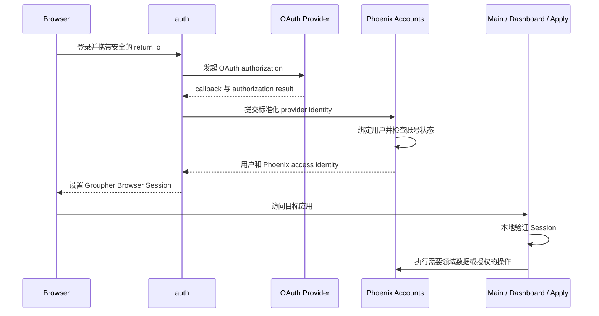

# Auth

> 运行形态：独立 Next.js + Auth.js 应用
>
> UI：独立的系统级登录 UI
>
> 当前状态：独立 Auth.js 应用已建立，Main 和 Dashboard 统一经 Gateway 使用

## 定位

`auth` 统一处理 Groupher 各前端应用的 OAuth、登录、登出和 Browser Session。
Main、Dashboard、Apply 以及后续前端应用不再分别部署一套 provider 和 callback
handler，只消费统一登录结果。

该子应用拆分的是认证协议和会话运行边界，不是 Phoenix 的用户领域。用户、
External Identity、账号状态、community membership 和业务权限继续由 Phoenix
管理。

名称使用 `auth` 而不是 `session`，因为 Session 只是其能力之一；OAuth provider、
callback 和登录流程同样属于这个边界。

## 当前状态

迁移前 Main 和 Dashboard 各自提供：

```text
/api/auth/[...nextauth]
/api/auth/logout
```

现在 OAuth provider、callback、logout 和 Phoenix identity exchange 已迁至
`frontend/auth`。Main 和 Dashboard 不再挂载 Auth handler，但继续使用相同的
`NEXTAUTH_SECRET` 本地验证 Browser Session；这避免业务请求为了读取登录态回访
Auth。

## 提供的服务

- GitHub 等 OAuth provider 的授权发起和 callback。
- OAuth state、错误和安全返回地址处理。
- 登录、登出、Session 签发、刷新和失效。
- 统一的 Cookie 名称、作用域和生命周期。
- 登录及 callback 所需的少量系统 UI。
- 向 Main、Dashboard 和 Apply 提供一致的用户登录状态。

## 领域边界

### `auth` 负责

- 外部 OAuth/OIDC 协议。
- Browser Session 的生命周期。
- Provider credential 和 callback 配置。
- 登录完成后返回原始前端应用。

### Phoenix Accounts 负责

- 用户和 External Identity。
- Provider identity 的绑定、冲突与账号合并。
- 账号状态、封禁和风险检查。
- Community membership、角色和业务授权。
- Phoenix access identity 和面向子应用的 delegation token。

### Main、Dashboard 和 Apply 负责

- 触发登录或登出。
- 本地读取并验证登录状态。
- 根据 Session 展示用户 UI。
- 把需要领域数据或权限判断的操作提交给 Phoenix。

前端应用不再分别维护 OAuth provider、callback 和 Session 签发逻辑。

## 基本流程



## 公共入口

用户可见 URL 继续由 Gateway 保持稳定：

```text
https://groupher.com/login
https://groupher.com/logout
https://groupher.com/api/auth/*
```

Gateway 把这些路径 rewrite 到独立 `auth` 部署。OAuth provider 只配置一组 canonical
callback，不感知 Main、Dashboard 和 Apply 的实际部署地址。

本地开发沿用同一边界。`main.groupher.localhost`、
`dashboard.groupher.localhost` 和 `landing.groupher.localhost` 都先进入 Gateway，
由 Gateway 把 `/api/auth/*` 转发到 Auth。Auth.js 的 Session、CSRF、callback、
state 和 PKCE Cookie 统一设置在 `.groupher.localhost`，因此从任意产品子域发起的
OAuth 流程都能回到 canonical callback：

```text
https://groupher.localhost/api/auth/callback/github
```

发起登录时必须把当前产品 URL（包括子域名）作为完整 `callbackUrl` 传给 Auth。
Auth 完成 canonical callback 后，只允许跳回 `groupher.localhost` 及其受控子域，
从而既保留 `dashboard.groupher.localhost` 等原始入口，也避免开放重定向。

统一 Session 使用 Groupher 专属 Cookie 名称
`__Secure-groupher-auth.session-token`。Main、Dashboard 和 Auth 共享同一份 Cookie
contract，并在解码时显式指定该名称，避免迁移前各应用遗留的
`__Secure-authjs.session-token` 与新 Session 发生同名、不同 Domain 的冲突。

浏览器 GraphQL 请求统一访问当前产品域下的 `/api/graphql`。Gateway 仅把 HttpOnly
`groupher-auth.token` Cookie 以同名 Cookie 转发给 Phoenix，不解析 token、不重命名，
也不转换成 `Authorization` header。这样登录态不依赖浏览器跨子域 Cookie、CORS
或第三方 Cookie 策略；
`api.groupher.localhost` 只作为 GraphiQL、诊断和服务间调用入口。

Main 和 Dashboard 把 JWT payload 内的 Phoenix `auth.token` 同步为专属 HttpOnly
Cookie `groupher-auth.token`。其中 JWT payload 字段只是 Auth.js Session 的内部数据；
浏览器、Gateway 与 Phoenix 之间只有 `groupher-auth.token` 这一种 Cookie 名称。
Phoenix 不兼容旧 `auth.token` Cookie，`Authorization: Bearer` 仅作为外部 API、
CLI 和 agent 调用的后备认证方式。

## Session 与 Delegation Token

Browser Session 表达“用户已经完成登录”，用于 Main、Dashboard 和 Apply 的登录态。
Delegation token 表达“某个服务可以代表该用户，在限定范围内执行某项操作”，由
Phoenix 面向具体下游服务签发。

两者不能混用，也不能把 Browser Session 直接传给 `content-import`、`assets-hub`
等执行应用充当服务授权。

## 关键约束

- 统一签发 Session，但业务应用应能本地验证，不能每次请求都同步查询 `auth`。
- `auth` 不缓存或复制 Phoenix 的完整用户和权限数据。
- 敏感业务操作仍由 Phoenix 检查最新账号状态和权限。
- `returnTo` 必须限制在允许的 Groupher 地址内，避免开放重定向。
- 登录、callback 和 logout 必须使用固定 canonical URL。
- 自定义社区域名不能直接共享 `groupher.com` Cookie；后续应使用安全的跳转和一次性
  交换流程解决跨域登录。

## 迁移方向

首期继续使用现有 Auth.js 实现，只移动运行边界：

1. 独立 `frontend/auth` Next.js/Auth.js 应用负责统一 handler。
2. Gateway 将登录、callback 和 logout 路径转发到 `auth`。
3. Main 和 Dashboard 只保留 Session 消费能力。
4. `Apply` 从开始就使用统一入口。

认证框架、Session 格式和密钥轮换方式等实现选择留到迁移阶段决定。
