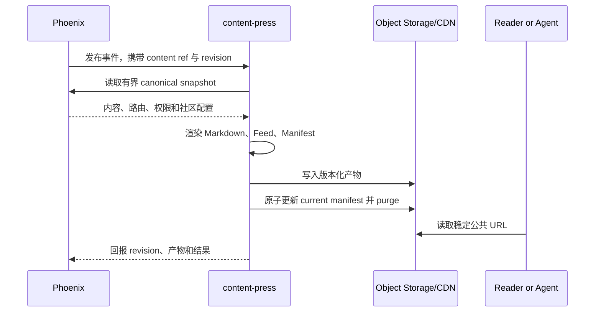

# Content Press

> 运行形态：Node/Hono
>
> UI：配置位于 Dashboard
>
> 当前状态：规划中

## 定位

`content-press` 把 Phoenix 中的 canonical 内容发布为单向、静态、官方的衍生产物。
`Press` 强调这些输出由 Groupher 发布、适合缓存和机器消费，而不是一个允许回写
内容的双向同步服务。

它统一解决 RSS 和文章 Markdown 等输出，避免 Docs、Changelog 和其他 Thread
分别维护一套导出机制。在 AI/Agent 场景下，同一机制也可以生成稳定、可发现、
可引用的机器友好内容。

## 提供的服务

- 单篇文章或 Docs 页面 Markdown 输出。
- RSS、Atom 和 JSON Feed。
- `llms.txt`、聚合 Markdown 和其他 agent-friendly manifest。
- sitemap、可下载 docs package 和静态索引清单。
- Changelog、Docs、Blog 等 Thread 的版本化 feed。
- 自定义域名下静态输出的路由和缓存刷新。
- 删除、撤回或权限变化后的 unpublish、tombstone 和 CDN purge。
- 面向下游搜索系统的版本化导出文档。

在线搜索索引目前仍可由 Phoenix `CMS.SearchArtiments` 维护；生成搜索导出物并不
自动意味着把现有在线搜索所有权迁到 `content-press`。

## 数据所有权

Phoenix 负责：

- canonical 内容、发布状态、权限和 community 配置。
- custom domain、可见 Thread 和 feed 开关。
- 发布、更新、删除等领域事件。

`content-press` 负责：

- 内容快照到输出格式的纯渲染。
- 模板、输出 schema 和 renderer version。
- 静态对象、manifest、缓存和原子切换。
- 生成任务、重试和技术 diagnostics。

它不能直接修改文章、Docs tree 或发布状态。

## 基本流程



## 幂等与版本

建议使用以下内容组成生成键：

```text
communityRef + contentRef + contentRevision + rendererVersion + outputKind
```

相同生成键必须产生相同结果。新的 revision 先写入不可变对象，再原子更新公开
manifest，避免读者看到半套 Feed 或 Docs package。

## 边界

`content-press` 不负责：

- 编辑或保存 canonical 内容。
- 从外部平台导入内容；该能力属于 `content-import`。
- Webhook、IM 或邮件投递；该能力属于 `posthouse`。
- AI 摘要和翻译本身；需要时调用 `ai` 并显式记录模型及 prompt version。
- 绕过 Phoenix 权限发布私有内容。

## 关键约束

- 每种输出格式都必须有 schema/renderer version。
- 私有或未发布内容不能落到公共 CDN。
- 内容删除和权限收紧必须优先于普通重建任务。
- canonical URL 应由 Groupher/Gateway 控制，不能绑定到某个存储 provider。
- Feed 和 agent 输出必须有明确的分页、大小和速率边界。
