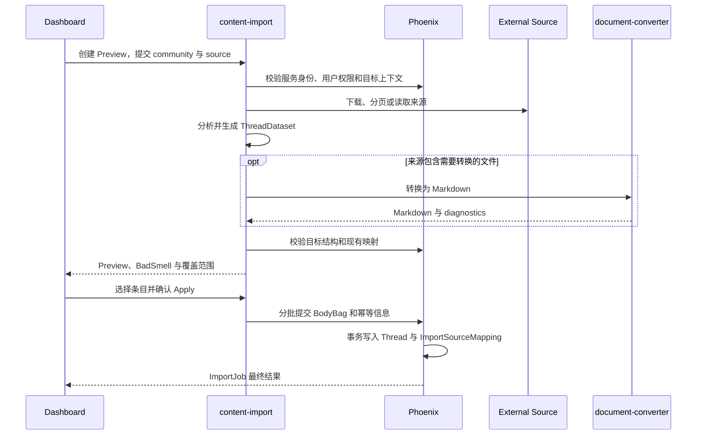

# Content Import

> 运行形态：Node/Hono + Workflow
>
> UI：Dashboard
>
> 当前状态：`backend/content-import` 已承载 server implementation；Dashboard 原 URL
> 只保留稳定 proxy 和产品 UI。

## 定位

`content-import` 负责从外部来源读取内容，把来源差异收敛为 Groupher 可 Review、
可 Apply 的版本化 Dataset。它是导入执行与编排层，不拥有社区内容，也不直接写入
Phoenix 数据库。

详细的 Dataset、PreviewStore 和 Phoenix 写入约束继续以
[`../bulk-import/content_import_architecture.md`](../bulk-import/content_import_architecture.md)
为准；本文只描述独立部署后的子应用边界。

## 本地入口

```bash
make be.content-import.start
```

本地固定端口为 `8001`，健康检查为 `GET /health`。Portless alias 为
`https://content-import.groupher.localhost/health`。

## 提供的服务

- Platform credential、API client、限流和有界重试。
- GitHub、Notion、Linear、Discourse 等 Platform/Source adapter。
- 下载、分页、安全解压和临时 workspace 管理。
- Docs framework 检测、导航分析和 canonical SourceTree。
- Markdown/MDX 安全清洗，禁止执行来源代码、表达式或构建命令。
- 构建版本化 `DocsDataset`、`ChangelogDataset` 或 `PostDataset`。
- Preview、BadSmell、选择范围和不可变任务产物管理。
- 调用共享 Import Content 生成 BodyBag，并以有界批次提交给 Phoenix。
- 导入进度、结构化错误、reset 和有限重试。

单文件 PDF、DOCX、PPTX、XLSX、HTML 到 Markdown 的转换委托给
[`document_converter`](./document_converter.md)。`content-import` 仍然负责来源
编排、Dataset 和目标映射。

## 边界

### `content-import` 负责

- 外部来源的访问和标准化。
- 临时文件、PreviewStore 和不可变 Dataset。
- 来源 revision、外部 item identity 和 BadSmell。
- 导入分析与准备阶段的长任务。

### Phoenix 负责

- 当前用户、community 和 `doc.import` 等权限。
- ImportJob、PostgreSQL staging 和 batch 幂等。
- 目标 revision、树结构和领域约束校验。
- 最终 Thread 写入事务和 `ImportSourceMapping`。
- 同来源再次导入时的覆盖审计及最终落库结果。

### Dashboard 负责

- 来源配置、进度、Preview、Review 和 Apply UI。
- 通过 `CONTENT_IMPORT_APP_ENDPOINT` 调用 content-import，不执行导入 handler。
- 对覆盖范围和风险进行明确提示。
- 同来源映射冲突时允许用户确认后继续覆盖；无法映射的目标冲突才阻止 Apply。

## 基本流程



## 关键约束

- Dataset 和 API contract 必须显式版本化。
- Preview 必须有 owner、community、TTL 和 source revision，不能依赖进程内状态。
- 技术重试不能生成多个互相竞争的业务 attempt。
- Apply 前 Phoenix 必须重新校验权限、source identity、mapping 和 target revision。
- 不导入 Groupher 用户；外部 actor 只能先作为外部身份引用。
- 首期不设计通用断点恢复引擎，失败后允许 reset/re-import。

## 与其他子应用的关系

- 调用 `document-converter` 完成非 Markdown 文档转换。
- 后续导入资源时，通过 `assets-hub` 上传并建立资源引用。
- 可把来源 URL、域名和文件 hash 交给 `risk-center` 做预检查。
- 导入完成后的公开派生输出由 `Press` 负责，不由导入流程生成。
