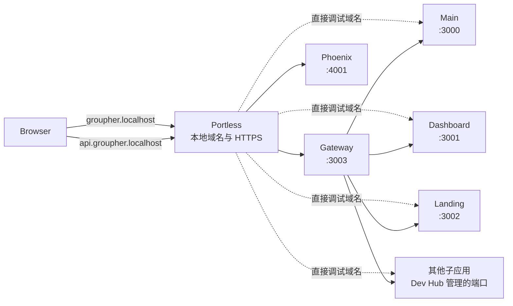

# Portless 本地子应用域名

> 定位：本地开发域名、HTTPS 和反向代理层
>
> 适用范围：Gateway、前端应用、Phoenix 和独立执行子应用
>
> 当前状态：方向约定，尚未接入

## 背景

随着 Groupher 拆出 `auth`、`apply`、`content-import`、`assets-hub`、`posthouse`
等子应用，本地开发会出现越来越多固定端口。端口适合作为进程监听的实现细节，
不适合作为开发者和 Agent 需要记忆、传播和写入回调配置的服务身份。

[Portless](https://github.com/vercel-labs/portless) 由 Vercel Labs 开源，可以把本地
端口映射为稳定、可读的 `.localhost` HTTPS 地址。例如：

```text
http://localhost:3003  -> https://groupher.localhost
http://localhost:4001  -> https://api.groupher.localhost
http://localhost:8000  -> https://converter.groupher.localhost
```

Groupher 使用 Portless 的主要目的有两个：

- 让开发者和 Agent 通过应用名称而不是端口识别服务。
- 在本地模拟线上的域名、HTTPS、Cookie、CORS 和 OAuth callback 行为。

## 定位与边界

Portless 不替代 Dev Hub，也不成为 Groupher 的生产 Gateway。

### Dev Hub 负责

- 启动、停止和重启本地进程。
- 服务依赖、运行状态和健康检查。
- 日志、CPU、内存和诊断信息。
- 管理各进程实际监听的本地端口。

### Portless 负责

- 把应用名称映射到 Dev Hub 管理的端口。
- 提供稳定的 `.localhost` 域名。
- 终止本地 HTTPS 并管理开发用 CA。
- 在需要时为 Git worktree 提供隔离的域名前缀。

### Groupher Gateway 负责

- 保持唯一的用户访问入口。
- 按线上规则把页面和系统路径转发到 Main、Dashboard、Apply、Auth 等应用。
- 保持登录、OAuth callback、logout 和产品 URL 稳定。

Portless 解决的是本地寻址问题；Gateway 解决的是产品路由问题；Dev Hub 解决的是
进程生命周期问题。三者不能互相替代。

## 推荐域名

| 应用               | 本地 URL                                    | 用途                           |
| ------------------ | ------------------------------------------- | ------------------------------ |
| Gateway            | `https://groupher.localhost`                | 唯一用户入口                   |
| Main               | `https://main.groupher.localhost`           | 直接调试                       |
| Dashboard          | `https://dashboard.groupher.localhost`      | 直接调试                       |
| Landing            | `https://landing.groupher.localhost`        | 直接调试                       |
| Phoenix API        | `https://api.groupher.localhost`            | 浏览器 GraphQL API             |
| Auth               | `https://auth.groupher.localhost`           | 直接调试，用户入口仍走 Gateway |
| Apply              | `https://apply.groupher.localhost`          | 直接调试，用户入口仍走 Gateway |
| Content Import     | `https://content-import.groupher.localhost` | 服务调试                       |
| Assets Hub         | `https://assets.groupher.localhost`         | 服务调试                       |
| Content Press      | `https://press.groupher.localhost`          | 服务调试                       |
| Posthouse          | `https://posthouse.groupher.localhost`      | 服务调试                       |
| AI                 | `https://ai.groupher.localhost`             | 服务调试                       |
| Risk Center        | `https://risk.groupher.localhost`           | 服务调试                       |
| Document Converter | `https://converter.groupher.localhost`      | 服务调试和健康检查             |

用户不应从 Main、Dashboard 或 Auth 的直接调试域名进入完整产品流程。登录、退出和
跨应用导航统一从 `https://groupher.localhost` 进入，由 Gateway 模拟线上路由。

## 本地拓扑



图中的端口仍然存在，但只作为 Dev Hub 和本地进程之间的实现细节。

## 固定端口映射

现阶段推荐使用 Portless 的静态 `alias` 能力，而不是立刻把所有服务改成动态端口：

```bash
portless alias groupher 3003
portless alias main.groupher 3000
portless alias dashboard.groupher 3001
portless alias landing.groupher 3002
portless alias api.groupher 4001
portless alias converter.groupher 8000
```

`alias` 只要求目标端口上存在服务，不关心服务使用 Next.js、Phoenix、Hono、
Uvicorn 还是其他运行时。因此当前 Phoenix mock 环境固定使用 `4001`、Document
Converter 固定使用 `8000`，也可以直接接入，不需要先修改启动命令。

未来如果希望多个 worktree 同时启动同一个应用，可以再让 Dev Hub 通过
`portless run` 启动进程。Portless 会向子进程注入动态 `PORT`，并为 linked
worktree 增加分支名前缀：

```text
https://fix-auth.auth.groupher.localhost
```

动态端口模式要求 Phoenix、Uvicorn 等进程读取 Portless 注入的端口。静态
`alias` 本身不会自动解决多个 worktree 使用同一固定端口的冲突。

## 浏览器请求地址

一旦页面通过 HTTPS Portless 域名加载，浏览器端请求不能继续访问
`http://localhost:*`，否则会产生 mixed content，并且无法真实验证跨子域 Cookie
和 CORS。

当前本地 GraphQL 地址：

```text
http://localhost:4001/graphiql
```

接入后应变为：

```text
https://api.groupher.localhost/graphiql
```

这与当前线上 `groupher.com` 和 `api.groupher.com` 的分域形态一致。Phoenix 需要
显式允许实际使用的 `https://*.groupher.localhost` Origin；在启用 credential
时不能用任意 Origin 通配来绕过配置。

登录、OAuth callback 和 logout 仍使用 Gateway 的 canonical URL：

```text
https://groupher.localhost/login
https://groupher.localhost/logout
https://groupher.localhost/api/auth/*
```

是否共享父域 Cookie、Cookie 的 Domain 和 SameSite 策略，应以 `auth` 的最终
Session 设计为准。

## 内部服务请求

Portless 域名首先是浏览器和开发者可见的本地入口，不要求所有服务间调用立刻改道。

首期可以继续使用：

```text
Gateway -> http://localhost:3000
Gateway -> http://localhost:3001
Node sub-app -> http://127.0.0.1:4001
```

这些地址不暴露给浏览器，不影响外部拓扑的生产模拟。服务地址仍应通过
`MAIN_SITE`、`PHOENIX_BASE_URL` 等环境变量配置，不能在业务代码里硬编码端口或
`.localhost` 域名。

如果未来希望 Portless 同时充当本地服务发现层，可以把对应环境变量改为
`https://api.groupher.localhost` 等命名地址。此时需要确保由 Dev Hub 独立启动的
Node、Python 和 Erlang 客户端信任 Portless CA；不能假设浏览器信任后所有运行时
也会自动信任。

## 本地 HTTPS

Portless 默认提供 HTTPS。首次启动代理时，它会生成本地 CA、请求将 CA 加入系统
信任，并在 macOS/Linux 上通过权限提升绑定 `443` 端口：

```bash
npm install -g portless
portless proxy start
```

如果首次跳过信任操作，可以再次执行：

```bash
portless trust
```

完全清理 Portless 状态、CA 信任项和 hosts 记录时使用：

```bash
portless clean
```

本地 HTTPS 是此方案的一部分，不建议为了省略 CA 初始化而长期使用 `--no-tls`，
否则无法可靠模拟 Secure Cookie、OAuth callback 和线上混合内容约束。

## 约束

- Portless 当前仍是 pre-1.0 工具，接入时应统一和固定团队使用的版本。
- `.localhost` 地址只用于本机开发，不能进入生产配置或持久化业务数据。
- Dev Hub 的健康检查可以继续访问实际端口；人类可见链接使用 Portless URL。
- 用户流程必须经过 Gateway，直接子应用域名只用于隔离调试。
- 浏览器 API、CORS、Cookie 和 OAuth callback 必须作为同一套本地域名方案验证。
- 静态 `alias` 解决可读性，不解决固定端口的 worktree 并行冲突。
- 是否进一步采用动态端口，应根据多 worktree 并行开发的实际需求决定。

## 接入方向

首期只建立命名和映射，不改变 Dev Hub 的进程模型：

1. 安装并信任 Portless 本地 CA。
2. 为 Gateway、Main、Dashboard、Landing、Phoenix 和 Converter 建立固定 alias。
3. 将浏览器可见的 GraphQL endpoint 改为 HTTPS API 域名。
4. 补充 Phoenix 本地 CORS 和 Auth Session 所需的域名配置。
5. 在 Dev Hub 中展示 Portless URL，同时保留真实端口用于诊断。
6. 新子应用创建时直接分配稳定名称，不再把端口当作对外身份。

只有当多 worktree 并行运行成为常态时，再评估由 Dev Hub 通过 `portless run`
启动子应用并接管动态端口。
