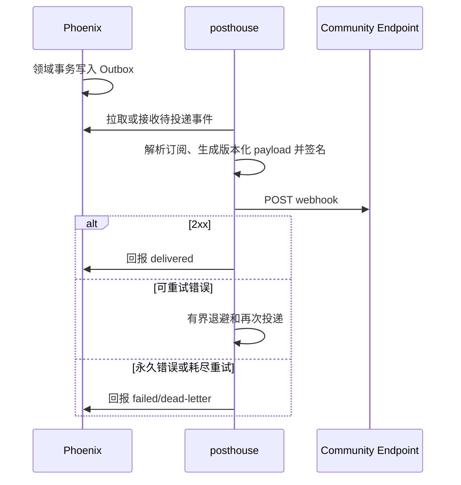

# Posthouse

> 运行形态：Node/Hono
>
> UI：Dashboard 的 `Integrations`
>
> 当前状态：规划中；现有 Webhooks 页面仍处于占位阶段

## 定位

`posthouse` 是 Groupher 与外部系统之间的收发中心，统一处理 Webhook、IM Bot、
邮件及后续消息渠道的 transport。

Dashboard 中的 `Integrations` 只是 Analytics、Webhooks、Bots、Email 和 Content
Sync 等功能的配置集合；服务端真正的收发、签名、重试和 adapter 位于
`posthouse`。

Webhook 通知明确归入 `posthouse` 的 outbound 能力，不与 Phoenix 的站内通知
记录混在一起。两者可以共享 Outbox 基础设施，但拥有不同的 delivery contract。

## 提供的服务

### Inbound

- 接收外部 Webhook 和 IM 平台事件。
- 在读取/解析业务 payload 前验证签名、时间窗和来源。
- 按 provider event ID 或 Groupher idempotency key 去重。
- 把不同平台 payload 标准化为版本化 internal event。
- 快速 ACK 后异步路由到 Phoenix 或 `ai`。

### Outbound

- 消费 Phoenix Outbox 中的社区事件。
- 向用户配置的 Webhook endpoint 投递签名 payload。
- 发送 Slack、Discord、Telegram 等 IM 消息。
- 通过邮件 provider 发送事务或订阅邮件。
- 处理 provider rate limit、退避重试、delivery receipt 和 dead letter。
- 向 Phoenix 回报最终投递状态和有界 diagnostics。

### 公共执行能力

- Provider adapter 和 credential resolution。
- 消息模板渲染的 transport 部分。
- 路由、批处理、并发控制和防回环。
- delivery attempt、耗时和 provider response 分类。

## 基本流程

### Outbound Webhook



### Inbound Bot

```text
External IM
  -> posthouse signature verification
  -> dedupe and normalize
  -> Phoenix command or AI request
  -> business result / generated reply
  -> posthouse provider adapter
  -> External IM
```

## 数据所有权

Phoenix 负责：

- community、权限和 Integration 配置的 source of truth。
- Webhook subscription、事件过滤条件和业务启停状态。
- 领域事件、站内通知和最终业务操作。
- 可供用户查看的最终投递状态和审计摘要。

`posthouse` 负责：

- provider credential 的安全使用。
- 队列、技术 attempt、重试和短期 payload。
- 签名、协议 adapter 和 provider-specific error mapping。

敏感 credential 可以由 Phoenix 加密配置配合 secret manager 管理，但不能进入
Dashboard 浏览器 bundle、日志或普通事件 payload。

## 与 AI 的边界

- `posthouse` 负责“消息如何从平台进来、如何发回去”。
- `ai` 负责“机器人如何理解、检索、生成和调用工具”。
- Phoenix 负责权限、领域命令和最终数据变更。

因此不能把完整 Chat Bot 产品逻辑放进 transport adapter，也不能让 `ai` 直接处理
Slack/Discord 的签名与重试。

## 关键约束

- Outbound event 和 payload schema 必须版本化。
- 所有投递必须有稳定 event ID，重试不能生成新的业务事件。
- Inbound endpoint 必须限制 body size、时间窗和请求速率。
- 业务事务不能等待第三方 endpoint 返回；先写 Outbox，再异步投递。
- 必须防止 inbound event 触发 outbound 后再次被同一集成回送的消息环。
