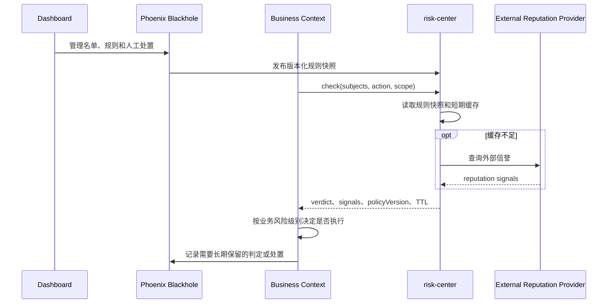

# Risk Center

> 运行形态：Node/Hono
>
> UI：Dashboard
>
> 当前状态：规划中；Phoenix 领域层继续命名为 `Blackhole`

## 定位

`risk-center` 是风控信号的查询、聚合和低延迟判定中心。任何办理业务的入口都可以
先查询某个用户、内容、IP、URL、域名、文件 hash 或外部身份是否存在风险。

它与 Phoenix `Blackhole` 组成双层边界：

- `Blackhole` 是领域数据、人工处置、策略和审计中心。
- `risk-center` 是外部信誉查询、规则执行、缓存和批量检查中心。

中文产品概念使用“风控中心”。不使用 `anti-fraud-center`，因为当前范围还包括
内容违规、恶意文件和平台滥用，并不只限于诈骗。

## 提供的服务

- 标准化 user、content、IP、device、URL、domain、file hash 和 external identity。
- 查询域名/IP reputation、malware/hash、spam/abuse 等外部 provider。
- 聚合人工名单、规则快照、历史信号和外部结果。
- 返回统一 `allow | review | deny` 风险判定。
- 短期缓存、negative cache 和 provider circuit breaker。
- 批量检查、规则编译和 Edge 可执行的只读快照。
- 向 Phoenix 回报命中规则、证据摘要、policy version 和过期时间。

推荐响应至少包含：

```json
{
  "verdict": "review",
  "riskLevel": "medium",
  "signals": [],
  "matchedRules": [],
  "policyVersion": "2026-07-24.1",
  "expiresAt": "2026-07-24T12:00:00Z"
}
```

不能只返回一个布尔值，否则调用方无法区分需要人工 Review、临时 provider 故障和
明确拒绝。

## 数据所有权

### Phoenix `Blackhole`

- 人工黑名单、白名单和处置记录。
- subject、reason、scope、community、过期时间和申诉状态。
- 风控策略配置和规则版本。
- 操作员权限、审计和最终业务处罚。
- 需要长期保留的风险判定摘要。

### `risk-center`

- 外部 provider adapter 和 credential。
- 规则快照及只读风控 read model。
- 短期 reputation cache、批任务和 provider health。
- 技术 trace 和有界 diagnostics。

规则和人工名单由 Phoenix 通过事件或版本化快照同步给 `risk-center`，避免每次风险
查询再同步回调 Phoenix 形成循环依赖。

## 基本流程



## 调用方

- Gateway/Auth：IP、设备和登录异常。
- `assets-hub`：文件 hash、MIME 欺骗和恶意资源。
- `posthouse`：URL、域名、外部账号和消息来源。
- `content-import`：来源 URL、archive 和批量内容预检查。
- Phoenix 业务 Context：用户、内容和历史行为，并执行最终业务决策。

Node 子应用可以用 `risk-center` 做早期拒绝以节省资源，但封号、删除内容、禁止发布
等敏感操作必须由 Phoenix 在执行前重新检查并审计。

## 缓存和 Edge

该服务适合部署在靠近调用方的 Node/Edge 环境，并使用 KV 或区域缓存，但不能把
风险查询当作公开 CDN endpoint：

- 所有请求必须有服务身份和明确 scope。
- 缓存 key 对敏感 indicator 做规范化和必要的 hash。
- 结果携带 TTL、provider freshness 和 policy version。
- 人工 deny、撤销和申诉结果需要主动失效缓存。
- Edge 规则快照只用于快速预检查，不能替代 Phoenix 对敏感操作的最终校验。

## 失败策略

不同业务不能共享一个固定的 fail-open/fail-closed 行为：

- 登录、发布等高风险动作可转入 `review` 或更严格地拒绝。
- 非敏感读取在外部 provider 故障时可以降级。
- 上传和 Webhook 可先隔离/quarantine，再异步完成扫描。

调用方必须显式声明 action 和风险等级；`risk-center` 在响应中区分“未发现风险”
与“因依赖故障无法完成检查”。
