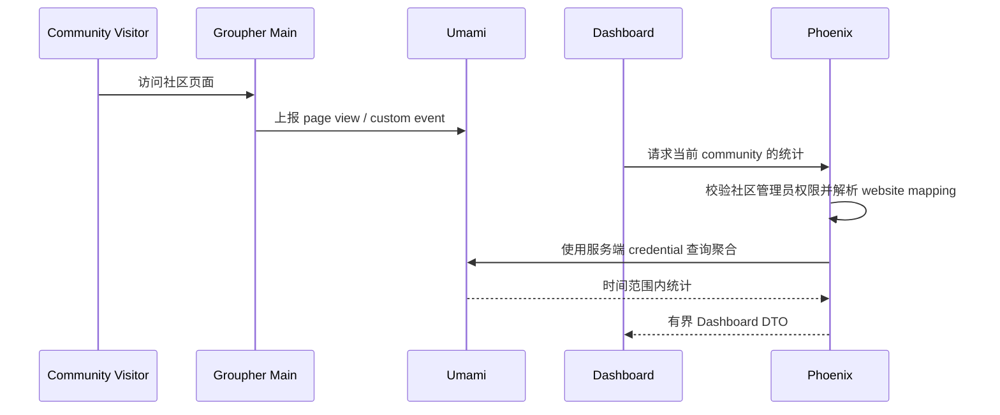

# Umami

> 运行形态：自托管 vendor application
>
> UI：配置和社区视图位于 Dashboard
>
> 当前状态：规划中

## 定位

Umami 提供社区访问统计。Groupher 自托管一个受版本控制的 Umami 实例，并为每个
community 建立独立 website mapping，而不是为每个社区部署一个 Umami 实例。

Umami 是 vendor deployment，不需要为了符合 Groupher Context 结构而 fork 或重写
其内部领域模型。Groupher 只维护必要的映射、权限和展示适配。

## 提供的能力

- Page view、访客、来源、设备、地区和自定义事件统计。
- 每个 community 独立 website identity。
- Main/社区站点的统计脚本和事件上报。
- Dashboard 中按社区查看统计摘要。
- 通过 Umami API 获取时间范围内的聚合数据。

社区管理员不直接进入 Umami 管理后台；配置入口和常用图表保留在 Groupher
Dashboard。

## 数据所有权

Phoenix 负责：

- community 与 Umami website ID 的映射。
- 哪些社区启用统计，以及管理员查看权限。
- 套餐、保留策略或高级分析功能的产品配置。
- Dashboard 可见的配置状态。

Umami 负责：

- 原始 analytics event。
- visitor/session 聚合。
- analytics schema、查询和 retention 执行。

Groupher 不复制完整 Umami 原始事件到 Phoenix 数据库。确实需要产品使用的聚合值
可以定期投影，但必须有明确用途和时间粒度。

## 基本流程

如果查询适配逻辑明显增加，可以在 vendor deployment 前增加一个受信任的薄
adapter；不要把 Umami admin credential 发送到浏览器。

## 与其他子应用的边界

- `Integrations` 是 Dashboard 中配置 Analytics 的入口，不是服务。
- Analytics event 不通过 `posthouse`；`posthouse` 处理消息和投递协议。
- 周报中需要统计摘要时，`ai` 或 `content-press` 读取经过权限校验的聚合 DTO，
  不能直接访问 Umami 数据库。
- 风控行为统计若需要 Umami 信号，应先形成有界投影，再交给 `risk-center`。

## 部署与运维

- 固定并审查 Umami 版本，升级前验证数据库 migration。
- 对 Umami 数据库做独立备份和恢复演练。
- 使用 Groupher 控制的 analytics 域名，避免页面绑定部署平台地址。
- admin credential 只存在服务端 secret store。
- 为 API、采集 endpoint 和数据库分别监控可用性及延迟。

## 隐私约束

- 默认不向 Umami 发送正文、邮箱、用户名或其他直接 PII。
- 自定义事件属性使用稳定的业务类别，不包含用户输入原文。
- 根据社区配置、地区要求和 consent 策略决定是否加载统计脚本。
- 明确保留周期、删除流程和社区停用后的数据处理方式。
