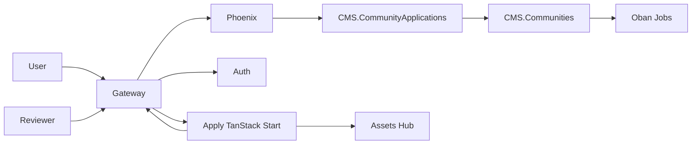
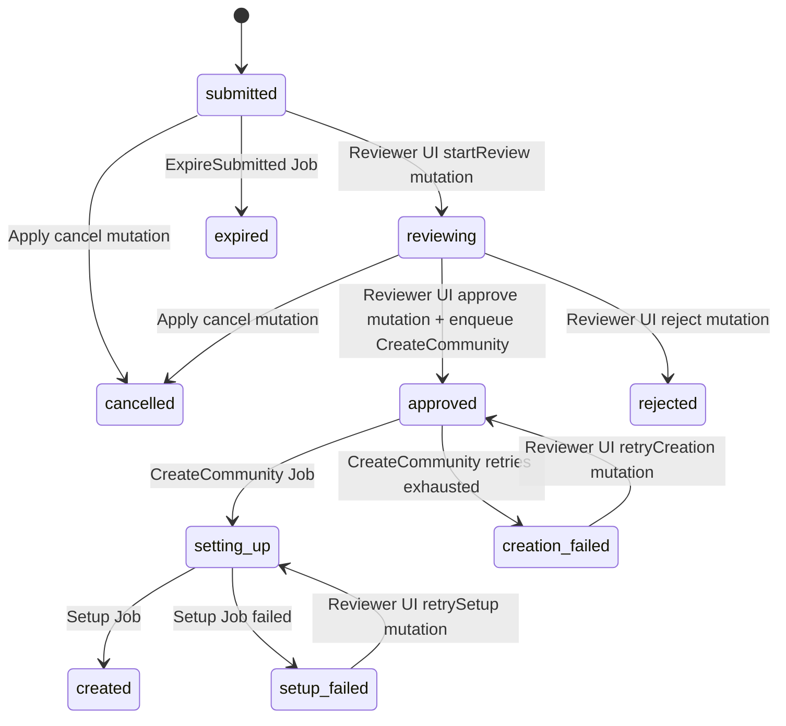

# Apply V1

> 迁移说明：下文“当前实现”中的 Main 页面是独立 Apply 应用建立前的历史输入。当前入口为
> `frontend/apply`；旧 Main/Dashboard 路径不再是实现位置或兼容目标。

> 状态：目标实现合同
>
> 前端运行时：独立 TanStack Start 应用
>
> 公开入口：`https://groupher.com/apply`
>
> 领域后端：Phoenix；不新增独立 Apply 后端服务

## 相关文档

- [`docs/sub-apps/apply.md`](../sub-apps/apply.md) 定义 Apply 的部署定位和子应用边界。
- [`docs/sub-apps/README.md`](../sub-apps/README.md) 定义 Groupher 子应用的总体原则。
- [`docs/auth/v1.md`](../auth/v1.md) 定义 Apply 消费的 Browser Session、Phoenix
  Access Cookie、CSRF 和刷新合同。
- [`docs/dashboard-to-tanstack/v2.md`](../dashboard-to-tanstack/v2.md) 是现有
  TanStack Start、Gateway、SSR、GraphQL 和 Platform 边界的实现参考，但 Apply
  不复用 Dashboard 的 Community Shell。
- [TanStack Router URL Rewrites](https://tanstack.com/router/latest/docs/guide/url-rewrites)
  定义 `basepath` 对公开 URL 与 app-local route 的双向映射语义。

本文是 Apply V1 的详细 source of truth。`docs/sub-apps/apply.md` 只保留稳定的产品
定位和部署概览；运行时、前后端所有权、状态机、数据模型、迁移和验收以本文为准。

## 定位

Apply 承载用户从“尚未拥有社区”到“社区创建完成”的低频流程：

- 登录或注册引导。
- 创建权限和当前申请状态检查。
- 社区类型、slug、名称、Logo 和基础信息填写。
- 名称占用、系统保留词和基础安全规则检查。
- 申请提交、审核、拒绝、取消和失败恢复。
- 社区核心记录创建与默认能力初始化。
- 创建完成后跳转 Main 或 Dash。

Apply 不属于 Main，因为这段流程发生在 Community 身份建立之前；也不属于 Dash，
因为它不是已有 Community 的管理功能。V1 将现有 Main 页面迁为独立 TanStack Start
应用，并同步重构 Phoenix 中粗糙的 `Community.pending` 申请模型。

## V1 已确认决策

```text
Frontend application
  frontend/apply
  TanStack Start + Vite + React

Canonical public route
  /apply

Apply app-local route root
  /
  Router basepath 将公开 /apply/* 映射到 app-local /*

Legacy route
  /apply/community 直接删除
  不保留 redirect 或 compatibility route

Direct local debug identity
  apply.groupher.localhost

Product entry
  groupher.localhost/apply
  始终经过 Gateway

Frontend feature ownership
  CommunityEditor 从 frontend/core 迁入 frontend/apply
  Core 只保留真正共享的 UI、Theme、Auth、GraphQL 和 Platform primitives

Reviewer UI ownership
  属于 frontend/apply
  app-local /review，公开 /apply/review
  不属于 Main、Dash 或 Dashboard

Client workflow state
  继续使用 Valtio
  Store 由 Apply Provider 按流程实例化
  不使用模块级全局 proxy

Frontend hooks
  useApplyStep
  useApplyDraft
  useApplySubmit

Backend public context
  GroupherServer.CMS.CommunityApplications

Community creation internals
  GroupherServer.CMS.Communities.Creation
  GroupherServer.CMS.Communities.Setup

Application and Community
  提交申请时不创建 Community
  审核通过后才创建 Community

Concurrent application rule
  一个用户可以拥有多条历史申请
  任意时刻只能有一个进行中的申请
  由数据库约束而不是前端检查保证

V2 extension principle
  V1 建立稳定状态机、Policy、事件、Name Claim、Lifecycle 和 Job 边界
  V2 在这些边界上增加风控、品牌争议、Billing、Trial 和自动回收
  V2 不回退到 Community meta 或散落条件分支
```

## V1 范围

V1 必须完成：

- 新建独立 `frontend/apply` TanStack Start 应用。
- Gateway 接入 `/apply`、Apply 静态资源、Server Function 和本地 HMR。
- 将 Apply 作为独立 service 接入 Dev Hub，包括启动依赖、健康检查、关系图、指标和打开地址。
- 删除 Main 中的 `/apply/community` 页面和对应旧路由常量。
- 将 `CommunityEditor` 业务 UI 从 Core 迁入 Apply。
- 建立 route/flow scoped Valtio Provider 和三个职责 Hook。
- 支持未提交草稿的显式恢复，并排除瞬时状态污染。
- 提供 Application-scoped Logo 上传、校验和创建后的资产归属转换。
- 新建 `CMS.CommunityApplications` Context 和独立申请记录。
- 一个用户只有一个进行中申请的数据库级保证。
- 提交幂等、状态转换、审核、取消和申请事件记录。
- 在 Apply sub-app 提供隔离的审核队列、审核详情、批准、拒绝和失败重试入口。
- 建立系统保留 slug Policy 和统一 Slug Claim。
- 审核通过后通过 `Communities.Creation` 创建核心 Community。
- 通过明确归属的 Oban Jobs 驱动申请过期、Community Creation、Setup 和 Claim 清理。
- 通过 `Communities.Setup` 幂等初始化附属能力。
- Community 在 Setup 完成前不进入公开 Main、搜索、Press 或 Sitemap。
- 删除旧 `applyCommunity`、`hasPendingCommunityApply` 及旧审批 API。
- 完成迁移、并发、权限、重试、Gateway、Dev Hub 和前端流程测试。

V1 不完成：

- 自动化用户风险评分、设备图谱或“小黑屋”判定引擎。
- 完整品牌库、商标举证、投诉、答辩、申诉和名称转让后台。
- Payment Provider、账单、发票和正式 14 天 Free Trial 扣费流程。
- Trial 到期后的自动只读、暂停、归档、Slug 释放和永久删除。
- 跨设备服务端草稿。
- Apply 独立业务后端或独立数据库。

这些能力属于 V2，但 V1 的模型和 API 必须提供下文定义的扩展位置。

## 当前实现及必须替换的问题

迁移前入口是：

```text
frontend/main/src/app/apply/community/page.tsx
```

它为了运行 `CommunityEditor`，构造了假的 `community.slug = "apply"` 和空
Dashboard，再挂载完整 `MainProvider`。这说明 Apply 实际没有 Community/Dashboard
依赖，只是在借用 Main 的运行壳。

当前前端还存在以下问题：

- `CommunityEditor` 位于共享 Core，但实际只有 Apply 页面消费。
- Valtio `proxy` 在模块顶层创建，流程重新进入时可能继承旧 step 和表单状态。
- Account 没有通过 Apply 自己的 SSR loader 初始化。
- `checkPendingApply` 被注释，前端提示不是可靠领域约束。
- mutation 没有稳定错误码、取消、幂等、重试和失败恢复。
- Logo 使用硬编码值，现有 Uploader 不能视为可用上传能力。
- mutation 返回 pending Community，UI 却展示“社区已创建成功”。

当前 Phoenix `CMS.Communities.Apply` 还存在更关键的问题：

- 提交申请立即调用 `Communities.Write.create/2`，提前创建完整 Community。
- Root Moderator、Passport、Dashboard 和 Docs Tree 在审核前已经建立。
- `has_pending?` 只是普通查询，`apply/2` 本身没有串行校验。
- 两个并发请求可以同时提交，前端禁用按钮不能解决竞争条件。
- `pending` 是整数，不能表达审核、创建失败和后续生命周期。
- 拒绝申请通过硬删除 Community 实现。
- Community 创建的多个步骤没有收敛到一个核心事务和可重试 Setup 状态。
- 普通 Community Read/List 没有把 pending 作为统一可见性边界。

V1 不修补这些旧路径，而是用独立申请 Aggregate 替换它们。

## 总体所有权



### Apply 前端

负责：

- 路由、页面、步骤交互和表单体验。
- SSR 加载 Account、`canApply` 和当前申请。
- 未提交草稿的本地保存与恢复。
- 调用 Phoenix GraphQL 并展示稳定业务错误。
- 根据服务端 Application 状态恢复页面。
- 创建完成后的跨应用导航。
- 创建 Application-scoped Logo upload intent，并持久化返回的 `logoAssetRef`。

不负责：

- 决定用户最终能否提交。
- 最终判定 slug 是否可用。
- 审批、创建、权限、试用或回收状态转换。
- 直接访问数据库或 Payment Provider。

### Apply 审核入口

V1 的审核消费者与申请人流程属于同一个 Community Application 领域，因此放在独立
`frontend/apply` sub-app 内。下面左侧是 Apply 自己的 app-local route，右侧才是 Gateway
挂载后的公开 URL：

```text
/review                  -> /apply/review
/review/:applicationRef  -> /apply/review/:applicationRef
```

审核入口与申请人入口共用 Apply runtime、Auth 和 GraphQL 基础设施，但使用独立 route
branch 和 `ReviewerShell`：

```text
frontend/apply/src/routes/
├── __root.tsx
├── index.tsx
├── status.$applicationRef.tsx
└── review/
    ├── route.tsx
    ├── index.tsx
    └── $applicationRef.tsx
```

`ReviewerShell` 只加载 Account、全局 Permission 和审核数据，不挂载申请人的
`ApplyFlowProvider`，也不加载 Community、Dashboard 或 `CommunityBoundary`。Gateway 保持
公开 `/apply/*` pathname 转发，由 Apply Router basepath 匹配 app-local route；不新增
Main/Dash 路由。只有拥有全局审核权限的账号可访问，负责：

- 查看 submitted/reviewing/approved/creation_failed/setup_failed 队列和事件时间线。
- 开始审核、批准、拒绝。
- 重新入队 Community Creation 或 Community Setup。
- 展示 Job 最后失败原因和 operation ref。

app-local `/`、`/status/*` 只展示申请人可见状态，不放置审核控件。Reviewer route
必须独立鉴权和拆分 bundle，不能因为同属 Apply runtime 就把审核能力注入申请人 Flow。
未来若建立独立 System Admin sub-app，本节的 GraphQL/Permission 合同保持不变，只迁移
Reviewer UI 消费者。

### Phoenix Accounts / Auth

- Auth 按 `docs/auth/v1.md` 维护 Browser Session 和 Cookie 生命周期。
- Phoenix Accounts 仍是 User、Account State 和 Browser Session 的权威。
- Apply 只消费共享 Auth Client，不新增自己的 token 解析或刷新协议。
- V2 的账户限制由 Accounts Policy/Risk 边界提供，不能写入 Apply Store。

### `CMS.CommunityApplications`

负责：

- 申请记录和状态转换。
- `canApply` 规则编排。
- 单用户串行申请。
- 提交幂等。
- 审核、拒绝、取消和 Application Event。
- 调用名称 Policy 和 Slug Claim。
- 审批通过后请求 Communities 创建真实 Community。

### `CMS.Communities`

继续负责：

- Community、Root、Moderator、Passport、Dashboard 和 CMS 领域数据。
- 从批准申请创建 Community。
- Community Setup 和公开可见性。
- Community Lifecycle。
- Slug namespace 和已创建 Community 的名称变更。

Application Context 不直接创建 Community 表及其附属记录。

### Gateway

- 将公开 `/apply` 和 `/apply/*` 保持 pathname 转发到 Apply upstream。
- 将 `/api/graphql` 继续路由到 Phoenix。
- 将 `/api/auth/*` 继续路由到 Auth。
- 只转发合同允许的 Cookie，不解析身份或业务状态。
- 保持浏览器地址为 `groupher.com/apply`。

## 前端目标结构

```text
frontend/apply/
├── .env.example
├── app.config.ts
├── package.json
├── public/
├── tsconfig.json
└── src/
    ├── components/
    │   ├── ApplyFlow/
    │   └── ReviewerShell/
    ├── flow/
    │   ├── context.ts
    │   ├── provider.tsx
    │   ├── store.ts
    │   ├── spec.ts
    │   ├── persistence.ts
    │   └── hooks/
    │       ├── useApplyStep.ts
    │       ├── useApplyDraft.ts
    │       └── useApplySubmit.ts
    ├── routes/
    │   ├── __root.tsx
    │   ├── index.tsx
    │   ├── status.$applicationRef.tsx
    │   └── review/
    │       ├── route.tsx
    │       ├── index.tsx
    │       └── $applicationRef.tsx
    ├── server/
    │   ├── account.ts
    │   ├── application.ts
    │   ├── graphql.ts
    │   └── health.ts
    ├── utils/
    │   ├── first-paint.ts
    │   └── public-path.ts
    ├── router.tsx
    ├── routeTree.gen.ts
    └── server.tsx
```

具体文件可以按实现细节微调，但下列所有权不能改变：

- Apply 业务 UI、schema、store、步骤和 copy 属于 `frontend/apply`。
- `frontend/core` 只提供可被至少两个产品应用复用的基础能力。
- 不在 Apply 内复制 shared Auth Client、GraphQL 基础配置或 Platform contract。
- 不引入 Community Store、Dashboard Store、CommunityBoundary 或 DashboardShell。
- ReviewerShell 与 ApplyFlowProvider 分离，审核代码不进入申请人页面的初始 bundle。

## 独立应用边界

`frontend/apply` 是完整应用，不是 Main/Dash 中的 feature folder。它独立拥有：

```text
package.json / dependency graph
app.config.ts / build output
router.tsx / route tree
server.tsx / SSR runtime
public/ / static assets
env schema / listener / health check
error and pending boundaries
App root Provider
```

允许的共享只有稳定平台合同和通用 primitives：

- `frontend/core` 的 UI、Theme、Auth Client、GraphQL Client、Platform contract。
- `packages/contracts` 等无产品 Shell 的共享类型/协议。
- Gateway 提供的统一入口，以及 Phoenix/Assets Hub 的版本化 API。

禁止的耦合：

- 在 Community、Dash 等其他产品应用下增加 Apply route、proxy
  route、Provider 或 server adapter。
- 从 Apply import `@main/*`、`@dash/*`、MainProvider、Dashboard Store、Community Store 或
  CommunityBoundary。
- 从其他前端项目复制/软链 Apply 的 public assets、route tree、generated server files 或
  build output。
- 依赖 Main/Dash 的 env、listener、health endpoint、HMR path 或部署生命周期才能启动。
- 让 Reviewer UI 成为另一个项目的页面；它是 Apply 应用内独立鉴权、独立 bundle 的
  app-local route。

后端的“独立”是领域模块独立，不是另建 Apply 微服务：浏览器和 Apply SSR 只通过
Gateway/API 调用 Phoenix；`CMS.CommunityApplications` 独立拥有 Application schema、
Policy、状态机、Event 和 Jobs，并只通过公开 facade 协作 `CMS.Communities`、
`CMS.Assets`。`frontend/apply` 不连接 Phoenix 数据库。

创建完成后跳转 Main/Dash 是跨应用导航，不代表 Apply 运行时依赖它们。

## 路由和 Gateway

Apply 源码内的 Router 从 `/` 开始；`/apply` 只是 Gateway 的公开 mount prefix，不进入
file-route 目录名：

| Apply app-local route     | 浏览器及 Apply upstream pathname |
| ------------------------- | -------------------------------- |
| `/`                       | `/apply`                         |
| `/status/:applicationRef` | `/apply/status/:applicationRef`  |
| `/review`                 | `/apply/review`                  |
| `/review/:applicationRef` | `/apply/review/:applicationRef`  |

同一个 `/apply` namespace 覆盖 Apply 自己的静态资源、SSR data、Server Function 和 HMR；
Gateway 保持 pathname，不能只代理 HTML 页面，再让这些请求落到 Main/Dash：

```text
/apply/assets/*
/apply/_server/*
/apply/__apply_hmr
/apply/health
```

V1 不保留 `/apply/community`。切换时同时完成：

- 删除旧 Next page。
- 将所有创建社区入口改为 `/apply`。
- 删除旧 `APPLY_COMMUNITY = "/apply/community"` 常量。
- Gateway 在 Main/Dash fallback 之前识别 `/apply` namespace，并保持 pathname 转发。
- 不增加 redirect、rewrite compatibility 或隐藏旧入口。

Apply app config 通过单一 `APP_PUBLIC_BASE_PATH=/apply` 配置 TanStack Router `basepath`，
由 Router 把浏览器 `/apply/*` 双向映射为 app-local `/*`，并生成 href。Router source
route 始终是 app-local `/`。Gateway 只选择 upstream 和透传 pathname，不拥有 Apply 路由
语义。生产和开发路由都必须由 Host/pathname 明确判定，不依赖 Referer。
组件和 Server Function 不直接拼接 `/apply`；统一通过 Apply 自己的 `public-path.ts` 和
app config 读取 mount prefix。V1 的 canonical 与 direct-debug 环境都使用 `/apply`
basepath，避免同一应用出现两套路由语义。

Gateway 增加：

```text
GatewayTargetKind: apply
SITE.APPLY
APPLY_SITE
isApplyHost
isApplyRoute
Apply asset/server-function routing
Apply pathname preservation
```

本地接入：

```text
apply.groupher.localhost/apply -> Gateway -> Apply listener /apply
groupher.localhost/apply       -> Gateway -> Apply listener /apply
```

直接调试域名只用于隔离调试；登录、OAuth callback、退出和跨应用跳转必须通过
Gateway canonical URL 验证。

## Dev Hub 接入

V1 不能只在 Phase 5 写一句“更新 Dev Hub”。Apply 必须是 Dev Hub 的一等 service，不能
借用 Main、Dash 或 Dashboard 的进程卡片、健康状态和启动生命周期。

服务定义至少包含：

```text
id                    apply
port                  3006
command               make fe.dev.apply
config root           frontend/apply
direct health URL     http://127.0.0.1:3006/apply/health
canonical app URL     https://groupher.localhost/apply
portless debug URL    https://apply.groupher.localhost/apply
portless health URL   https://apply.groupher.localhost/apply/health
```

`3006` 是 Apply listener 的固定开发端口，并进入统一 service-endpoints 定义；Gateway 的
service definition 通过 `APPLY_SITE` 指向它，不能在 Gateway 和 Apply 各自硬编码不同地址。
同时新增 `make fe.dev.apply`，Dev Hub 只调用该正式入口，不拼装一套私有启动命令。

Apply 的默认启动策略是 `chain`：

```text
requiredDependencies = gateway, auth, phoenix, assets-hub
optionalDependencies = none
```

这四项都是 V1 完整申请流程的硬依赖：Gateway 提供 canonical 路由，Auth 提供登录会话，
Phoenix 提供 Application API，Assets Hub 提供 Logo 上传。Dev Hub 必须先等待 required
dependencies ready，再启动 Apply；`self` 模式仍允许开发者只启动 Apply 做隔离诊断，但不
承诺完整业务流程可用。

Apply `/apply/health` 使用仓库统一的 `health.v1` 合同，`service` 必须精确为 `apply`，状态只
能是 `ok` 或 `limited`。该 endpoint 必须廉价、无鉴权、无副作用，不聚合 Main/Dash 的
健康状态；Dev Hub 用它判断 `starting -> running`，不能只用端口监听代替应用 ready。

Dev Hub 和相邻基础设施还必须同时更新：

- Gateway service env 增加 `APPLY_SITE`，关系图增加 `gateway -> apply`，路径标注为
  `/apply/*`。
- 关系图增加 `apply -> phoenix`（GraphQL）、`apply -> assets-hub`（Application Logo）和
  `auth -> apply`（Browser Session/returnTo）。
- Assets Hub CORS 允许 canonical `https://groupher.localhost` 与 direct-debug
  `https://apply.groupher.localhost`；不能因 Dash 已在 allowlist 就假设 Apply 自动可用。
- Apply 接入 Dev Hub 现有 browser metrics reporter，指标归属 `serviceId = apply`，页面维度
  区分 applicant 与 reviewer route。
- Portless alias、env example、service card 的 Open action 都使用上面的同一组地址；Open
  默认进入 canonical `/apply`，不是 listener 裸端口，也不是其他产品 route。

Dev Hub 自身不拥有 Apply 的业务健康、权限或依赖规则；它消费 Apply `health.v1` 和 service
definition。Apply 对 Phoenix/Assets Hub 的运行时降级仍由 Apply 明确展示，不能由 Dev Hub
偷偷改写业务结果。

## SSR 初始数据

Apply 的 root route loader 只加载：

```typescript
type TFailedApplicationSummary = {
  publicRef: string
  status: 'creation_failed' | 'setup_failed'
  title: string
  slug: string
  updatedAt: string
}

type TApplyInitialData = {
  account: TAccount | null
  canApply: boolean
  applyBlockReason: TApplyBlockReason | null
  currentApply: TCommunityApplication | null
  latestFailedApplication: TFailedApplicationSummary | null
}
```

不加载假的 Community 或 Dashboard。

SSR 返回必须设置：

```text
Cache-Control: private, no-store
```

服务端通过共享 Browser Auth 合同读取 `groupher-auth.token`，并只向同源 Gateway
GraphQL 路径或已批准 Phoenix endpoint 转发该 Cookie。`403` 业务禁止不触发 token
refresh。

页面入口状态：

```text
account == null
  -> 登录引导

currentApply.status in blocking statuses
  -> 恢复服务端申请状态页

currentApply == null
  -> 若 latestFailedApplication != null，展示可关闭的“最近失败申请”入口
  -> canApply == false 时展示 applyBlockReason
  -> canApply == true 时创建或恢复未提交草稿
```

V1 的 `blocking statuses` 精确定义为：

```text
submitted
reviewing
approved
setting_up
```

`currentApply` 只返回上述会阻止下一次申请的 Application，不返回历史
`created/rejected/cancelled/expired/creation_failed/setup_failed` 记录。
`latestFailedApplication` 只返回当前用户最近一条 `creation_failed/setup_failed` 摘要，
用于在根页面提供 `/apply/status/:applicationRef` 入口；它不参与 blocking 判定，也不能
覆盖本地未提交草稿。若同时存在新的 blocking Application，页面优先恢复
`currentApply`，失败历史只作为次要入口。

因此用户完成一个 Community 或旧流程进入失败终态后再次进入 `/apply`，只要没有新的
blocking Application 且 `canApply = true`，就可以创建下一条草稿，同时仍能找到上一条
失败记录。Application 首次进入 `creation_failed/setup_failed` 时，轮询或 mutation 后续
导航必须停留在 canonical `/apply/status/:applicationRef`；不能跳回 `/apply` 后让记录失联。

创建流程提交后导航到 `/apply/status/:applicationRef`。该 route loader 按 public ref
加载当前用户拥有的指定 Application，覆盖 `rejected/cancelled/expired/created` 等已经
结束、不会出现在 `currentApply` 中的状态。`created` 页面提供进入 Main、进入 Dash 和
“创建另一个社区”三个动作；最后一个动作返回 `/apply` 并重新执行 `canApply`，不能从
历史 Application 直接复制提交。

## Valtio Store 和 Hook

V1 继续使用 Valtio，但 Store 必须由 `ApplyFlowProvider` 按路由实例创建：

```text
Apply route mount
  -> createApplyStore(initialData, persistedDraft)
  -> ApplyFlowProvider
  -> useApplyStep / useApplyDraft / useApplySubmit

Apply route unmount
  -> 当前 Store 销毁
```

禁止：

```typescript
const store = proxy(...)
```

作为模块级全局业务 Store。

三个 Hook 的职责：

### `useApplyStep`

- `currentStep`
- `nextStep()`
- `previousStep()`
- 当前步骤可进入条件
- 从恢复草稿或服务端 Application 派生初始步骤

### `useApplyDraft`

- `communityType`
- `slug`
- `title`
- `desc`
- `logoAssetRef`
- 其他 V1 表单字段
- `updateField()`
- `clearDraft()`
- 字段级本地校验结果

### `useApplySubmit`

- `submit()`
- `submitting`
- `submitError`
- `idempotencyKey`
- 服务端返回的 Application
- 提交成功后清理未提交草稿

Hook 可以共享一个底层 Context/Store，但不得各自创建互相不一致的 proxy。

## 草稿恢复

V1 的未提交草稿使用 versioned `localStorage`：

```text
key
  groupher.apply.draft.v1:<user-public-ref>

persist
  currentStep
  communityType
  slug
  title
  desc
  logoAssetRef
  form fields
  updatedAt

never persist
  submitting
  checking
  submitError
  request promise
  access token
  currentApply server status
```

恢复优先级：

```text
Phoenix currentApply
  > local unsubmitted draft
  > empty flow
```

存在服务端进行中申请时，本地草稿不能覆盖它。提交成功、用户主动清空或完成创建后
必须删除本地草稿。用户切换账号时只能读取当前 Account key 下的草稿。

跨设备草稿属于 V2；V1 不通过扩展全局 Store 模拟跨设备恢复。

## Logo 上传

V1 必须交付真实可用的 Logo 上传，不能继续提交硬编码 URL。上传使用 Assets Hub 的
Application scope，但业务授权和最终归属仍由 Phoenix 决定：

```text
Apply requests upload intent from Phoenix
  -> Phoenix verifies Account and canApply context
  -> Assets Hub uploads and finalizes the object
  -> Assets Hub calls Phoenix trusted completion endpoint
  -> Phoenix registers an ApplicationLogoUpload and returns immutable logoAssetRef
  -> submitCommunityApplication sends logoAssetRef
  -> Phoenix verifies owner, finalized state, MIME and size
  -> Community Creation registers the same object as a CommunityAsset in its DB transaction
```

现有 `CMS.Assets.Upload.complete/1` 和 `CMS.Assets.Write.register/3` 都要求
`community_id`，不能直接用于 Community 创建前的 Logo。V1 新增独立注册路径：

```text
CMS.CommunityApplications.LogoUploads
cms.community_application_logo_uploads
```

该模块负责 Application scope 的 intent、trusted completion、所有权校验和临时记录；
现有 `CMS.Assets.Write.register/3` 保持 Community-bound，不增加 nullable
`community_id`，也不构造假的 Community。上传 capability 明确包含
`scope = community_application_logo`、Account public ref、upload public ref、过期时间和
允许的 MIME/size，不能与普通 Community asset capability 混用。

`cms.community_application_logo_uploads` 至少记录：

```text
public_ref
user_id
application_id           nullable, submit 后关联
storage
storage_key
url
content_hash
mime_type
size_bytes
status                   pending | finalized | promoted | expired
expires_at
community_asset_id       nullable
finalized_at
promoted_at
inserted_at
updated_at
```

所谓 promotion 只是一组本地数据库写入，不移动或复制对象：Community Creation 创建
Community 后，在同一个 Ecto.Multi 中调用本地数据库 facade
`CMS.Assets.register_from_application_upload/3`。该函数使用已 finalize 的上传 metadata 和
真实 Community 调用现有 Community-bound `Write.register/3`，然后写回
`community_asset_id/promoted_at`，并把 Application 的 `logo_asset_ref` 投影为 Community
Logo。对象的 `storage_key` 保持不变，因此该步骤不调用 Assets Hub、对象存储或其他网络
Provider；任何 DB step 失败，Community Creation 整体回滚，Application upload 仍保持
finalized，供 Job 安全重试。

如果未来必须移动对象前缀，只能作为 Creation 提交后的独立幂等 Job，并且不能成为
Community identity 创建事务的成功条件。V1 不做对象移动。

V1 统一命名：

```text
frontend/store/input     logoAssetRef
GraphQL                  logoAssetRef
database                 logo_asset_ref
read projection          logo { applicationUploadRef, communityAssetRef, url }
```

`logoAssetRef` 在写入协议和数据库中始终是
`CommunityApplicationLogoUpload.public_ref`，从草稿、提交到历史状态页保持不变；它不是
`CommunityAsset.public_ref`。读取投影显式拆开两个 ref：

- `applicationUploadRef`：Application upload 的稳定 public ref，promotion 前后不变。
- `communityAssetRef`：promotion 前为 `null`，成功注册 CommunityAsset 后返回其 public ref。
- `url`：promotion 前从 finalized upload 解析，promotion 后从 CommunityAsset 解析；两者指向
  同一不可变对象内容。

Community 自己的 Logo 字段只保存/返回 `communityAssetRef`，不能把 Application upload ref
当作 Community Asset ref。这样 GraphQL cache key 和 status route 不会因为 promotion
悄悄换标识。

不再混用 `logo`、`logoRef` 和任意外部 URL。未提交上传必须有短期过期时间，并由 Assets
Hub 根据 Phoenix 产生的过期/清理任务回收；Application 被拒绝、取消或过期后，未被
promotion 的对象进入清理队列。上传 intent 只能由当前登录用户使用，提交时必须再次
核对 ref 所有权，不能相信浏览器传入的对象地址。

## 后端模块结构

```text
backend/api/lib/groupher_server/cms/
├── community_applications.ex
├── community_applications/
│   ├── config.ex
│   ├── read.ex
│   ├── write.ex
│   ├── transitions.ex
│   ├── policy.ex
│   ├── review.ex
│   ├── logo_uploads.ex
│   ├── events.ex
│   └── jobs/
│       ├── create_community.ex
│       ├── expire_submitted.ex
│       └── expire_logo_uploads.ex
├── communities.ex
├── communities/
│   ├── creation.ex
│   ├── setup.ex
│   ├── name_policy.ex
│   ├── slug_claims.ex
│   ├── lifecycle.ex
│   └── jobs/
│       ├── setup.ex
│       └── release_expired_slug_claims.ex
├── assets/
│   └── application_uploads.ex
└── model/
    ├── community_application.ex
    ├── community_application_event.ex
    ├── community_application_logo_upload.ex
    ├── community_slug_claim.ex
    └── community_lifecycle.ex
```

公开 facade：

```elixir
CMS.CommunityApplications.current(user)
CMS.CommunityApplications.latest_failed(user)
CMS.CommunityApplications.history(user, filter)
CMS.CommunityApplications.get_owned(public_ref, user)
CMS.CommunityApplications.review_queue(filter, reviewer)
CMS.CommunityApplications.review_detail(public_ref, reviewer)
CMS.CommunityApplications.can_apply(user)
CMS.CommunityApplications.submit(attrs, user, idempotency_key)
CMS.CommunityApplications.cancel(public_ref, user, expected_version)
CMS.CommunityApplications.start_review(public_ref, reviewer, expected_version)
CMS.CommunityApplications.approve(public_ref, reviewer, expected_version, metadata)
CMS.CommunityApplications.reject(public_ref, reviewer, expected_version, reason)
CMS.CommunityApplications.retry_creation(public_ref, reviewer, expected_version)
CMS.CommunityApplications.create_logo_upload_intent(attrs, user)
CMS.CommunityApplications.complete_logo_upload(attrs)
CMS.CommunityApplications.expire_due(now)
CMS.CommunityApplications.mark_creation_failed(public_ref, operation_ref, reason)

CMS.Communities.create_from_application(application_ref, operation_ref)
CMS.Communities.run_setup(community_ref, operation_ref)
CMS.Communities.retry_setup(application_ref, reviewer, expected_version)

CMS.Assets.register_from_application_upload(community, upload, user)
```

GraphQL Resolver 只能调用公开 facade，不能直接调用 `Read`、`Write`、`Review`、
`Creation`、`Setup` 或 Model。

`expire_due/1`、`mark_creation_failed/3`、`create_from_application/2` 和 `run_setup/2` 是
Worker-facing public facade，不暴露为 GraphQL mutation；Worker 同样不能越过 facade。
`CMS.Assets.register_from_application_upload/3` 是 Creation-facing 的本地数据库 facade，
不是上传 endpoint。

## Community Application 数据模型

表：

```text
cms.community_applications
```

核心字段：

```text
id
public_ref
user_id
community_id                nullable, 核心 Community 创建事务完成后填写
status
version

title
slug
desc
logo_asset_ref
locale
apply_category
apply_message

idempotency_key
policy_snapshot
review_metadata

submitted_at
expires_at
reviewed_at
setup_started_at
completed_at
cancelled_at
expired_at
last_job_error

reviewer_id
decision_reason_code
decision_note

inserted_at
updated_at
```

`last_job_error` 是仅供 reviewer/ops 的结构化字段，至少包含 `reason_code`、`message`、
`operation_ref`、`occurred_at` 和 `attempt`；不能只保存一段不可分支的堆栈字符串。对外
`reviewCommunityApplication.lastJobError` 使用对应 camelCase 投影，owner Query 不返回
该字段。

核心业务字段使用独立列，不能全部塞进 `meta`。`policy_snapshot` 和
`review_metadata` 只承载可演进的当时判定上下文，不能成为核心状态的唯一来源。
`completed_at` 只在 Application 进入 `created` 时写入；它与 Ecto 的 `inserted_at` 含义
不同，不使用容易和记录创建时间混淆的 `created_at`。

时间字段遵守仓库约定：

- Ecto schema 使用 `:utc_datetime`。
- migration 普通时间列使用 `:timestamptz`。
- migration `timestamps()` 不显式指定类型。
- 不依赖数据库或服务器本地时区。

### Application 状态

V1 状态：

```text
submitted
reviewing
approved
creation_failed
setting_up
setup_failed
created
rejected
cancelled
expired
```

阻止下一条申请的状态：

```text
submitted
reviewing
approved
setting_up
```

`creation_failed` 和 `setup_failed` 是“可重试的终态”：它们保留错误、事件和 retry
入口，但不继续占用用户的串行申请名额。申请人可以直接创建下一条 Application；旧失败
记录仍通过 `/apply/status/:applicationRef` 展示。

允许转换：



Application 状态合法性和 Event 写入必须集中在
`CommunityApplications.Transitions`。Review、Communities.Creation 和
Communities.Setup 可以在各自 Ecto.Multi 中组合 transition step，但禁止 Resolver、
Worker 或管理脚本直接 `ORM.update(status: ...)`。

`version` 用于审核和重试的乐观并发保护。操作必须声明预期 version，旧管理页面或
重复 Job 不能覆盖更新后的决定。

从 `creation_failed` 或 `setup_failed` retry 时，会重新进入 blocking status，因此同一
事务必须重新经过 partial unique index：如果用户已经提交了新 Application，retry 返回
`active_application_exists`，不能同时恢复两条流程。

### 状态转换触发方

每个 V1 转换都有唯一的公开触发方：

| 转换                                 | 触发方                                           | 执行边界                                           |
| ------------------------------------ | ------------------------------------------------ | -------------------------------------------------- |
| `nil -> submitted`                   | Apply `submitCommunityApplication`               | `CommunityApplications.submit/3`                   |
| `submitted -> reviewing`             | Apply Reviewer `startCommunityApplicationReview` | `CommunityApplications.start_review/3`             |
| `submitted -> cancelled`             | Apply `cancelCommunityApplication`               | `CommunityApplications.cancel/3`                   |
| `submitted -> expired`               | Oban `ExpireSubmitted`                           | `CMS.CommunityApplications.expire_due/1`           |
| `reviewing -> approved`              | Apply Reviewer `approveCommunityApplication`     | `CommunityApplications.approve/4`                  |
| `reviewing -> rejected`              | Apply Reviewer `rejectCommunityApplication`      | `CommunityApplications.reject/4`                   |
| `approved -> setting_up`             | Oban `CreateCommunity`                           | `CMS.Communities.create_from_application/2`        |
| `approved -> creation_failed`        | `CreateCommunity` 最终失败处理                   | `CMS.CommunityApplications.mark_creation_failed/3` |
| `creation_failed -> approved`        | Apply Reviewer `retryCommunityCreation`          | `CommunityApplications.retry_creation/3`           |
| `setting_up -> created/setup_failed` | Oban `Setup`                                     | `CMS.Communities.run_setup/2`                      |
| `setup_failed -> setting_up`         | Apply Reviewer `retryCommunitySetup`             | `CMS.Communities.retry_setup/3`                    |

Resolver 和 Worker 都只能调用 facade。表中的内部模块拥有具体事务，但不能成为
GraphQL 的直接入口。

### Application 过期策略

V1 明确定义 submitted Application 的最大等待时间：

- `CommunityApplications.Config.submitted_ttl_days/0` 默认 `30` 天，可按环境配置。
- submit 在同一事务写入 `expires_at = submitted_at + ttl`。
- `ExpireSubmitted` 每 15 分钟扫描 `status = submitted AND expires_at <= now` 的记录，
  使用小批量锁和 `SKIP LOCKED` 幂等处理。
- 过期事务同时执行 `submitted -> expired`、写 Event，并释放 V1 application Claim。
- reviewer 执行 `start_review` 时在同一事务清空 Application 和 application Claim 的
  `expires_at`；`reviewing` 不因后台审核延迟自动过期，只能被 reviewer 决定或申请人取消。
- Job 重跑遇到非 submitted、version 已变化或 Claim 已释放时返回成功 no-op。

该策略保证无人处理的 submitted 不会永久占住用户的串行名额，也避免平台已经开始
审核后因定时任务误过期。

### 单用户串行申请

数据库建立 partial unique index：

```sql
UNIQUE (user_id)
WHERE status IN (
  'submitted',
  'reviewing',
  'approved',
  'setting_up'
)
```

服务层仍在 `can_apply/1` 中返回友好原因，但数据库约束是并发下最终保证。冲突必须
转换为稳定业务错误 `active_application_exists`，不能把 constraint name 暴露给前端。

用户可以在前一条 Application 进入 `created`、`rejected`、`cancelled`、`expired`、
`creation_failed` 或 `setup_failed` 后提交下一条。

### 提交幂等

`idempotency_key`：

- 由 Apply 前端为一次逻辑提交生成。
- 在同一 user scope 内唯一。
- 相同 user/key/normalized input 返回同一 Application。
- 相同 user/key 但 input 不同返回 `idempotency_conflict`。
- 不依赖请求超时或按钮禁用判断是否重复。

建议唯一约束：

```text
(user_id, idempotency_key)
```

## Application Event

表：

```text
cms.community_application_events
```

每次状态变化记录：

```text
application_id
from_status
to_status
actor_type
actor_id
reason_code
operation_ref
metadata
occurred_at
inserted_at
```

`actor_id` 和 GraphQL 的 `actor` 都允许为空，但语义由 `actor_type` 约束：

- 申请人或 reviewer 触发的 Event 必须写对应 `actor_id`，GraphQL 返回
  `actor { publicRef }`。
- Job 驱动的 Event（包括 `submitted -> expired`、`approved -> setting_up` 以及 Setup 的
  最终转换）写 `actor_type = job`、`actor_id = null`，并必须写非空 `operation_ref`。
- 不为 Job 构造假的 Account 或 reviewer；审核详情中 `actor = null` 是合法结果，身份由
  `actorType = job`、`operationRef` 和 Event metadata 中的 worker 名称共同表达。

Event 是追加记录，不承担恢复状态；Application 当前行仍是状态权威。Event 用于：

- 审核历史。
- 用户状态时间线。
- 管理操作追责。
- V2 风控、通知、Trial 和争议流程订阅。
- 排查重复提交和 Setup 重试。

现有 `CMS.Audit` 强制依赖 `community_id`，不能直接覆盖 Community 创建前的申请历史。
V1 使用独立 Application Event；创建 Community 后的重要操作仍可投影到 CMS Audit。

## `canApply` Policy

`CommunityApplications.Policy` 提供可组合规则：

```elixir
Policy.can_apply(user, context)
```

返回结构不能只有 boolean：

```elixir
%{
  allowed: boolean(),
  reason_code: atom() | nil,
  retry_at: DateTime.t() | nil,
  metadata: map()
}
```

V1 规则：

1. 用户已登录且 Account 有效。
2. 用户没有 status 属于 `submitted/reviewing/approved/setting_up` 的 blocking Application。
3. Apply 产品入口没有被系统级 Feature Flag 暂停。

V1 不定义提交冷却时间，也不返回 `apply_cooldown`。前一条 Application 到达
`created/rejected/cancelled/expired/creation_failed/setup_failed` 后，用户可以立即提交下一
条。限频、历史行为冷却和 `retry_at` 的生产规则在 V2 接入 Policy Pipeline 后再启用；
返回结构先保留 `retry_at`，避免届时修改 GraphQL 形状。

V2 通过同一 Policy Pipeline 增加：

- 账户年龄和身份验证强度。
- 历史拒绝、取消、创建和 Trial 使用情况。
- Rate Limit、CAPTCHA、IP/设备风险信号。
- AccountRestriction 和 Risk Center 判定。
- Plan、配额和付费前置条件。

V2 规则必须注册到 Policy Pipeline，不得散落在 GraphQL middleware、Resolver 或
Apply 前端。

## 名称 Policy

`Communities.NamePolicy` 同时服务：

- Application slug 检查。
- Application 最终提交。
- Community 创建。
- Community 后续改名。
- V2 名称争议和回收。

V1 至少支持技术保留词：

```text
home
dash
dashboard
apply
api
auth
login
logout
pricing
assets
static
_next
```

最终列表必须从 Groupher 实际顶层路由、子应用名、系统 Community 和基础设施路径
生成/维护，不能把本文示例复制成第二份漂移列表。

规则层次：

```text
syntax normalization
  -> system reserved slug
  -> active slug claim
  -> protected-name rules (V2)
  -> risk/manual-review rules (V2)
```

V1 返回稳定 reason code：

```text
invalid_slug
reserved_slug
slug_claimed
```

`slug_in_cooldown` 和 `name_review_required` 分别属于 V2 的回收冷却与 protected-name /
manual-review 规则，不是 V1 返回码。

前端可做即时提示，但提交和创建事务必须重新执行最终 Policy。

## Slug Claim

表：

```text
cms.community_slug_claims
```

字段：

```text
slug
status
application_id
community_id
claimed_by_user_id
claim_reason
expires_at
released_at
cooldown_until
inserted_at
updated_at
```

状态：

```text
application
community
reserved
cooldown       V2
disputed       V2
```

要求：

- normalized slug 在 active claim 中唯一。
- 提交 Application 与创建 application claim 在同一事务。
- submit 在同一事务把 Claim `expires_at` 设置为 Application `expires_at` 的完全相同 UTC
  时间值，不能由两个模块分别计算 TTL。
- 审批创建 Community 时，把 claim 从 application 原子转为 community。
- V1 的 reject/cancel/expire 在同一状态事务释放 application claim，不启用冷却。
- Application 的正常过期由 `ExpireSubmitted` 同时处理状态与 Claim；Claim 清理 Job 只做
  孤儿/终态修复，不能绕过仍在进行中的 Application 单独释放 slug。
- Community 永久删除或名称争议不能直接删除 claim row；先记录释放/冷却决定。

集中 Claim 避免分别查询 Application 和 Community 后仍发生竞争条件。

并发冲突必须在 `SlugClaims.claim/…` 内完成稳定映射：

```text
database unique index
  community_slug_claims_active_slug_index

Ecto unique_constraint violation
  -> {:error, :slug_claimed}
  -> GraphQL reasonCode = "slug_claimed"
```

迁移中的 active-slug unique index 必须使用上述固定名称；前端和 Resolver 不读取
constraint name。提交前的 `NamePolicy` 查询只是体验优化，数据库唯一约束才是两个用户
并发抢同一 slug 时的最终裁决。V2 启用 cooldown 后，由 Policy 明确返回
`slug_in_cooldown`，不能混成 `slug_claimed`。

## 审核

`CommunityApplications.Review` 负责：

```elixir
Review.start(public_ref, reviewer, expected_version)
Review.approve(public_ref, reviewer, expected_version, metadata)
Review.reject(public_ref, reviewer, expected_version, reason)
```

要求：

- Approve/Reject 使用明确 Passport action。
- 每个操作锁定 Application 并检查 expected version。
- 决策 reason code 与给用户展示的文案分离。
- Review 写 Application Event。
- `start` 只由 Apply Reviewer `startCommunityApplicationReview` mutation 调用。
- `approve` 在状态转换和 Event 的同一事务中插入唯一 `CreateCommunity` Oban Job。
- Approve 请求不执行 Community Creation 长事务，也不依赖 watcher 轮询 approved 记录。
- Reject 不删除 Community，因为 V1 正常流程中 Community 尚未创建。
- 人工脚本也必须调用 facade，不能直接修改状态。

权限建议：

```text
community.application.review
community.application.approve
community.application.reject
community.application.retry_creation
community.application.retry_setup
```

V1 一步删除旧 `community.apply.approve/deny` 兼容路径，最终 literal 以 Permission
Registry 中注册的 action 为准。

## Community Creation

创建过程按职责拆成：

```text
CMS.Communities.Creation
CMS.Communities.Setup
```

### `Communities.Creation`

入口：

```elixir
Creation.create_from_application(application)
```

`CommunityApplications.Jobs.CreateCommunity` 只调用公开
`CMS.Communities.create_from_application/2`；facade 重新读取 Application 后再委托本模块。
Job 参数只保存 `application_public_ref` 和 `operation_ref`，不能把整个 Application
snapshot 塞进 args。

`Review.approve` 使用以 application public ref 为唯一维度的 Oban uniqueness；状态变化、
Event 和 Job insert 必须在同一个 Ecto.Multi 中提交。Worker 的第一次有效执行推进
`approved -> setting_up`；重复 Job 遇到 setting_up/created/setup_failed 时成功
no-op。若 Worker 达到最大重试次数仍无法进入 setting_up，则通过 facade 记录
`approved -> creation_failed`、结构化 `last_job_error`，并释放尚未转成 Community 的
application Claim。Apply Reviewer UI 通过
`retryCommunityCreation` 将其恢复到 approved，并原子插入新的唯一 Job。

retry_creation 必须在同一事务重新执行 NamePolicy、重新取得 application Claim，并检查
单用户 blocking index；slug 已被他人占用时返回 `slug_claimed`，用户已经有新申请时返回
`active_application_exists`。

负责数据库核心事务：

1. 锁定 approved Application。
2. 再次执行 NamePolicy 并锁定 Slug Claim。
3. 创建 Community identity。
4. 从 finalized ApplicationLogoUpload 的 metadata 注册 CommunityAsset；只写本地数据库。
5. 创建最小 CommunityLifecycle，状态为 `setting_up`。
6. 将 Slug Claim 转为 Community ownership。
7. 将 Application 更新为 `setting_up`、关联 `community_id` 并投影 Community Logo。
8. 插入 Application Event。
9. 在同一数据库事务中插入唯一 Community Setup Oban Job。

核心事务中不调用外部分析、存储、邮件或其他网络 Provider。

Creation 必须通过 Ecto.Multi/Repo transaction 保证上述数据库写入共同成功或回滚。
Job 入队失败不能被吞掉；不能使用当前会把 enqueue error 转成 `{:ok, :pass}` 的通用
best-effort helper。

### `Communities.Setup`

入口：

```elixir
Setup.run(community)
```

`Communities.Jobs.Setup` 只调用公开 `CMS.Communities.run_setup/2`；facade 重新读取
Community 和关联 Application 后再委托本模块。Worker 不直接调用 `Setup.run/1`。

负责 V1 已有能力能够明确承接的可重试初始化：

- 创建 Root/Owner Moderator 和根 Passport。
- 确认 Community Dashboard 默认配置；该关联由 `create_core` 随 Community identity
  一起插入，Setup 重试不得重复创建。
- 初始化空的 Docs Tree site state；产品模板、默认板块和 taxonomy 不在 V1 Setup
  中臆造，等对应产品 facade 稳定后再接入。
- 初始化 Web Analysis；Provider 未配置时视为无需执行，其他错误进入 Job 重试。
- 最终事务将 Lifecycle 切到 `active`，这是 Main、列表、Press、Feed 和 Sitemap
  公开 projection 的唯一开关；不单独维护一份搜索/缓存可见状态。

创建完成通知属于后续 Event 消费者，不阻塞 V1 Setup，也不在 Setup 内直接调用邮件 Provider。

每个步骤必须：

- 幂等。
- 可以识别已经完成的步骤。
- 重试不创建重复 Moderator、Passport、Dashboard 或 Tree Root。
- 返回结构化失败原因。
- 记录 operation ref 和可观测日志。

Setup 成功：

```text
Application: setting_up -> created
CommunityLifecycle: setting_up -> active
```

Setup 失败：

```text
Application: setting_up -> setup_failed
CommunityLifecycle: setting_up -> setup_failed
```

失败状态下 Community 不公开。申请人可以在 Apply applicant route 查看状态；只有有权限的
reviewer 可以在 Apply reviewer route 触发受控重试。

## Job 所有权和调度

V1 的 Job 不是泛化 watcher；每个 Worker 都有单一触发和状态责任：

| Worker                                         | 入队/调度方                   | 责任                                                                                       |
| ---------------------------------------------- | ----------------------------- | ------------------------------------------------------------------------------------------ |
| `CommunityApplications.Jobs.CreateCommunity`   | approve/retry_creation 事务   | `approved -> setting_up`，并由 Creation 插入 Setup Job                                     |
| `CommunityApplications.Jobs.ExpireSubmitted`   | Oban Cron，每 15 分钟         | 过期 submitted Application 和对应 Claim                                                    |
| `CommunityApplications.Jobs.ExpireLogoUploads` | Oban Cron                     | 标记未 promotion 的过期上传，并请求 Assets Hub 幂等删除对象                                |
| `Communities.Jobs.Setup`                       | Creation 核心事务/retry_setup | 执行幂等 Setup，收敛到 created 或 setup_failed                                             |
| `Communities.Jobs.ReleaseExpiredSlugClaims`    | Oban Cron，每 15 分钟         | 修复孤儿/终态 application Claim；遇到有效进行中 Application 必须 no-op，V2 可扩展 cooldown |

所有 Worker 必须使用 public ref、operation ref、明确 queue、固定 `max_attempts` 和
可观测 metadata。定时扫描 Job 可以重复执行；业务 Job 使用数据库状态与 Oban
uniqueness 双重幂等。任何 Job 都不能通过直接更新 schema 绕过 facade 状态转换；Claim
清理也不能在 Application 仍是 reviewing/approved/setting_up/setup_failed 时释放名称。

V1 上线前必须配置 CreateCommunity/Setup exhausted 告警、Reviewer 失败队列负责人和明确的
响应 SLO，并提供 retry/保持非公开/最终归档的 runbook。失败终态不阻止用户提交下一条，
但 setup_failed Community 仍保持非公开且保留 Community Claim，直到 reviewer 成功重试
或后续生命周期操作将其归档。

这意味着 V1 接受一个明确的运维债务：同一用户反复遇到 `setup_failed` 并继续提交新 slug
时，可能累积多个非公开 Community 和长期占用的 Community Claim。V1 不用自动释放 Claim
来掩盖该问题，因为 Community 已真实存在，盲目释放会造成身份冲突。上线时必须提供：

- unresolved `setup_failed` Community 总量与按用户聚合指标；
- 单用户异常累积告警，默认阈值为 `>= 3`，它只是告警阈值，不改变 `canApply`；
- reviewer 的 retry、归档和合规改名 runbook，所有动作写 Lifecycle/Application Event；
- V2 接入账户级配额、失败 Community 上限和自动处置策略的位置。

因此“失败不阻止下一次申请”和“失败对象不会无限静默堆积”分别由产品状态机与运维监控
保证，二者不能混成一个隐含 blocking 规则。

## Community Lifecycle

V1 创建 `cms.community_lifecycles`，把 Community 可用性从旧 `pending` 整数中移出。
完整状态、公开读取、软删除、Moderation、Audit、Billing 和回收边界以
[`docs/community/lifecycle.md`](../community/lifecycle.md) 为准。

V1 实际使用：

```text
setting_up
active
setup_failed
```

V2 预留状态：

```text
trialing
grace
past_due
read_only
suspended
scheduled_reclaim
archived
destroy
```

V1 不实现 Billing 转换，但所有公开入口统一查询 Lifecycle 是否允许 public read。
Main、Search、Press、Sitemap、Feed 和自定义域名不能各自猜测状态。

V2 增加 14 天 Trial 时：

- Trial 从 Setup 成功开始，不从 Application 提交开始。
- Billing Context 拥有 Subscription、TrialGrant 和 PaymentEvent。
- Communities Lifecycle 只消费 Billing entitlement 并控制产品可用性。
- Trial 到期先进入 grace/read-only，再暂停、归档和回收；不在到期瞬间硬删除。
- 一个用户可创建多个 Community，不代表每个 Community 自动获得新 Trial。

## GraphQL V1 合同

### Query

```graphql
query CommunityApplicationState {
  communityApplicationState {
    canApply {
      allowed
      reasonCode
      retryAt
    }
    currentApplication {
      publicRef
      status
      version
      title
      slug
      desc
      logo {
        applicationUploadRef
        communityAssetRef
        url
      }
      locale
      applyCategory
      submittedAt
      completedAt
      updatedAt
      decisionReasonCode
      community {
        slug
      }
    }
    latestFailedApplication {
      publicRef
      status
      title
      slug
      updatedAt
    }
  }
}
```

Apply 状态页按 owner scope 读取指定历史记录：

```graphql
query CommunityApplication($ref: ID!) {
  communityApplication(ref: $ref) {
    publicRef
    status
    version
    title
    slug
    desc
    logo {
      applicationUploadRef
      communityAssetRef
      url
    }
    completedAt
    decisionReasonCode
    community {
      slug
    }
  }
}
```

`communityApplication(ref)` 始终是 owner-scoped Query。审核详情不能复用它再在 Resolver
内部偷偷放宽授权；V1 增加独立的 review-scoped Query，使协议、缓存和权限边界都可见：

```graphql
query ReviewCommunityApplication($ref: ID!, $eventAfter: String) {
  reviewCommunityApplication(ref: $ref) {
    publicRef
    status
    version
    applicant {
      publicRef
    }
    title
    slug
    desc
    logo {
      applicationUploadRef
      communityAssetRef
      url
    }
    locale
    applyCategory
    applyMessage
    submittedAt
    expiresAt
    reviewedAt
    setupStartedAt
    completedAt
    updatedAt
    decisionReasonCode
    decisionNote
    reviewer {
      publicRef
    }
    community {
      publicRef
      slug
    }
    lastJobError {
      reasonCode
      message
      operationRef
      occurredAt
    }
    events(first: 100, after: $eventAfter) {
      edges {
        cursor
        node {
          fromStatus
          toStatus
          actorType
          actor {
            publicRef
          }
          reasonCode
          operationRef
          occurredAt
        }
      }
      pageInfo {
        endCursor
        hasNextPage
      }
    }
  }
}
```

该 Resolver 只能调用
`CMS.CommunityApplications.review_detail(public_ref, reviewer)`，并强制检查全局
`community.application.review`；facade 也必须基于传入 reviewer 再检查同一权限，不能把
Resolver 当作可信边界。它不是 Community-scoped 权限。`lastJobError` 和内部
operation ref 只在该 review-scoped 投影返回，owner 状态页只得到稳定、可展示的失败状态
和 `decisionReasonCode`，不能泄露 Provider/Job 内部错误。Events 默认按
`occurredAt ASC`、`insertedAt ASC` 加内部 id 作为稳定游标排序，每页最多 100 条，不能静默
截断；内部 id 只编码进 opaque cursor，不进入 GraphQL node。

需要管理历史时使用独立分页 Query，不把全部历史塞进首屏状态：

```graphql
input CommunityApplicationsFilter {
  statuses: [CommunityApplicationStatus!]
  applicantRef: ID
  reviewerRef: ID
  slug: String
  submittedFrom: DateTime
  submittedTo: DateTime
}

query PagedCommunityApplications(
  $filter: CommunityApplicationsFilter!
  $after: String
  $first: Int = 20
) {
  pagedCommunityApplications(filter: $filter, after: $after, first: $first) {
    edges {
      cursor
      node {
        publicRef
        status
        version
        title
        slug
        submittedAt
        reviewer {
          publicRef
        }
      }
    }
    pageInfo {
      endCursor
      hasNextPage
    }
  }
}
```

`pagedCommunityApplications` 和 `reviewCommunityApplication` 都是全局审核 API，不做
Community scope 授权。Resolver 必须要求
`community.application.review`，限制 `first <= 100`，默认按 `submittedAt ASC`、
`publicRef ASC` 返回，避免审核队列翻页漂移；分页 Resolver 只调用
`CMS.CommunityApplications.review_queue(filter, reviewer)`，facade 再做权限检查。普通申请人
只能使用 owner-scoped `communityApplicationState/communityApplication(ref)`，不能通过
filter 枚举其他用户。

### Mutation

V1 的两个写入 Input 是稳定 GraphQL 合同，不能让 Resolver 直接接受任意 map，也不能要求
实现者从数据库 Model 反推字段：

```graphql
enum CommunityApplicationCategory {
  PRODUCT
  GAMING
  TEACH
  GROUP
}

input CommunityApplicationInput {
  title: String!
  slug: String!
  desc: String!
  logoAssetRef: ID!
  locale: String!
  applyCategory: CommunityApplicationCategory!
  applyMessage: String
}

input ApplicationLogoUploadInput {
  fileName: String!
  mimeType: String!
  sizeBytes: Int!
}
```

`ApplicationLogoUploadInput` 只描述浏览器准备上传的文件。`scope`、Account、upload public
ref、过期时间和允许规则由 Phoenix 生成；`storage`、`storageKey`、`url`、`contentHash`、
状态与所有权只能由 Assets Hub trusted completion 写回，浏览器不得提交。

`CommunityApplicationInput` 必须经过 trim、slug normalization、长度/枚举校验，再写入
Application 的独立列；不接受额外字段。`logoAssetRef` 仍按下文规则校验 finalized state
和 Account ownership。Apply 前端的 `communityType` 是表单命名，提交时一对一映射为
`applyCategory`，数据库只保存 `apply_category`，不再额外创建含义重复的
`community_type` 字段。

```graphql
createCommunityApplicationLogoUploadIntent(input: ApplicationLogoUploadInput!)
submitCommunityApplication(input: CommunityApplicationInput!, idempotencyKey: String!)
cancelCommunityApplication(ref: ID!, expectedVersion: Int!)
startCommunityApplicationReview(ref: ID!, expectedVersion: Int!)
approveCommunityApplication(ref: ID!, expectedVersion: Int!, note: String)
rejectCommunityApplication(
  ref: ID!
  expectedVersion: Int!
  reasonCode: String!
  note: String
)
retryCommunityCreation(ref: ID!, expectedVersion: Int!)
retryCommunitySetup(ref: ID!, expectedVersion: Int!)
```

`CommunityApplicationInput.logoAssetRef` 只接受已 finalize 且属于当前 Account 的
Application-scoped asset ref。审核 mutations 和两个 retry mutation 只供 Apply Reviewer
route 消费，并在 GraphQL 层执行对应 Permission action；申请人 route bundle 不生成这些
操作。

Logo completion 不使用浏览器 GraphQL mutation。Assets Hub 通过现有 server-trust 边界调用
Phoenix 的 Application-logo completion endpoint，由该 endpoint 调用公开
`CMS.CommunityApplications.complete_logo_upload/1`；浏览器只能轮询/查询 intent 状态，
不能自行声明对象已经上传完成。

V1 删除：

```text
applyCommunity
hasPendingCommunityApply
approveCommunityApply
denyCommunityApply
```

不保留同义字段或 deprecated compatibility layer。

### 稳定错误码

至少包括：

```text
active_application_exists
apply_not_allowed
application_not_found
application_state_conflict
asset_not_found
asset_not_owned
asset_not_ready
idempotency_conflict
invalid_application_input
invalid_slug
reserved_slug
slug_claimed
```

GraphQL message 用于当前用户文案，`reasonCode` 用于前端稳定分支。前端不能解析英文
error message 决定页面状态。

`creation_failed`、`setup_failed` 是 Application status，不是同步 GraphQL 错误码；
`creation_in_progress`、`setup_in_progress` 也没有独立业务生产者，因此四者都不进入稳定
错误码集合。异步创建/初始化结果由 status、owner-safe 的失败投影和 reviewer-only
`lastJobError` 表达。

并发和状态冲突的生产者固定为：

| 场景                                                           | reasonCode                   |
| -------------------------------------------------------------- | ---------------------------- |
| submit 或 retry 触发单用户 blocking partial unique constraint  | `active_application_exists`  |
| cancel/startReview/approve/reject/retry 不允许当前 status 执行 | `application_state_conflict` |
| `expectedVersion` 已过期                                       | `application_state_conflict` |
| application public ref 不存在，或 owner query 不属于当前用户   | `application_not_found`      |

Resolver 不得根据页面名称创造 `*_in_progress` 同义码；客户端应重新读取 Application status
决定展示。

## V2 扩展边界

### Account Restriction 和风险规则

V2 可以增加：

```text
Accounts.Policy / Risk Center
account_restrictions
scope = community.apply
reason_code
expires_at
appeal_status
```

并由这些规则开始生产 `apply_cooldown` 等带 `retry_at` 的阻止原因。

CommunityApplications 只消费标准 `canApply` 结果。不要复用内容 Blackhole；当前
Blackhole 是文章处置空间，不是账户安全模型。

### 品牌名称和争议

V2 在 NamePolicy/SlugClaims 上增加：

```text
protected_names
community_name_cases
reported -> evidence_received -> owner_notified
         -> awaiting_response -> decided -> appealed -> executed
```

支持的决定可以包括：

```text
no_action
require_disclaimer
force_rename
temporarily_suspend
release_slug
transfer_slug
transfer_ownership
archive
```

protected-name/manual-review 规则接入后才增加 `name_review_required` reason code。
Slug 回收冷却策略接入后才增加 `slug_in_cooldown` reason code。

这些动作通过 Communities facade 和 Lifecycle/SlugClaims 执行，不能直接改表或硬删。

### Billing 和 Free Trial

V2 新建独立 Billing Context：

```text
Billing.Subscriptions
Billing.TrialGrants
Billing.PaymentEvents
```

Payment Provider webhook 幂等进入 Billing，Billing 计算 entitlement，Communities
Lifecycle 应用 `trialing/active/grace/read_only/suspended`。Billing 不直接删除 CMS
数据，CMS 也不解析 Provider-specific webhook payload。

### 通知和高级自动化

Application Event 和 Lifecycle transition 为以下能力提供稳定输入：

- 申请状态邮件和站内通知。
- 审核 SLA、自动分派和升级；V1 已有的 Apply Reviewer 基础审核队列继续复用。
- Trial 即将结束提醒。
- Setup 失败告警和重试。
- 名称争议通知、答辩和申诉。
- 回收前数据导出和最终通知。

V1 不需要实现全部消费者，但事件必须包含 public ref、operation ref、actor、reason 和
UTC 时间。

## 可扩展性约束

为保证 V2 可以在同一流程上扩展，V1 实现必须遵守：

1. Application 与 Community 是两个 Aggregate，不重新合并。
2. 核心状态使用明确字段，不把状态机塞进 JSON meta。
3. 状态转换集中在 Context 内，不由 Resolver、Worker 或前端拼装。
4. Policy 返回稳定 reason code 和 metadata，不只返回 boolean。
5. NamePolicy 是所有 slug 写入的统一入口。
6. SlugClaims 是 namespace 占用权威，不做跨表“先查再写”。
7. Creation 只负责核心事务，Setup 负责可重试初始化。
8. 外部副作用通过可重试 Job/Event 驱动，不放进核心事务。
9. 每个用户操作和 Job 都有 operation ref/idempotency key。
10. 前端只根据服务端状态恢复已提交申请；未提交草稿显式持久化。
11. GraphQL 返回 public ref，不把数据库 id 暴露为跨应用协议。
12. 新 V2 规则通过 Policy、Event、Lifecycle 和 NamePolicy 注册，不在旧条件分支上打补丁。

## 迁移和上线顺序

### Phase 1：Phoenix Application Foundation

- 创建 Application、Event、SlugClaim、Lifecycle schema 和 migration。
- 建立 `CMS.CommunityApplications` facade。
- 建立 Policy、状态转换和 partial unique index。
- 建立 NamePolicy 的技术保留词规则。
- 建立 Application-scoped Logo upload intent、归属校验和过期清理。
- 实现 owner-scoped、review-scoped GraphQL Query、Mutation 和后端测试。

### Phase 2：Community Creation 和 Setup

- 建立 `Communities.Creation` 核心事务。
- 建立 CreateCommunity、ExpireSubmitted、ExpireLogoUploads、Setup 和
  ReleaseExpiredSlugClaims Jobs。
- 把现有 Community 初始化步骤改为幂等步骤。
- 统一 Lifecycle public visibility。
- 验证 Setup failure/retry 不产生半成品或重复数据。

### Phase 3：Apply TanStack Shell

- 建立 `frontend/apply`、router、server、health 和 app config。
- route tree 从 app-local `/` 开始；配置独立 public path、静态资源、Server Function 和
  HMR namespace。
- 接入共享 Auth、GraphQL、Theme、first paint 和 Platform contract。
- 建立 SSR Application State loader。
- 建立 ApplyFlowProvider 和三个 Hook。

### Phase 3.2：Dev Hub 注册

- 增加 `apply:3006` service endpoint、`make fe.dev.apply` 和独立 Apply service definition。
- 默认 `chain` 启动并等待 Gateway、Auth、Phoenix、Assets Hub ready；保留 `self` 诊断模式。
- 让 `/apply/health` 返回 `health.v1` 且 `service = apply`，作为 Dev Hub readiness 权威。
- 增加 Gateway/Apply/Phoenix/Assets Hub/Auth 关系边、browser metrics 和 Open URL。
- 更新 Assets Hub CORS、Portless alias、env example 和 Dev Hub service/start-plan 测试。

### Phase 3.5：Apply Reviewer 入口

- 在 `/apply/review` 和 `/apply/review/:applicationRef` 建立 ReviewerShell、全局审核队列和
  详情页。
- ReviewerShell 与 ApplyFlowProvider 分离，并做 route-level bundle split。
- 详情页使用 `reviewCommunityApplication(ref)`，不能用 owner-scoped Query 读取他人申请。
- 接入 start review、approve、reject、retry creation 和 retry setup mutations。
- 展示 Application Event、Job failure 和 operation ref。
- 以全局 Permission 保护路由和所有服务端操作。

### Phase 4：迁移 CommunityEditor

- 将业务文件从 `frontend/core/unit/CommunityEditor` 迁入 Apply。
- 删除假的 Community/Dashboard Provider。
- 接入本地草稿、服务端 Application 状态和稳定错误码。
- 接入真实 Logo 上传，并从草稿到 GraphQL 全程使用 `logoAssetRef`。
- 根页面展示 `latestFailedApplication` 次要入口，失败后保持 canonical status URL 可发现。
- 完成 guest、blocked、draft、reviewing、rejected、creation_failed、setup_failed、created
  页面。

### Phase 5：Gateway Cutover

- Gateway 增加 Apply target，保持 `/apply/*` pathname 转发；Router basepath 映射到
  app-local `/*`。
- 接入 Apply 静态资源、Server Function 和 HMR。
- 将 Phase 3.2 已注册的 Dev Hub 地址切到最终 Gateway target，并验证 canonical/direct-debug
  两条链路一致。
- 所有产品入口切换到 `/apply`。
- 删除 `/apply/community` 和 Main 旧页面。

### Phase 6：删除 Legacy Apply

- 删除旧 GraphQL fields、Resolver 和 `CMS.Communities.Apply`。
- 删除 Community `pending` 在申请流程中的使用。
- 若无其他用途，单独迁移并删除 `pending` 字段和常量。
- 删除 Core 中已无消费者的 Apply 业务文件。
- 清理旧测试、copy、schema 和 route literal。

## Legacy 数据切换

上线前查询生产环境现有 `pending = applying` Community 数量。

如果为零：

- 不保留 Legacy runtime path。
- 直接启用新 Application 模型。

如果不为零：

- 在切换前人工完成、拒绝或迁移这些记录。
- 迁移记录必须生成对应 Application/Event，并保留原用户、输入和审核状态。
- 不因为少量 Legacy 数据长期保留双状态机或旧 GraphQL API。

切换期间先禁止旧提交入口，再迁移数据，最后开启新 `/apply`，避免两个系统同时创建
申请。

## 测试要求

### Phoenix

- 同一用户两个并发 submit 只有一个成功。
- 同一 idempotency key 重试返回同一 Application。
- key 相同但 input 不同返回 conflict。
- 两个 Input 拒绝额外字段、非法枚举、超限 MIME/size；上传 completion 元数据不能由浏览器
  Input 伪造。
- 不同用户可以分别提交自己的 Application。
- rejected/cancelled/expired 后可以提交下一条。
- submitted 到达 `expires_at` 后由 ExpireSubmitted Job 转为 expired 并释放 Claim。
- start review 与 ExpireSubmitted 并发时只有一个合法转换，reviewing 不会被过期 Job 改写。
- start review 同时清除 Application 和 Claim 的 `expires_at`，Claim 清理 Job 不释放进行中名称。
- submit 写入的 Application 与 Claim `expires_at` 完全相同。
- 系统保留 slug 在查询和最终事务中都被拒绝。
- 两个用户竞争同一 slug 只有一个 claim 成功。
- active slug unique constraint 被稳定映射为 `slug_claimed`，不泄露 constraint name。
- Approve 并发执行只创建一个 Community。
- start review mutation 是 `submitted -> reviewing` 的唯一 GraphQL 入口。
- Approve 在同一事务写 approved Event 和唯一 CreateCommunity Job。
- CreateCommunity 重试耗尽进入 creation_failed，retry mutation 只重新入队一次。
- creation_failed 释放 application Claim，且不再阻止用户提交下一条。
- setup_failed 保持 Community 非公开和 Claim，但不再阻止用户提交下一条。
- setup_failed Community 按总量和用户维度可观测，单用户累计三条时触发运维告警。
- 用户已有新 blocking Application 时，旧 creation_failed/setup_failed retry 返回
  `active_application_exists`。
- Reject 不创建或删除 Community。
- Creation 任一步失败时核心事务完整回滚。
- Setup 重试不重复 Root、Passport、Dashboard、Docs Tree 或 Job。
- Setup 未完成 Community 不公开。
- Application version conflict 不覆盖新状态。
- 非审核权限用户不能 approve/reject/retry。
- 所有状态转换写入 Application Event。
- Job 驱动的 Event 返回 `actor = null`、`actorType = job` 和非空 `operationRef`；人工操作
  Event 返回对应 actor public ref。
- Logo upload intent 校验 Account、finalized state、MIME、size 和所有权。
- 任意外部 URL、其他用户的 asset ref 和未完成上传都不能作为 Logo 提交。
- Application Logo completion 不要求 community_id，也不调用现有 Community-bound
  `Write.register/3`。
- Logo promotion 与 Community 核心记录在同一数据库事务提交，失败时不产生半注册
  CommunityAsset，也不移动对象。
- `applicationUploadRef` 在 promotion 前后保持不变；`communityAssetRef` 只在 promotion
  成功后出现，二者不能互换。

### Apply frontend

- Guest 展示登录引导。
- `canApply = false` 展示稳定阻止原因。
- 未提交草稿在离开再进入后恢复。
- `submitting/checking/error` 不从草稿恢复。
- 服务端 current Application 优先于本地草稿。
- 没有 current Application 但存在最近失败记录时，根页面展示可到达 status route 的入口，
  同时允许创建或恢复新草稿。
- 首次进入 creation_failed/setup_failed 后保持 `/apply/status/:applicationRef`，刷新和返回
  `/apply` 都不会让失败记录失联。
- 提交成功清理本地草稿。
- 切换 Account 不读取其他用户草稿。
- Logo 从上传到草稿恢复和提交始终使用同一 `logoAssetRef`。
- 刷新 reviewing/creation_failed/setup_failed/created 页面保持一致。
- status route Query 返回 Logo projection，刷新后不依赖本地草稿才能展示 Logo。
- `/apply/status/:applicationRef` 只能读取当前用户拥有的 Application。
- 已 created 的用户回到 `/apply`，在 `canApply = true` 时可以开始下一条草稿。
- 重复点击只使用同一 idempotency key。
- `/apply` SSR 和 hydration 无主题闪烁或假 Community 状态。

### Gateway 和 E2E

- `/apply` 路由到 Apply，不落入 Main。
- Gateway 保持 `/apply`、`/apply/status/*`、`/apply/review/*` pathname 转发；Apply Router
  分别匹配 app-local `/`、`/status/*`、`/review/*`。
- `/apply/community` 不存在且不兼容跳转。
- `/apply/assets/*`、`/apply/_server/*` 和 `/apply/__apply_hmr` 只进入 Apply upstream，
  且不依赖 Referer 才能路由。
- `/apply/health` 返回 Apply 自己的 build/runtime 健康信息，不聚合或冒充 Main/Dash
  health。
- Apply dev HMR 在 `apply.groupher.localhost` 可用。
- Browser Auth Cookie 和 CSRF 合同与 Main/Dash 一致。
- 登录后返回 canonical `/apply`。
- 创建成功跳转 canonical Main/Dash URL，不暴露 upstream host。

### Dev Hub

- Dev Hub 存在独立 `apply` service card；启动/停止/重启不会借用 Main、Dash 或 Dashboard
  进程。
- `chain` 模式在 Apply 前启动并等待 Gateway、Auth、Phoenix、Assets Hub ready；`self` 模式
  不隐式启动它们。
- Apply readiness 校验 `health.v1.service == "apply"` 和 `status in ok|limited`，不是只探测
  3006 端口。
- Open action 进入 `https://groupher.localhost/apply`；direct-debug 地址仍保持 `/apply`
  pathname。
- 关系图包含 gateway/auth/phoenix/assets-hub 与 apply 的真实边，Browser Metrics 归属 apply。
- Assets Hub 接受 Apply canonical/direct-debug Origin，未放宽为任意 Origin。

### Apply Reviewer 入口

- 无全局审核权限的账号不能访问队列或调用审核 mutation。
- `/apply/review` 和 `/apply/review/:applicationRef` 由 Apply upstream 响应，不进入
  Main/Dash，也不加载 Community 或 Dashboard。
- 申请人 `/apply` 初始 bundle 不包含 ReviewerShell、审核 mutation document 或队列组件。
- `pagedCommunityApplications` 无全局审核权限时拒绝访问，并正确应用 filter/cursor/limit。
- `reviewCommunityApplication(ref)` 允许有 review 权限的 reviewer 读取非本人申请的完整详情、
  决策、事件和 Job 错误；无权限用户不能借此绕过 owner scope。
- `communityApplication(ref)` 仍只能读取当前用户自己的申请，并且不暴露 `lastJobError`。
- reviewer 可以从 submitted 队列开始审核，并完成 approve/reject。
- approve 后页面能观察 approved、setting_up 到 created/setup_failed 的服务端状态。
- creation_failed 和 setup_failed 分别调用正确的 retry mutation，不能混用。
- 重复点击 approve/retry 不会产生重复 Community 或重复有效 Job。

## 验收标准

V1 完成必须同时满足：

- `frontend/apply` 可以独立开发、构建、启动和健康检查。
- Dev Hub 能以独立 `apply` service 管理它，并通过 required dependency/readiness 测试。
- Main、Dash、Dashboard 未启动且没有其 build output 时，Apply 仍能完成 build、SSR、
  hydration、Reviewer route 和 health check。
- Apply route tree 从 app-local `/` 开始，源码中不存在 `routes/apply` 父目录。
- Apply 没有 `@main/*`、`@dash/*` 或其他产品 Shell import，也不读取其他前端项目的
  public、env、generated route/server 文件。
- 用户产品入口只有 `/apply`。
- Main bundle 和 Provider 不再包含 Apply 业务流程。
- Core 不再拥有单消费者 CommunityEditor 业务组件。
- Store 生命周期与草稿持久化边界通过测试证明。
- Logo 上传真实可用，且 asset ref、所有权和清理边界通过测试证明。
- Logo 的 Application upload ref 与 CommunityAsset ref 语义稳定且分别可验证。
- Phoenix 中 Application 和 Community 已彻底分离。
- 单用户串行申请由数据库并发测试证明。
- Slug namespace 由 NamePolicy + SlugClaims 统一控制。
- submitted 申请有明确的 30 天默认过期机制，不会永久占用串行名额。
- Apply sub-app 有与申请人 Flow 隔离、受全局权限保护的审核和失败重试入口。
- creation_failed/setup_failed 不会永久占用串行名额；生产环境具备 exhausted 告警、
  失败 Community 累积指标、明确负责人、响应 SLO 和失败处理 runbook。
- 审核通过前不存在真实 Community。
- 创建核心事务和 Setup 重试不会产生重复或公开半成品。
- 旧 API、旧 route 和旧 `CMS.Communities.Apply` 被删除。
- V2 可以通过 Policy、Event、NamePolicy、Lifecycle 和 Billing entitlement 扩展，
  不需要推翻 V1 Aggregate 或前端恢复协议。
