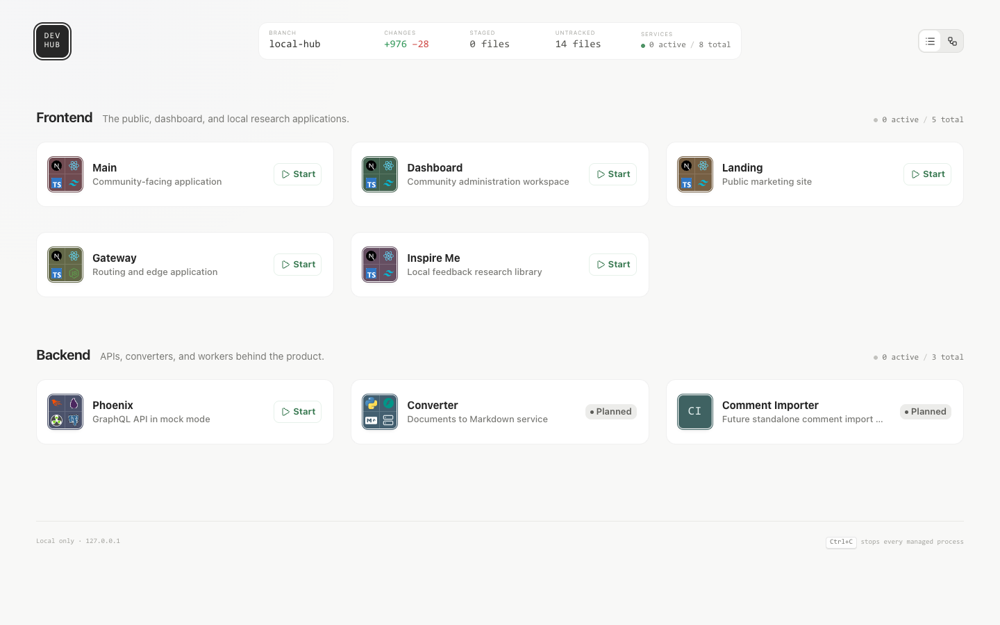
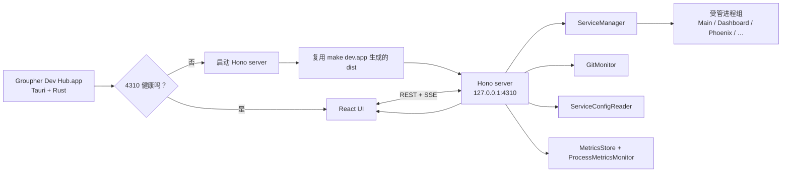

# Groupher Dev Hub

Groupher Dev Hub 是 Groupher monorepo 的本地开发控制台。它把分散在不同目录、端口和终端里的前后端服务集中到一个界面中，负责启动与停止进程、展示日志、识别端口占用、观察运行指标，并把 Git 状态、配置文件和服务依赖关系放在同一处。



图中是列表视图：顶部汇总当前分支、代码改动和服务数量；中间按 Frontend / Backend 分组展示服务及技术栈；每个可运行服务都可以直接启动，运行后还能展开终端、查看指标或重启进程。右上角可以在列表视图和依赖关系图之间切换。

## 为什么需要 Dev Hub

Groupher 不是单进程项目。日常开发可能同时涉及 Main、Dashboard、Landing、Gateway、Phoenix、文档转换器以及本地研究工具。只靠多个终端手动管理会带来几个反复出现的问题：

- 每个服务的目录、启动命令、端口和环境变量都不同。
- 很难快速判断端口对应的是 Dev Hub 管理的进程，还是外部已经启动的进程。
- 日志散落在不同终端，停止开发时容易残留子进程。
- 前端路由、GraphQL API 和其他服务之间的依赖关系不直观。
- Git 改动、服务配置和 CPU / 内存状态需要在多个工具之间来回查看。

Dev Hub 把这些知识固化为服务定义，并提供一个只监听 `127.0.0.1` 的统一入口。它不是生产运维面板，也不会替代各服务自己的开发命令；它解决的是本地多服务开发的编排和可观测性。

## 三种运行方式

在仓库根目录运行：

| 命令           | 用途                  | 运行内容                                                                                            |
| -------------- | --------------------- | --------------------------------------------------------------------------------------------------- |
| `make dev.dev` | 开发 Dev Hub 本身     | 启动 Vite HMR 页面（`4310`）和独立 API（`4311`），修改 React、CSS 或 Node 代码时使用                |
| `make dev`     | 运行构建后的 Web 版本 | 先执行 Vite production build，再由 Hono 在 `127.0.0.1:4310` 提供静态页面和 API                      |
| `make dev.app` | 构建并安装 macOS 应用 | 安装项目依赖、构建 production 页面和 Tauri `.app`、替换 `/Applications/Groupher Dev Hub.app` 并启动 |

### 推荐的日常开发流程

```bash
# 1. 开发 Dev Hub
make dev.dev

# 2. 开发完成后按 Ctrl+C 停止开发版

# 3. 重新构建、安装并打开桌面版
make dev.app
```

切换到 `make dev.app` 前必须先停止 `make dev.dev`。桌面启动器会健康检查 `127.0.0.1:4310`；如果开发版仍在运行，它会复用现有服务，而不会另外启动 production 版本。

平时只使用 Dev Hub、不修改它时，直接从 Raycast、Spotlight 或 `/Applications` 打开 **Groupher Dev Hub** 即可，不需要先打开终端。

## 第一次安装

`make dev.app` 当前只支持 macOS。新环境需要先具备：

- Xcode Command Line Tools：`xcode-select --install`
- 当前 Node.js LTS
- Yarn，或 Node 安装中可用的 Corepack

然后在仓库根目录执行：

```bash
make dev.app
```

安装脚本会：

1. 检查 macOS、Xcode Command Line Tools 和 Node.js。
2. 在缺少 Rust 时下载官方 `rustup-init`，校验 SHA-256 后安装 stable toolchain。
3. 使用 `yarn install --immutable` 安装 monorepo 依赖。
4. 构建 production 页面，再构建并 ad-hoc 签名 `Groupher Dev Hub.app`。
5. 关闭已安装的旧版本，并安全替换 `/Applications` 中 bundle id 匹配的应用。
6. 刷新 Launch Services，然后启动新版本。

当前应用是本地开发工具，没有做 Apple notarization，不用于 Mac App Store 或对外分发。

## 能力

- **服务编排**：启动、停止和重启服务；按进程组清理子进程。
- **外部进程识别**：目标端口被其他进程占用时标记为 external，避免误杀非 Dev Hub 管理的进程。
- **实时状态**：通过 Server-Sent Events 推送服务状态、日志、Git 快照和指标。
- **内嵌终端**：使用 xterm.js 展示 stdout / stderr，并保留 ANSI 颜色。
- **列表与关系图**：既能按 Frontend / Backend 浏览，也能查看 Gateway 路由和 GraphQL 依赖。
- **运行指标**：聚合服务进程组的 CPU、RSS 和进程数，也接收前端页面的 JS heap 与 long-task busy time。
- **Git 面板**：展示分支、staged / unstaged / untracked 汇总及 patch。
- **配置查看**：按服务读取 Next.js env、Elixir config 和 Python settings；敏感值只用于本地展示。
- **桌面唤起**：Tauri 单实例应用；关闭窗口时隐藏，从 Raycast、Spotlight 或 Dock 再次唤回。

## 架构



桌面应用本身保持很薄：它负责单实例、窗口生命周期、仓库定位、健康检查和 production Hub 子进程。`make dev.app` 在安装时生成 `dist`；以后冷启动 `.app` 只启动 Hono 服务并复用该产物，不会再次执行 Vite build。真正的服务编排逻辑仍在 Node 端，因此 Web 版本和 `.app` 使用同一套能力。

关闭红色窗口按钮只会隐藏窗口，受管服务继续运行；从应用菜单使用 Quit 或按 `Cmd+Q` 退出时，Tauri 会终止自己启动的 Dev Hub 进程组，Dev Hub 随后清理它管理的各个服务。

## 当前服务图

| 服务       | 默认端口 | 角色                  | 主要技术                                 |
| ---------- | -------: | --------------------- | ---------------------------------------- |
| Main       |   `3000` | 社区前台              | Next.js、React、TypeScript、Tailwind CSS |
| Dashboard  |   `3001` | 社区管理后台          | Next.js、React、TypeScript、Tailwind CSS |
| Landing    |   `3002` | 官网与营销页面        | Next.js、React、TypeScript、Tailwind CSS |
| Gateway    |   `3003` | 本地域名与路由入口    | Next.js、React、TypeScript、Node.js      |
| Inspire Me |   `3010` | 本地反馈研究库        | Next.js、React、TypeScript、Tailwind CSS |
| Phoenix    |   `4001` | mock 模式 GraphQL API | Phoenix、Elixir、Absinthe、PostgreSQL    |
| Converter  |   `8000` | 文档转 Markdown 服务  | Python、FastAPI、MarkItDown、Uvicorn     |

服务及关系的来源是 [`src/server/services.ts`](./src/server/services.ts)。新的服务应在这里声明工作目录、命令、端口、配置来源、技术栈和指标阈值；服务之间的路由或 API 依赖也在同一文件维护。

## Start Chain

Dev Hub 的启动行为由服务配置驱动，不从 Flow 里的路由/API 关系自动推断。Flow 关系描述运行时流量方向，例如 Gateway 会路由到 Main 和 Dashboard；启动依赖描述“为了调试这个服务，哪些服务必须先可用”。

每个服务可以声明 `startPolicy`：

```ts
startPolicy: {
  defaultMode: 'self' | 'chain' | 'related'
  requiredDependencies: string[]
  optionalDependencies: string[]
}
```

启动模式含义：

- `self`：只启动当前服务。
- `chain`：启动强依赖，再启动当前服务。
- `related`：启动强依赖、弱依赖和当前服务。

没有声明 `startPolicy` 的服务默认等价于：

```ts
{
  defaultMode: 'self',
  requiredDependencies: [],
  optionalDependencies: [],
}
```

当前 `main` 和 `dashboard` 默认使用 `chain`，强依赖是 `gateway`、`auth` 和 `phoenix`，弱依赖是 `document-converter`。因此点击主 `Start` 会启动默认链路，菜单里显示 `Start chain (default)`；需要隔离调试时，可以从小三角菜单选择 `Start only this service`；需要把 converter 一起拉起时，选择 `Start all related`。

Converter 依赖 `backend/document-converter/.venv` 中的 Python 3.12 环境。首次使用前在仓库根目录运行：

```sh
make be.document-converter.install
```

安装完成后，Dev Hub 会通过 `make be.document-converter.start` 启动它，并使用 `http://127.0.0.1:8000/health` / `https://converter.groupher.localhost/health` 做健康检查。

`landing`、`gateway`、`inspire-me` 和当前后端服务没有声明强弱依赖时，只显示普通 `Start`，不显示小三角，也不显示依赖 Drawer 入口。

有依赖的服务在 Card Footer 会显示依赖图标。点击后打开 Drawer，按 `Required` 和 `Optional` 展示依赖列表。列表中的状态点来自当前 service status：

- 绿色：`running` 或 `external`。
- 黄色：`starting`。
- 红色：`stopped`、`stopping` 或 `error`。
- 灰色：`unavailable`。

## 技术栈

### Desktop

- Tauri 2
- Rust 2021
- `tauri-plugin-single-instance`
- macOS 原生 WebView 与窗口

### Client

- React 19 + TypeScript
- Vite 8 + Tailwind CSS 4
- React Flow + ELK.js：服务关系图与自动布局
- xterm.js：实时日志终端
- Recharts：指标趋势
- Pierre Diffs：Git patch 展示
- Base UI、Lucide、Motion

### Local server

- Node.js + TypeScript / TSX
- Hono + `@hono/node-server`
- REST API + Server-Sent Events
- Node `child_process` 进程组管理
- 本地 Git、配置与进程指标采集

## 目录

```text
local/dev-hub/
├── src/
│   ├── client/          # React 界面、视图、抽屉和浏览器端连接
│   ├── server/          # Hono API、进程、Git、配置和指标
│   └── shared/          # 前后端共享协议
├── src-tauri/
│   ├── src/main.rs      # 桌面启动器与窗口/进程生命周期
│   └── tauri.conf.json  # bundle 和初始窗口配置
├── scripts/
│   └── install-app.sh   # 一键构建、安装和启动 macOS 应用
├── docs/                # README 使用的项目图片
├── package.json
└── vite.config.ts
```

## 本地端口与数据

| 内容                          | 默认位置                                |
| ----------------------------- | --------------------------------------- |
| production Hub / 桌面应用后端 | `http://127.0.0.1:4310`                 |
| `make dev.dev` Vite 页面      | `http://127.0.0.1:4310`                 |
| `make dev.dev` API            | `http://127.0.0.1:4311`                 |
| 指标数据                      | `local/dev-hub/.data/metrics`           |
| 桌面启动日志                  | Tauri 的应用日志目录中的 `launcher.log` |

Dev Hub 只监听 loopback 地址，不应改为局域网或公网服务。配置读取、Git patch 和进程控制接口都按“仅本机开发者可访问”的边界设计。

## 验证

```bash
# Node 端测试
yarn workspace @groupher/local-dev-hub test

# TypeScript
yarn workspace @groupher/local-dev-hub type-check

# 格式检查
yarn workspace @groupher/local-dev-hub format:check

# Rust 启动器
cargo test --manifest-path local/dev-hub/src-tauri/Cargo.toml --locked
```
