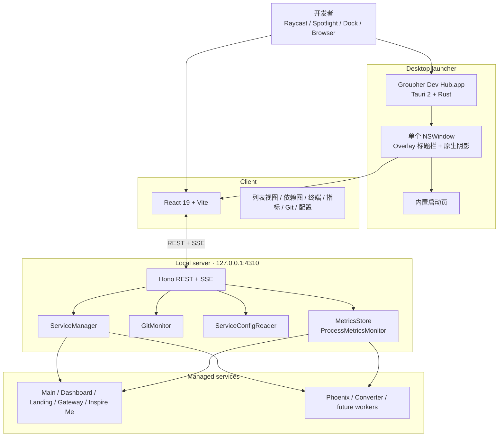

# Groupher Dev Hub 工程日志

> 最后更新：2026-07-24
> 当前状态：macOS 桌面版采用单个不透明 Tauri 窗口，并使用 AppKit 原生阴影。

## 背景

Groupher 是一个包含多个前端、后端和本地工具的 monorepo。日常开发经常需要同时处理：

- Main、Dashboard、Landing、Gateway 等 Next.js 应用；
- Phoenix GraphQL API；
- Python Converter；
- 本地研究工具和未来的独立 worker；
- 每个服务各自的端口、环境变量、日志和子进程。

如果完全依赖终端手动管理，开发者需要记住每个服务的目录和命令，很难判断端口占用来自 Dev Hub 还是外部进程，也容易在停止开发后留下子进程。Git 状态、配置文件、依赖关系和运行指标还分散在不同工具中。

Dev Hub 的目标是把这些本地开发知识固化成一个统一控制面：

- 集中启动、停止和重启服务；
- 聚合日志、CPU、内存和进程数量；
- 展示 Git 状态和 patch；
- 查看服务配置及依赖关系；
- 明确区分受管进程和外部占用端口的进程；
- 通过 macOS 应用从 Raycast、Spotlight、Dock 或 Applications 直接唤起。

它不是生产运维系统，也不替代各子项目自己的开发命令。它只负责本机开发环境的编排与可观测性，并且只监听 `127.0.0.1`。

## 当前整体架构

Dev Hub 由四层组成：



### Desktop launcher

入口位于 `src-tauri/src/main.rs`，职责保持克制：

- 保证应用单实例；再次打开时只唤回已有窗口；
- 检查 `127.0.0.1:4310` 是否已经是一个有效的 Dev Hub；
- 如果 Hub 尚未运行，启动 `yarn workspace @groupher/local-dev-hub hub:serve`；
- 在 Node 服务准备期间显示内置 bootstrap 页面；
- 服务健康后把窗口导航到 `http://127.0.0.1:4310`；
- 红色关闭按钮只隐藏窗口；
- `Cmd+Q` 或 Quit 时终止启动器自己创建的 Hub 进程组。

桌面启动器不会在每次打开应用时重新执行 Vite build。production 页面由 `make dev.app` 在安装阶段生成，之后 `.app` 只启动 Node server 并复用现有 `dist`。

### Local server

Node/Hono server 是 Dev Hub 的能力中心：

- `ServiceManager` 负责服务进程组的启动、停止、重启和退出清理；
- `GitMonitor` 监听 worktree 与 Git 元数据，并定期主动校准；
- `ServiceConfigReader` 读取服务配置并对敏感信息做展示边界处理；
- `ProcessMetricsMonitor` 定期读取进程表，按受管进程组聚合 CPU、RSS 和进程数；
- `MetricsStore` 保存有限的本地指标历史；
- REST API 处理命令和查询；
- Server-Sent Events 推送服务状态、日志、Git 和指标变化。

服务定义、工作目录、命令、端口、技术栈和依赖关系集中维护在 `src/server/services.ts`。

### Client

React client 通过 REST 获取初始快照，通过 SSE 接收增量更新。主要界面包括：

- Frontend / Backend 服务列表；
- 服务关系图；
- 内嵌 xterm.js 日志终端；
- 进程与浏览器指标；
- Git diff；
- 配置文件查看；
- 服务启动、停止和重启操作。

浏览器模式和桌面模式共用同一套 client 与 server。桌面版只是多了一层本地启动和窗口生命周期管理。

## 三种运行方式

| 命令           | 定位                     | 行为                                                                                     |
| -------------- | ------------------------ | ---------------------------------------------------------------------------------------- |
| `make dev.dev` | 开发 Dev Hub 本身        | 启动 Vite HMR 页面和独立 API，修改 React、CSS、Node 代码时使用                           |
| `make dev`     | 运行 production Web 版本 | 构建 client，再由 Hono 在 `127.0.0.1:4310` 提供静态资源和 API                            |
| `make dev.app` | 生成并安装 macOS 应用    | 安装依赖、构建 production 页面、构建并签名 `.app`、替换 `/Applications` 中的旧版本并启动 |

推荐流程：

```bash
# 开发
make dev.dev

# 开发完成后停止 dev server，再重新构建和安装
make dev.app
```

需要注意：桌面启动器会复用端口 `4310` 上已经通过健康检查的 Dev Hub。如果 `make dev.dev` 仍在运行，打开 `.app` 时可能看到的仍然是开发版本。因此切换到安装版前应先停止 `make dev.dev`。

## macOS 应用化过程

最初讨论过 Pake 一类网页封装工具，最终选择 Tauri，主要原因是 Dev Hub 不只是打开一个网页：

- 如果 Node server 没有运行，需要由应用启动；
- 退出应用时需要清理自己创建的进程；
- 需要单实例、隐藏和重新唤起；
- 需要稳定地定位仓库和 production 产物；
- 后续可能继续使用 macOS 原生窗口能力。

`make dev.app` 被设计成新环境的一站式入口：

1. 检查 macOS、Xcode Command Line Tools 和 Node.js；
2. 缺少 Rust 时安装 stable toolchain；
3. 安装 monorepo JavaScript 依赖；
4. 构建 production Dev Hub；
5. 构建并 ad-hoc 签名 Tauri `.app`；
6. 关闭旧版本并替换 `/Applications/Groupher Dev Hub.app`；
7. 刷新 Launch Services；
8. 启动新版本。

这样不需要记住较长的 workspace 构建命令，也不需要手动拖动 `.app`。

## 窗口与阴影问题复盘

阴影是整个桌面化过程中最曲折的部分。问题不是简单的 CSS 调参，而是 macOS 窗口模型、Tauri 透明窗口和截图软件窗口枚举共同造成的。

### 1. 原始表现：透明窗口的原生阴影过重

早期窗口配置是：

```text
decorations: true
transparent: true
shadow: true
titleBarStyle: Overlay
```

页面使用透明根节点，在内部 `.window-frame` 上绘制背景、圆角和轻微内边缘。macOS 仍然为整个透明 `NSWindow` 生成系统阴影，但视觉效果明显比常见 Electron 应用更黑、更突兀。

AppKit 对外只提供类似 `hasShadow: Bool` 的开关，没有公开的 blur、offset、spread 或 opacity 参数。阴影形态还会受窗口透明性、style mask、内容轮廓和窗口实现方式影响，因此“都调用 `setHasShadow(true)`”并不意味着最后一定拥有相同的视觉结果。

Tauri 社区存在几乎相同的报告：

- [tauri-apps/tauri#14394](https://github.com/tauri-apps/tauri/issues/14394)：透明 Overlay 窗口缺少正常浅色内缘，只剩黑色外缘，并明确对比 Electron；
- [tauri-apps/tauri#4243](https://github.com/tauri-apps/tauri/issues/4243)：透明/无装饰窗口的暗边、阴影和刷新问题；
- [tauri-apps/tauri#9287](https://github.com/tauri-apps/tauri/issues/9287)：自定义窗口圆角和阴影能力不足。

这些 issue 中常见的 `invalidateShadow()` 只能要求 AppKit 重新计算阴影，适合修复内容变化、移动或 resize 后的旧阴影残留，不能改变阴影强度。

### 2. 直接关闭系统阴影

把 `shadow` 设置为 `false` 后，突兀的黑色阴影消失了，但窗口完全没有层次，与背景贴在一起，同样不像正常 macOS 应用。

这个阶段证明了问题确实来自窗口外部阴影，而不是 Dev Hub 页面内部的卡片阴影。

### 3. 在同一个透明窗口内部绘制 CSS 阴影

下一步尝试关闭系统阴影，扩大透明窗口边界，在窗口内部为可见内容绘制 CSS `box-shadow`。

视觉可以精确控制，但产生了两个结构性问题：

1. macOS 认为整个透明区域都是窗口范围，resize handler 位于阴影结束处，而不是可见内容边缘；
2. 最大化后透明 padding 仍然占据窗口尺寸，可见内容无法真正铺满屏幕。

这些问题不是继续调整 CSS blur 或 padding 可以解决的。只要阴影像素位于同一个窗口内部，系统窗口边界就必然包含阴影区域。

### 4. 主窗口 + 独立阴影窗口

为了同时保留可调阴影和正确的主窗口 resize 边界，后来拆成两个窗口：

```text
main NSWindow
└── shadow NSWindow（透明、不可聚焦、忽略鼠标、位于主窗口下方）
```

主窗口保持准确的可见尺寸；阴影窗口比主窗口向四周扩展，并使用 CSS 绘制多层柔和阴影。主窗口移动、缩放、隐藏、最大化或恢复时，Rust 代码同步阴影窗口的位置、尺寸和可见性。

这个方向解决了：

- resize handler 偏移；
- 最大化时内容无法铺满；
- 阴影强度、距离和 blur 无法调整。

但双窗口同步随后暴露出更多边缘问题：

- 最大化再恢复后移动窗口会出现残影；
- 窗口状态切换期间两个窗口的 frame 更新时序不同；
- 启动 bootstrap 页面也需要拥有一致的窗口轮廓；
- 需要在 move、resize、focus、maximize、restore 后反复校准；
- 应用逻辑显著复杂化。

这些问题通过把阴影窗口设为 child window、延迟状态校准、最大化时隐藏阴影等方式基本得到控制，但这仍然不是最终方案。

### 5. 截图软件吸附到了阴影窗口

最终暴露的关键问题来自 CleanShot 一类支持“窗口吸附”的截图软件。

截图工具不是按照肉眼看到的内容边缘选择窗口，而是通过 macOS Window Server / CoreGraphics / ScreenCaptureKit 枚举真实窗口。双窗口方案在系统层面确实存在两个 layer-0 窗口：

```text
main    1280 × 820
shadow  1344 × 904
```

因此截图工具会选中尺寸更大的 shadow window。即使它透明、不可点击、没有标题，也仍然是一个真实的 `CGWindow`。

尝试过的规避属性包括：

- 从 Accessibility tree 隐藏；
- `setExcludedFromWindowsMenu(true)`；
- `NSWindowSharingType::None`；
- 更接近辅助面板的窗口属性；
- 调整窗口层级。

这些设置对使用 Accessibility 枚举窗口的软件可能有效，但实际截图工具直接读取 Window Server，仍然可以看到 shadow window，所以没有效果。

这也解释了为什么常见 Electron 应用没有同样的问题：它们经常自绘标题栏和页面内容，但窗口外阴影通常仍由一个原生窗口承载，并不意味着会创建第二个阴影窗口。

### 6. 最终方案：不透明单窗口 + AppKit 原生阴影

进一步查看 Tauri issue 后发现，Dev Hub 实际并不需要真正的窗口透明：

- 页面始终有完整的实色背景；
- 不需要露出桌面；
- 没有异形窗口；
- 没有依赖透明像素的视觉效果。

因此最终方案是：

```text
一个不透明的标准 NSWindow
├── decorations: true
├── transparent: false
├── shadow: true
├── titleBarStyle: Overlay
├── hiddenTitle: true
└── Web 内容覆盖标题栏区域
```

同时删除：

- 独立 shadow window；
- `shadow.html`；
- 阴影位置和尺寸同步；
- 最大化/恢复补偿；
- macOS Accessibility 和 Window Sharing 实验；
- 透明根节点；
- 页面模拟的窗口圆角和外部阴影。

窗口圆角、边缘、阴影、resize、最大化和 Mission Control 行为重新交给 AppKit。最终通过 CoreGraphics 枚举确认应用只剩一个 `1280 × 820` 的 layer-0 窗口，截图软件不再有第二个阴影窗口可吸附。

最终视觉不再追求完全自定义的阴影参数，而是选择可接受的原生效果，换取：

- 正确的截图窗口边界；
- 正确的 resize hit area；
- 正确的最大化和恢复；
- 无双窗口移动残影；
- 更少的原生同步代码；
- 更稳定的未来 macOS 兼容性。

## 阴影方案对比

| 方案                    | 视觉可控 | Resize   | 最大化       | 截图吸附             | 复杂度 | 结论                  |
| ----------------------- | -------- | -------- | ------------ | -------------------- | ------ | --------------------- |
| 透明窗口 + 系统阴影     | 低       | 正常     | 正常         | 正常                 | 低     | Tauri 下阴影/边缘过重 |
| 完全关闭阴影            | 无       | 正常     | 正常         | 正常                 | 低     | 窗口缺乏层次          |
| 单窗口内部 CSS 阴影     | 高       | 边界错误 | 无法真正铺满 | 包含透明 padding     | 中     | 放弃                  |
| 独立阴影窗口            | 高       | 正常     | 可补偿       | 吸附到 shadow window | 高     | 放弃                  |
| 不透明单窗口 + 系统阴影 | 低       | 正常     | 正常         | 正常                 | 低     | **当前方案**          |

## 其他过程中解决的问题

### 响应式排列

早期卡片布局在宽度变化时会出现不均匀留白或列数不合理。后续改为根据可用宽度自动变化列数，并保证卡片内部图标、标题、说明和操作按钮在较窄宽度下仍然稳定截断，不挤压主要操作。

桌面窗口设置最小尺寸只是兜底，页面自身仍需要支持不同窗口宽度，不能依赖固定三列。

### 启动页反复出现

bootstrap 页面本来用于 Node server 尚未启动时提供状态反馈。曾出现每次打开都显示“Building the production Dev Hub…”的误导性体验。

最终启动流程改为先健康检查：

- `4310` 已经是有效 Dev Hub：直接导航，不启动新服务；
- 未运行：显示启动页并启动 production server；
- server 准备完成：导航到正式 UI；
- 安装阶段负责 build，冷启动阶段不再执行 build。

### Raycast / Spotlight 找不到应用

仅把 `.app` 放入某个目录并不总能立刻被系统搜索索引。安装脚本最终统一负责：

- 安装到 `/Applications`；
- 校验 bundle id，避免误覆盖其他应用；
- 刷新 Launch Services；
- 启动新版本。

因此新环境只需要使用 `make dev.app`，不再手动移动 bundle。

### 开发版与 production 版边界

Dev Hub 默认运行 production build。只有 `make dev.dev` 才启动带 HMR 的开发版本。

这个边界很重要：

- 从 Applications 打开的应用不应隐式进入开发模式；
- 日常使用不依赖 Vite dev server；
- 开发 Dev Hub 和使用 Dev Hub 是两种明确状态；
- `make dev.app` 是从开发结果进入安装版的唯一收口命令。

## 当前窗口设计约束

后续修改桌面窗口时，应保持以下约束：

1. 主窗口保持 `transparent: false`，除非出现必须展示桌面穿透的真实需求；
2. 不要为外阴影创建第二个窗口；
3. 不要通过扩大主窗口透明边界绘制外阴影；
4. 不要把 AppKit `hasShadow` 当作可调阴影 API；
5. `invalidateShadow()` 只用于刷新阴影形状，不用于调节强度；
6. 保持 `decorations: true + titleBarStyle: Overlay`，继续使用原生交通灯和窗口行为；
7. 修改窗口结构后至少验证：
   - 初次打开；
   - 隐藏后重新唤起；
   - resize；
   - 最大化和恢复；
   - 恢复后拖动；
   - Mission Control；
   - Raycast / Spotlight 唤起；
   - 截图软件窗口吸附；
   - CoreGraphics 枚举到的应用窗口数量。

## 验证命令

```bash
# TypeScript
yarn workspace @groupher/local-dev-hub type-check

# Node server
yarn workspace @groupher/local-dev-hub test

# 格式
yarn workspace @groupher/local-dev-hub format:check

# Rust launcher
cargo test --manifest-path local/dev-hub/src-tauri/Cargo.toml --locked

# 完整构建、安装并打开
make dev.app
```

视觉问题不能只依靠自动化测试。涉及窗口层级、阴影、拖动和截图时，还必须在真实安装版上完成手动验证。

## 最终经验

这次最重要的经验不是某个阴影参数，而是区分三种边界：

1. **Web 内容边界**：React/CSS 负责窗口内部界面；
2. **原生窗口边界**：AppKit 负责窗口 frame、resize、圆角、阴影、最大化和系统集成；
3. **进程边界**：Tauri 只负责启动和托管 Hub，Node server 负责服务编排。

当 CSS 试图绘制窗口外部效果，或者用第二个窗口模拟一个本应属于 Window Server 的能力时，视觉问题会迅速演变为交互、生命周期和系统集成问题。

最终实现选择少量不可调的原生视觉，换取正确、简单且可维护的窗口语义。这比继续追求一张静态截图中的完美阴影更符合 Dev Hub 作为长期本地开发工具的目标。
